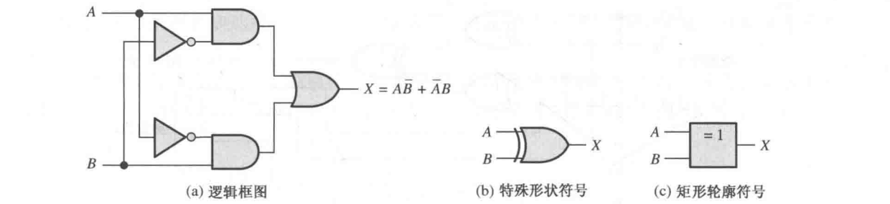
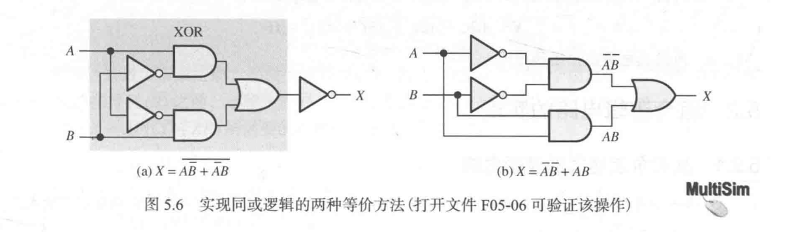
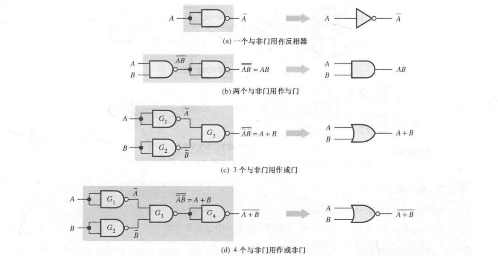
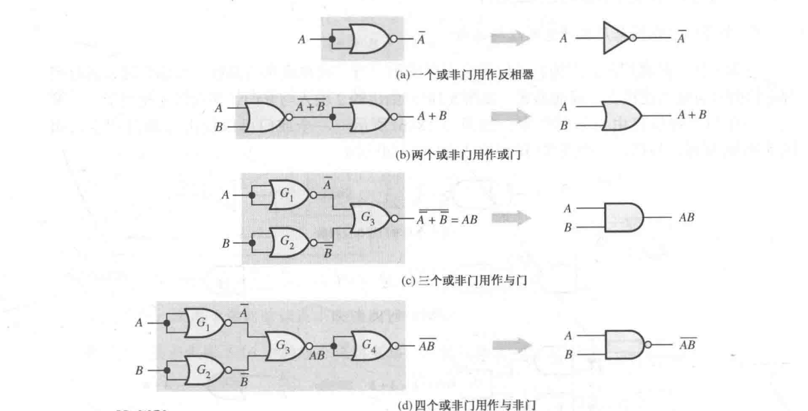
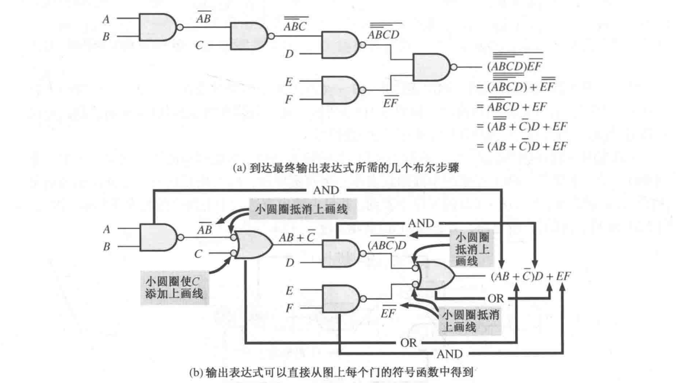
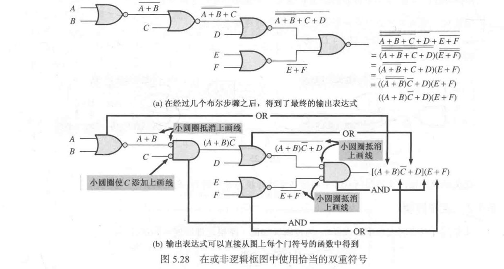
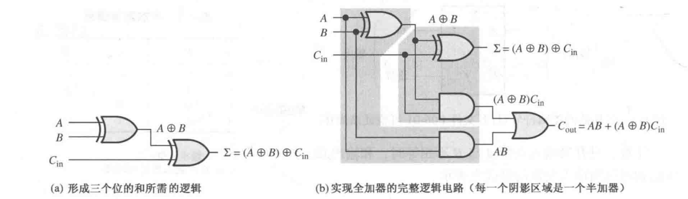
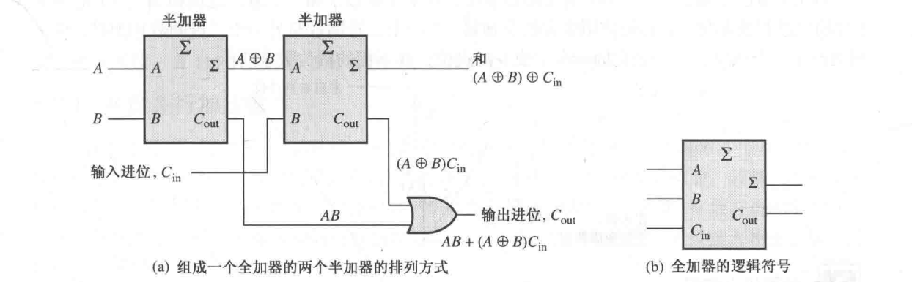

| 章节                                           | 内容概述         | 重点程度 |
| -------------------------------------------- | ------------ | ---- |
| Ch.5 Combinational Logic Analysis 组合逻辑分析     | 电路分析和实现      | 高    |
| Ch.6 Functions of Combinational Logic 组合逻辑电路 | 加法器、选择器、译码器等 | 高    |
# 5 组合逻辑分析
## 5.1~5.2 组合逻辑电路
- 与-或逻辑：产生乘积项之和表达式 
- 与-或-非逻辑：产生和项表达式 
- 异或逻辑：异或门实际上是与门、或门、非门的组合 $$A \oplus B = A \overline{B} + \overline{A}B$$ 
- 同或逻辑：同或门也是与门、或门、非门的组合 $$\overline{A \oplus B} = \overline{A \overline{B} + \overline{A}B} = AB + \overline{A}·\overline{B}$$ 
## 5.3~5.4 使用与非门和或非门的组合逻辑
- 与非门可以产生任意逻辑函数：
	- $\overline{A} = \overline{AA}$：将 $A$ 连接到两个输入内
	- $AB = \overline{\overline{AB}}$：连用两次取反
	- $A + B = \overline{\overline{A}·\overline{B}}$：先对 $A, B$ 取反，再用一个与非门
	- $\overline{A + B} = \overline{\overline{\overline{A}·\overline{B}}}$：先对 $A, B$ 取反，再用一个与非门，再取反
	
- 或非门可以产生任意逻辑函数：
	- $\overline{A} = \overline{A + A}$：将 $A$ 连接到两个输入内
	- $A + B = \overline{\overline{A + B}}$：先用一个或非门，再取反
	- $AB = \overline{\overline{A} + \overline{B}}$：先对 $A, B$ 取反，再用一个或非门
	- $\overline{AB} = \overline{\overline{\overline{A} + \overline{B}}}$：先对 $A, B$ 取反，再用一个或非门，再取反
	
- 与-或逻辑电路转与非逻辑电路：先转与非/非-或电路，然后将非-或门转成与非门 
- 或-与逻辑电路转或非逻辑电路：先转或非/非-与电路，然后将非与-门转成与非门 
- 双重符号：
	- 对于使用与非门的逻辑框图，需要用与非门或者等价的非-或符号来表示每一个门，来表示与-或逻辑运算。
	- 对于使用或非门的逻辑框图，需要用或非门或者等价的非-与符号来表示每一个门，来表示与-或逻辑运算。
# 6 组合逻辑电路
## 6.1~6.3 加法器
- 半加器 (Half Adder)：实现两数相加，产生和与进位 $$
  \begin{aligned}
	  \Sigma &= A \oplus B = A \overline{B} + \overline{A} B \\\\
	  C_{out} &= AB
  \end{aligned}$$ 
- 全加器（Full Adder）：给定输入进位，实现两数相加，产生和输出与进位输出 $$
  \begin{aligned}
	  \Sigma &= A \oplus B \oplus C_{in} \\\\
	  C_{out} &= AB + AC_{in} + BC_{in} = AB + (A \oplus B) C_{in}
  \end{aligned}$$ 
- 用两个半加器实现全加器：视作三个数相加。将第一个半加器的和与第三个输入继续相加，而进位输出则是两个半加器进位输出的或。
- 并行加法器：将低位的进位输出作为高位的进位输入，即可计算多位二进制加法 
- 4 位并行加法器芯片：74XX283
- 加法器级联：将低位加法器的进位输出作为高位加法器的进位输入即可（异步进位） 
- 异步进位加法器：将每个全加器的进位输出连接到下一个高一级全加器的进位输入。
	- 这样的电路会造成加法过程的时间延迟，延迟时间正比于全加器的数量。
- 超前进位加法器：直接计算每个进位输出关于 $A, B$ 的逻辑表达式
	- 进位生成和传输：$C_{g,i} = A_iB_i$，$C_{p,i} = A_i + B_i$，判断是否可以产生或传递进位
	- 进位输出：$C_{out,i} = C_{g, i} + C_{p, i} C_{in, i}$，要么当前位生成，要么从低位进位传递而来
	- 进位传递：$C_{in, i} = C_{out, i - 1}$，全加器级联
	- 这样的电路可以立即获得所有位的进位，除了门电路的延迟。 
## 6.4 比较器
- 相等：$X = \overline{A_0 \oplus B_0} · \overline{A_1 \oplus B_1} \cdots \overline{A_{n - 1} \oplus B_{n - 1}}$，使用同或门 + 与门（或者异或门 + 与非门）
- 不相等：从高到低依次比较，高位均相等，到某一位不相等的时候，根据 $A\overline{B}, \overline{A}B$ 的情况输出电平。
- 4 位大小比较器芯片：74XX85
## 6.5~6.7 译码器、编码器、代码转换器
- 译码器：

|        名称         |         功能         |        原理        |        对应芯片        |
| :---------------: | :----------------: | :--------------: | :----------------: |
| 基本二进制译码器 （译码门） |   判断输入是否为某个二进制数    |    用一个与函数即可实现    |                    |
|  三八译码器 四十六译码器  |   判断输入是否为某个二进制数    | 需要使用 8 / 16 个译码门 | 74XX138 74XX154 |
|    BCD-十进制译码器     |  将 BCD 码转换为十进制数输出  |   需要使用 10 个译码门   |       74XX42       |
|     BCD-7段译码器     | 将 BCD 码转换为 7 段码的输出 |   需要使用 7 个译码门    |       74XX47       |
- 注意在 74XX47 中，可以灭零（删除前导零 / 后导零），对应功能接口为 $\overline{RBI}, \overline{BI} / \overline{RBO}$ 的级联。
- 编码器：

|       名称        |              功能              |    原理     |  对应芯片   |
| :-------------: | :--------------------------: | :-------: | :-----: |
|  十进制 - BCD 编码器  |       将十进制数输入转换为 BCD 码       | 用多个或门即可实现 |         |
| 十进制 - BCD 优先编码器 | 功能相同。但是可以按照最高位的十进制数有效输入来产生输出 |           | 74XX147 |
- 代码转换器：
	- BCD - 二进制转换：将 BCD 码中的每个位为 $1$ 对应的权表示的二进制数 $2^i \times 10^j$ 相加，这个可以用多个加法器实现。
	- 二进制 - 格雷码转换：$G_{n - 1} = B_{n - 1}, G_{i} = B_{i + 1} \oplus B_i$，可以使用多个异或门实现。
	- 格雷码 - 二进制转换：$B_{n - 1} = G_{n - 1}, B_i = B_{i + 1} \oplus G_{i}$，可以使用多个异或门实现。 
## 6.8~6.9 多路复用器、多路分配器
- 多路复用器 (MUX)：数据从多条数据线传送到一条线路上。可以使用与-非逻辑实现
	- 如四选一数据选择器 $Y = D_0\overline{S_1}\overline{S_0} + D_1 \overline{S_1} S_0 + D_2 S_1 \overline{S_0} + D_3 S_1 S_0$
	- 对应芯片 74XX153（双四选一数据选择器）、74XX151（八选一数据选择器）、74XX157（四二选一数据选择器）
- 逻辑函数发生器：将真值表对应的数据线设为对应的高/低电平，那么地址输入作为变量输入，则输出的就是对应的逻辑函数值
- 多路分配器 (DEMUX)：数据从一条数据线传送到多条数据线上。可以使用多个与门实现
	- 如一四多路分配器：$D_0 = D\overline{S_1}\overline{S_0}, D_1  = D\overline{S_1} S_0, D_2 = D S_1 \overline{S_0}, D_3 = DS_1 S_0$
	- 将译码器的片选输入作为 $D$ 的输入，即可做到多路分配器。
## 6.10 奇偶发生器/校验器
- 奇偶校验就是将所有位取异或函数，看是否为 $0 / 1$
- 奇偶校验器：对应芯片 74XX280
- 奇偶发生器：如果是偶发生器，则取 74XX280 的奇数输出作为偶校验位；如果是奇发生器，择取 74XX280 的偶数输出作为奇校验位。