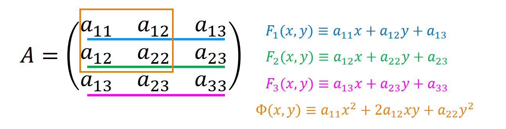

# 5.0 二次曲线的定义

**二次曲线的方程**：$F(x, y) \equiv a_{11}x^2 + 2a_{12} xy + a_{22}y^2 + 2a_{13} x + 2a_{23} y + a_{33} = 0$

**二次曲线的矩阵、$\Phi(x, y)$ 的矩阵**：$$A = \begin{bmatrix}a_{11} & a_{12} & a_{13} \\\\ a_{12} & a_{22} & a_{23} \\\\ a_{13} & a_{23} & a_{33} \\\\ \end{bmatrix},\quad A^* = \begin{bmatrix}a_{11} & a_{12} \\\\ a_{12} & a_{22}\end{bmatrix}$$
那么有 $$F(x, y) = \boldsymbol x A \boldsymbol x^T = \begin{bmatrix}x & y & 1\end{bmatrix} \begin{bmatrix}a_{11} & a_{12} & a_{13} \\\\ a_{12} & a_{22} & a_{23} \\\\ a_{13} & a_{23} & a_{33} \\\\ \end{bmatrix} \begin{bmatrix}x \\\\ y \\\\ 1\end{bmatrix}$$
**相关记号**：
$$
\begin{aligned}
F_{1}(x,y)&\equiv \begin{bmatrix}a_{11} & a_{12} & a_{13}  \end{bmatrix} \begin{bmatrix}x & y & 1\end{bmatrix}^T \equiv a_{11}x+a_{12}y+a_{13}\\\\
F_{2}(x,y)&\equiv \begin{bmatrix}a_{21} & a_{22} & a_{23}  \end{bmatrix} \begin{bmatrix}x & y & 1\end{bmatrix}^T \equiv a_{12}x+a_{22}y+a_{23}\\\\
F_{3}(x,y)&\equiv \begin{bmatrix}a_{13} & a_{23} & a_{33}  \end{bmatrix} \begin{bmatrix}x & y & 1\end{bmatrix}^T \equiv a_{13}x+a_{23}y+a_{33}\\\\
\Phi(x,y)&\equiv \begin{bmatrix}x & y\end{bmatrix} \begin{bmatrix}a_{11} & a_{12}\\\\ a_{12} & a_{22} \end{bmatrix} \begin{bmatrix}x \\\\ y\end{bmatrix} \equiv a_{11}x^{2}+2a_{12}xy+a_{22}y^{2}\\\\
F(x,y)&\equiv  \begin{bmatrix}x & y & 1\end{bmatrix} \begin{bmatrix}F_1(x, y) &F_2(x,y)&F_3(x,y)\end{bmatrix}^T\equiv xF_{1}(x,y)+yF_{2}(x,y)+F_{3}(x,y)\\\\
\end{aligned}
$$
$$
I_{1}=a_{11}+a_{22} ,\quad
I_{2}=\begin{vmatrix} a_{11} & a_{12} \\\\ a_{12} & a_{22} \end{vmatrix}, \quad
I_{3}=\begin{vmatrix} a_{11} & a_{12} & a_{13} \\\\ a_{12} & a_{22} & a_{23} \\\\ a_{13} & a_{23} & a_{33} \end{vmatrix} ,\quad
K_{1}=\begin{vmatrix} a_{11} & a_{13} \\\\ a_{13} & a_{33} \end{vmatrix}
+\begin{vmatrix} a_{22} & a_{23} \\\\ a_{23} & a_{33} \end{vmatrix}$$

# 5.1 二次曲线和直线的相关位置

**与直线参数方程联立过程**：
$$
\begin{cases}
x = x_0 + Xt,\\\\[4pt]
y = y_0 + Yt
\end{cases}
$$
$$
(a_{11}X^{2}+2a_{12}XY+a_{22}Y^{2})t^{2}
+2[(a_{11}x_{0}+a_{12}y_{0}+a_{13})X+(a_{12}x_{0}+a_{22}y_{0}+a_{23})Y]t
+(a_{11}x_{0}^{2}+2a_{12}x_{0}y_{0}+a_{22}y_{0}^{2}+a_{13}x_{0}+2a_{23}y_{0}+a_{33})=0$$
$$\Phi(X,Y)\cdot t^{2}
+2[\,F_{1}(x_{0},y_{0})\cdot X+F_{2}(x_{0},y_{0})\cdot Y\,]t
+F(x_{0},y_{0})=0$$
$$
\Delta = [\,F_{1}(x_{0},y_{0})\cdot X + F_{2}(x_{0},y_{0})\cdot Y\,]^{2} - \Phi(X,Y)\cdot F(x_{0},y_{0})
$$

| 二次项系数             | 判别式                                                                             | 交点情况       |
| ----------------- | ------------------------------------------------------------------------------- | ---------- |
| $\Phi(X,Y) \ne 0$ | $\Delta > 0$                                                                    | 两个不同的实交点   |
|                   | $\Delta = 0$                                                                    | 两个相互重合的实交点 |
|                   | $\Delta < 0$                                                                    | 两个共轭的虚交点   |
| $\Phi(X,Y) = 0$   | $F_{1}(x_{0},y_{0})\cdot X+F_{2}(x_{0},y_{0})\cdot Y \ne 0$                     | 唯一实交点      |
|                   | $F_{1}(x_{0},y_{0})\cdot X+F_{2}(x_{0},y_{0})\cdot Y \ne 0,\ F(x_0, y_0) \ne 0$ | 无交点        |
|                   | $F_{1}(x_{0},y_{0})\cdot X+F_{2}(x_{0},y_{0})\cdot Y = F(x_0, y_0) = 0$         | 直线在二次曲线上   |
# 5.2 二次曲线的渐近方向、中心、渐近线

**渐近方向**：在无穷远处，曲线渐近为直线的方向。满足 $\Phi(X, Y) = 0$ 的方向 $(X, Y)$ 叫做二次直线的渐近方向，即 $$\Phi(X,Y)\equiv \begin{bmatrix}X & Y\end{bmatrix} \begin{bmatrix}a_{11} & a_{12}\\\\ a_{12} & a_{22} \end{bmatrix} \begin{bmatrix}X \\\\ Y\end{bmatrix} \equiv a_{11}X^{2}+2a_{12}XY+a_{22}Y^{2} = 0$$ 
$$a_{11}\left(\frac{X}{Y}\right)^{2}+2a_{12}\left(\frac{X}{Y}\right)+a_{22} = 0$$
是一个二次方程，因此渐近方向至多有两个。

**通过渐近方向判断二次曲线类型**：$\Delta = (2a_{12})^2 - 4a_{11}a_{22} = -4I_2 = -4 \begin{vmatrix} a_{11} & a_{12} \\\\ a_{12} & a_{22} \end{vmatrix}$
- 若 $I_2 > 0$，则有一对共轭虚渐近方向，没有实渐近方向，称该二次曲线为椭圆型。
- 若 $I_2 = 0$，则有一对重合的实渐近方向，称该二次曲线为抛物型。
- 若 $I_2 < 0$，则有一对不重合的实渐近方向，称该二次曲线为双曲型。

**中心**：二次曲线的中心满足，它是所有过该点的弦的**中点**。满足下列方程组的解的点叫做二次曲线的中心，即 $$\begin{cases}F_1(x_0, y_0) \equiv a_{11}x+a_{12}y+a_{13} = 0 \\\\ F_2(x_0, y_0) \equiv a_{12}x+a_{22}y+a_{23} = 0\end{cases}$$
当且仅当 $a_{13} = a_{23} = 0$ 时，原点为二次曲线中心。

| 中心类型   | 判别法                                                                                       | 类型                                                                  |
| ------ | ----------------------------------------------------------------------------------------- | ------------------------------------------------------------------- |
| 中心二次曲线 | $I_2 \ne 0$，方程有唯一解                                                                        | 椭圆型、双曲型（包括双曲线和双直线）                                                  |
| 无心二次曲线 | $I_2 = 0$，且 $\frac{a_{11}}{a_{12}} = \frac{a_{12}}{a_{22}} \ne \frac{a_{13}}{a_{23}}$，无解  | 抛物型                                                                 |
| 线心二次曲线 | $I_2 = 0$，且 $\frac{a_{11}}{a_{12}} = \frac{a_{12}}{a_{22}} = \frac{a_{13}}{a_{23}}$，无穷多组解 | 单直线 $(ax + by + c)^2 = 0$ 或双平行线 $(ax + by + c)(ax + by + d) = 0$ |

**渐近线**：过**二次曲线的中心**，且以**渐近方向为方向**的直线，是二次曲线的渐近曲线。

二次曲线和它的渐近线要么没有交点，要么整条直线都在这条二次曲线上。
- 椭圆有两条虚渐近线，双曲线有两条实渐近线，抛物线没有渐近线。
- 二次曲线和它的渐近线要么没有交点，要么整条直线都在该二次曲线上。