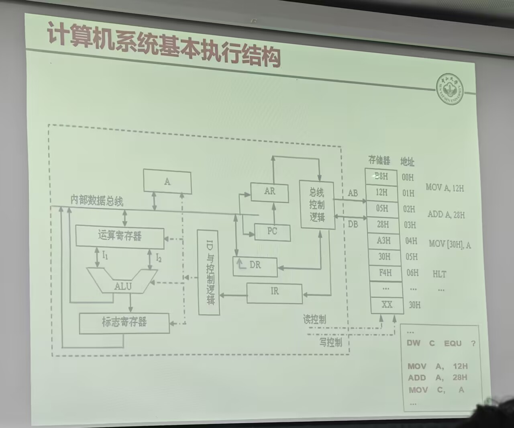
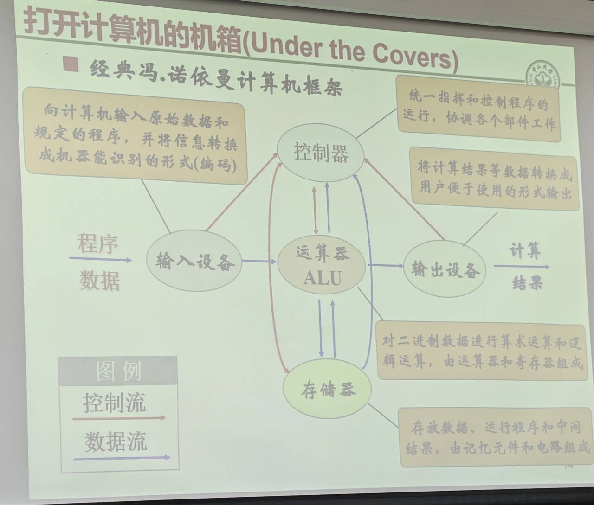
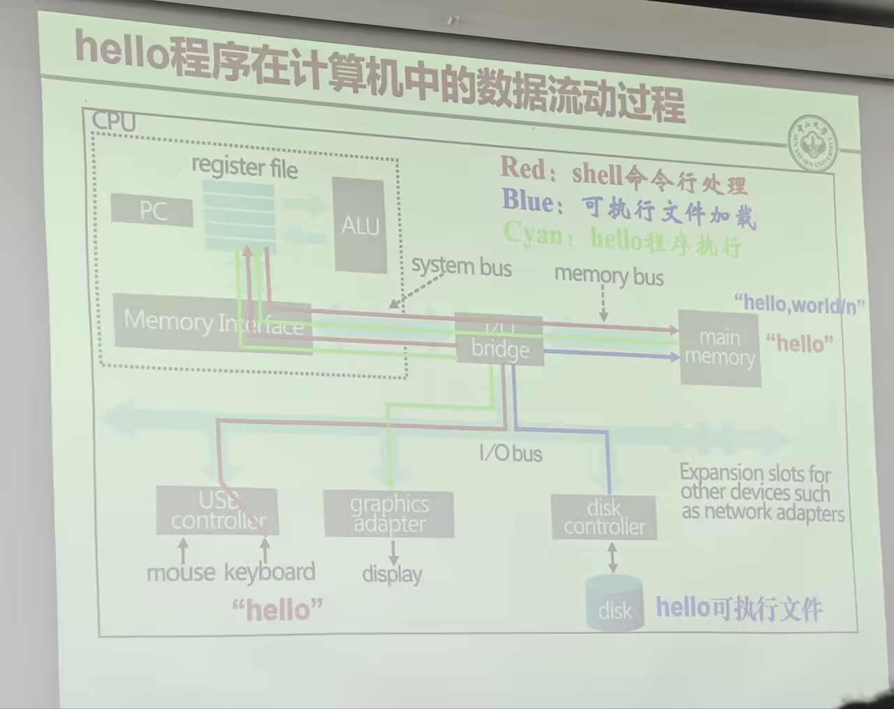

# 课程介绍
理论：作业40%，期末60%
实验课：1学分

课程内容：
- ch2-4 CPU
- ch5 存储器
- ch6 外部设备
- ch7 总线
# 1.1 引言
## 计算机简史
**计算模型**：图灵机模型，可计算计算机。

图灵机的结构：无限长的纸带+读写头+状态寄存器（运行/终止）+指令集

**物理器件**：二极管、晶体管 (Intel)

香农：二值数字电路

第一台电子计算机（ENIAC）

**大规模集成**：Jack 集成电路；Intel 微处理器4004

摩尔定律（每1.5年，芯片晶体管数目翻倍）

**存储程序**：

ENIAC 没有存储介质

冯·诺依曼：存储程序原理（有存储器，指令和数据以二进制存储）

**操作系统**：

1940s前没有操作系统

1964，IBM 360 大型机，OS/360 操作系统。

功能：管理硬件、软件资源

**互联网**：

**多媒体**：多模态

**人工智能**：计算机能否像人一样思考

1950 图灵测试：人与机器问答而无法分辨。

1996 IBM 深蓝 战胜象棋棋王

2011 沃森

2016 AlphaGo，战胜李世石、柯洁

Chatgpt, deepseek

> 第1章 计算机抽象及相关技术

# 1.1 引言

## 1.1.1 计算应用的分类及其特性

**计算机的分类**：
- **个人计算机**：单个用户，价格低廉，通常运行第三方软件
- **服务器**：为多用户运行使用 、执行大负载任务、常为需要加以定制、故障恢复代价高
- **超级计算机**：高端服务器、有上万个处理器组成，用于高端科学计算和工程计算
- **嵌入式计算机**：嵌入其他设备的计算机、运行预定义程序、对成本功耗可靠性要求高

## 1.1.2 欢迎来到后 PC 时代

- **个人移动设备**(PMD) 替代 PC
- **云计算** 替代传统服务器
## 1.1.3 你能从本书学到什么
硬软件组成部分
- 算法
- 编程语言、编译器、体系结构
- 处理器和存储系统
- IO系统（硬件和操作系统）
# 1.3 程序表象之下

硬软件层次结构：**硬件 → 系统软件 → 应用软件**，层层隐藏，上一层隐藏下一层（抽象）

**系统软件**：
- 操作系统：为了使程序更好地在计算机上运行的管理计算机资源的监控程序
- 编译器：将高级语言翻译为汇编语言的程序
- 汇编器：将汇编语言翻译为机器语言的程序
**硬件**：CPU、主存、IO、数字系统、电路设计

## 从高级语言到硬件语言

高级语言 →(编译器) 汇编语言 →(汇编器) 机器语言 →(连接 include) 可执行文件
→(从磁盘读到寄存器, 主存) → **逐条执行加载到内存中的二进制机器指令流**

*（PPT额外补充）*
$\bigstar$ **指令的执行过程**（重复操作，直至结束）：
- **取指阶段**：读取指令，指向下一条要执行的指令
- **执行阶段**：对指令译码，执行译码好的指令

常见汇编语言：
- `MOV A VAL`：将 VAL 的值移动到 A 寄存器中
- `ADD A VAL`：将 VAL 的值和 A 的值相加并放到 A 中
- `HLT`：停止 CPU 执行

- PC (Program Counter)：程序计数器，指向下一个要执行的指令的内存地址
- IR (Instruction Register)：指令寄存器，将当前指令内容存储
- AR (Address Register)：地址寄存器，当前指令的内存地址
- DR (Data Register)：数据寄存器
- AB (Address Bus), DB (Data Bus)：地址总线（总线到存储器单向）、数据总线（总线和存储器双向）
- ID (Instruction Decoder)：指令译码器，解释当前指令是做什么的

存储器是线性内存空间，从 0 开始编址，每条指令 2 字节
**指令执行过程**：
1. 初始，PC 从 00H 开始，传送到 AR，PC 指向 02H
2. 取出的指令传送到 IR，又由 ID 解释指令执行，将数据传到 DR
3. 在内部执行相应操作，然后重复下一条指令执行

# 1.4 机箱之内的硬件

ENIAC：电子管、靠电线重新连接来实现编写程序。

$\bigstar$ **存储程序原理**：将程序如同数据，将二进制存储在机器中，让计算机自动高速地从机器中逐条取出指令加以执行。

**存储程序思想**：
- 程序是指令的有序集合
- ...
- ALU执行指令，取出数据，得出结果

RAM →(数据) CPU；CPU →(已处理的数据) RAM

**冯诺依曼结构**：
- 输入设备、输出设备、运算器(运算器+寄存器)、控制器(指挥协调)、存储器(记忆元件+电路)。
- 之间有控制流、数据流
- 用二进制表示

现代计算机中，运算器和存储器包含在 CPU 里面

$\bigstar$ **冯诺依曼计算机特点**：
- 采用**二进制**表示机器指令和数据
- 硬件系统由运算器、控制器、存储器、输入设备、输出设备**组成**
- 程序和数据**存储**在存储器中，逐条指令执行
- 操作时根据指令执行顺序，从存储器中取出指令和数据，有控制器解释执行，运算器完成运算

**非冯诺依曼模型**：神经网络、基图算法、量子计算

电源、风扇、主板、内存条、硬盘、光驱

## CPU
处理器，Central Processing Unit
功能：执行程序
组成：
- 控制器（译码指令）
- 数据通路（执行指令，核心 ALU 计算逻辑单元 +Register 寄存器）

常用寄存器：32个
- GRS (General Register Set)：存放操作数和中间结果，以加快存储速度
- PC (Program Counter)：程序计数器，指向下一个要执行的指令的内存地址
- IR (Instruction Register)：指令寄存器，将当前指令内容存储

## 存储器
功能：存储程序和数据
组成：层次化结构
 - 内存 (Primary Memory)：
	 - Cache 高速缓存：在 CPU 内，存放最近使用的数据和指令，三级缓存
	 - MM 主存：存储被启动的程序中的部分程序和指令
- 外存 (Secondary ~)：磁盘、光盘、闪存
- 层次结构：
	- 寄存器 → 高速缓存 → 主存 → 硬盘/磁盘 → 磁带/光盘
	- 存储空间越来越大，访问频率越来越低，速度/延迟越来越慢，成本越来越便宜

## 总线
连接各个功能组件

# 1.6 性能
**基本指标**：速度、功耗、制造成本

**两种性能**：
- 响应时间 / 完成单个任务的时间：$响应时间 = 执行时间 + 等待时间$
- 单位时间完成的任务量：吞吐率、带宽
在不同领域、应用、层次结构对不同性能的侧重不同

[^1]: 
