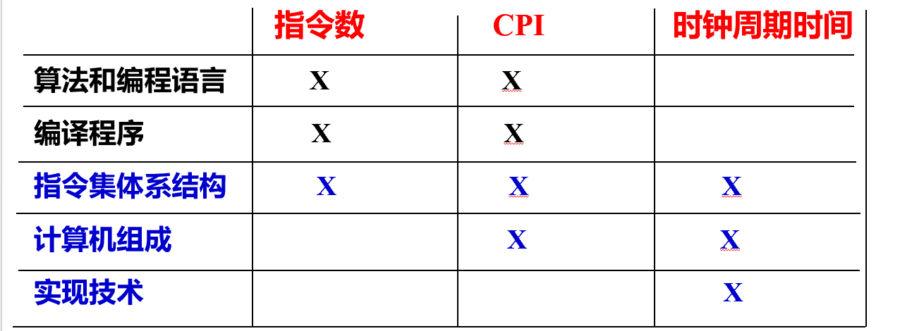
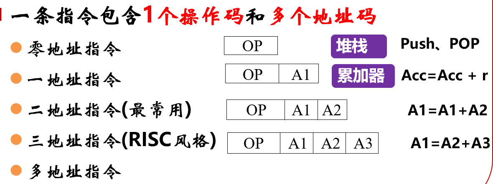

# 1.6 性能 (cont'd)

$响应时间=CPU时间+等待时间$

$CPU时间=用户CPU时间+系统CPU时间$

测算CPU性能一般是通过计算用户CPU时间来进行

## CPU 性能公式

常用 **CPU 时间** 来评价 CPU 性能

$\bigstar$ $\text{CPU Time} = 程序包含指令数量 \times \text{CPI} \times 时钟周期$

CPU 时间：包括用户 CPU 时间+系统 CPU 时间

时钟周期：硬件时钟产生的离散时间间隔

时钟频率 / 主频：时钟周期的倒数。主频越大，时钟周期越小。$$时钟周期 = \frac{1}{主频}$$

$\bigstar$ **CPI** (Clock Cycles Per Instruction)：平均每条指令所需的时钟周期数 
$$\text{CPI} = \sum_i \text{CPI}_i \times f_i$$，是所有类型指令按频率的加权平均值。

**影响以上三因素**：

- 算法不同：相同任务的指令数不同
- 编程语言不同：编译器生成的指令模式不同，影响 CPI
- 编程程序：优化好的话，总指令数就少；生成的指令类型不同，会影响平均 CPI
- 指令集体系结构 （ISA）：决定任务要用多少指令，还会影响 CPI，还影响电路实现
- 计算机组成：流水线等 → 降低 CPI。数据通路设计、并行度、寄存器数目 → 决定能否提高主频（缩短时钟周期时间）。
- 实现技术：半导体工艺能让晶体管更快，缩短时钟周期

计算机设计包括**指令集**设计与**计算机硬件**设计。

_（关系很复杂，指令数、CPI，时钟周期会相互影响，不是独立的）_

**MIPS**：每秒执行的指令数($10^6$) $$\text{MIPS} = \frac{指令总数}{执行时间 \times 10^6}$$
单凭MIPS判断性能不可靠，因为没有关注不同指令是否简单/复杂，所需的时钟数不同

**MFLOPS**：每秒执行的浮点指令数($10^6$)

**总执行时间**：所有程序所需时间按照频率的加权平均
（SPEC CPU Benchmark）
# 1.7  功耗
计算机功耗分为动态功耗、静态功耗

$动态功耗 \propto \frac{1}{2}CU^2 \times f$

$C$：负载电容、$U$ 工作电压、$f$ 开关频率

$静态功耗  \propto UI$

$U$ 工作电压、$I$ 泄漏电流

# 1.8 计算机的发展
**摩尔定律**：芯片上晶体管数量大约每 18–24 个月翻一番，硬件性能指数级提升。 → 强调硬件快速发展趋势。

**安迪–比尔定律（Andy–Bill’s Law）**  安迪给的（硬件性能红利），比尔拿走（软件膨胀消耗）。”→ 强调软件往往吃掉硬件的进步。

**内存墙定律**：CPU 性能提升远快于内存速度提升，最终程序性能受限于内存访问延迟。 → 强调存储瓶颈。

$\bigstar$ **Amdahl定律**：并行计算的加速比受限于程序中的串行部分：假设有 $P$ 部分可并行加速，有 $N$ 个处理器，那么加速比 $S(N) = \dfrac{1}{(1 - P) + \dfrac{P}{N}}$
- 即使处理器无限多，加速比最多也只有 $\frac{1}{1-P}​$。
- 启示：再多处理器也无法突破串行部分的限制，优化串行部分比加处理器更重要

**Gustafson定律**：任何足够大的任务均可被有效的并行化。很多程序随着应用规模的扩大，程序中不能被并行化部分的执行时间基本保持不变
- 推论：只要问题规模可扩展，并行所带来的加速比就可扩展

# 2.1 指令系统概述
**机器指令**：计算机实现某操作的命令

**指令系统**(Instruction System)：一台计算机所有指令的集合，是软件和硬件的接口和界面

指令系统的设计原则：完备性、有效性、规整性、兼容性

指令系统计算机 (Instruction Set Computer) 的**分类**：
- 复杂指令集计算机 (CISC)：出现早，大而全
	- 特点：系统复杂、指令周期很长、各种指令都能访问存储器、有专用寄存器、使用微程序控制、难以编译优化
	- 存在的问题：研制周期长、难以调试和维护、时钟周期长、性能低
- **精简指令集计算机 (RISC)**：Jock Cocke 提出、小而精
	- 特点：系统简化、寄存器-寄存器方式工作、指令周期短、使用大量通用寄存器、组合逻辑电路控制、采用优化的编译系统
	- 常用 RISC 指令集：ARM, MIPS, RISC-V

# 2.2 指令格式
**指令格式**：操作码 +地址码（操作对象+寻址方式）

**设计原则** 有很多！：

- **规整性**：指令长度（指令的二进制代码位数）
	- 定长指令字 (RISC) ：所有指令长度相同，向最长指令看齐。取指译码简单，浪费内存空间
	- 变长指令字 (CISC)：不同指令长度不同，灵活性更强，取指译码复杂。
- **有效性**：每条指令的操作码只有一个，代表一个指令

**操作码设计**：操作码一般不等长
- 编码方式：定长操作码法 (Fixed Length Opcodes)、变长/扩展操作码法 (Expanding Opcodes)
- 操作码长度和指令长度没有绝对关系
- 当前 RISC 常用定长指令字、变长操作码

**地址码设计**：地址码子段可以是 0 到多个，按需求而定
  

