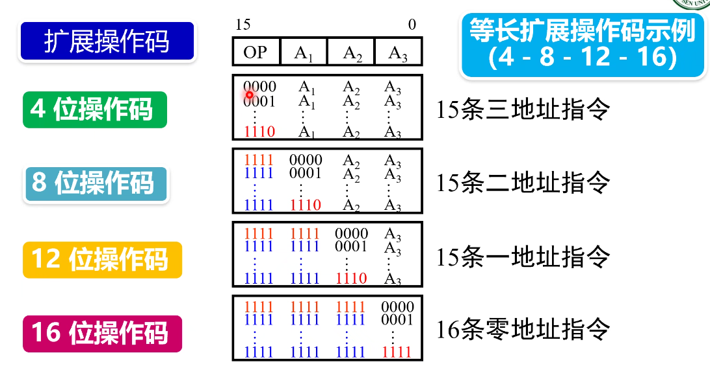

# 2.2 指令格式 (cont'd)

## 2.2.2 操作码设计 (cont'd)

$\bigstar$ **设计等长拓展操作码的示例**：

- 三地址指令：高四位 0000~**1110**
- 二地址指令：先用 1111 占位，然后第二个四位 0000~**1110**
- 一地址指令：先用 1111,1111 占位，然后第三个四位 0000~**1110**
- 零地址指令：先用 1111,1111,1111 占位，然后第四个四位 0000~**1111**

这样能够保证区分不同的指令。

拓展操作码的时候，每次需要拓展一个地址码的位域。

指令格式设计的**基本原则**：
- 指令尽量短
- 要有足够的操作码位数
- 指令编码必须具有唯一的解释
- 指令字长应是字节的整数倍
- 均衡设计、指令尽量规整
- 合理选择地址子段的个数

## 2.2.3 地址码结构

- 零地址指令 `OP`：无需操作数或操作数为默认
- 一地址指令 `OP A1`：单目运算，取反，取负，累加器
- 二地址指令 `OP A1 A2`：两操作数结果放到其中一个地址
- 三地址指令 `OP A1 A2 A3`：RISC 风格

地址字段数越多，硬件实现越复杂，程序指令数越短。

# 2.3 寻址方式

## 2.3.1 寻址方式的概念

**寻址方式**：寻找操作数所在位置的方法

寻址方式出现的目的：
- 扩大访问地址的范围
- 提高访问数据的灵活性和有效性

## 2.3.2 基本寻址方式

*没法单独考，会放在大题里面模拟*，可能会考非常规的寻址方式

|    寻址方式     | 解释                                                                                                       | 操作数/有效地址计算     | 优点                                                  | 缺点                                               |
| :---------: | -------------------------------------------------------------------------------------------------------- | -------------- | --------------------------------------------------- | ------------------------------------------------ |
|  **立即数寻址**  | 直接将操作数放在指令当中                                                                                             | $操作数 = A$      | - 指令执行时间短，无需访问内存  - 广泛使用                      | - 操作数的大小受子段长度的限制                                 |
| **存储器直接寻址** | 将操作数在存储器的地址放到指令当中                                                                                        | $EA = A$       | - 处理简单直接                                            | - 寻址空间收到指令的地址字段长度的限制  - 较少使用，在8位计算机或16位计算机 |
| **寄存器直接寻址** | 操作数在寄存器中，所在的寄存器的编号放到指令当中                                                                                 | $操作数 = (R)$    | - 只需要很短的地址字段  - 无需访问内存，速度快  - 使用最多，提高性能 | - 地址范围有限                                         |
| **存储器间接寻址** | 指令的地址码 $A1$ 指向存储器的地址，访存得到操作数的地址 $A2$，再次访存得到操作数 $Data$                                                    | $EA = (A)$     | - 寻址空间大，灵活，便于编程                                     | - 至少需要两次访存才能取到操作数  - 执行速度慢                 |
| **寄存器间接寻址** | 指令的地址码 $R_n$ 指向第 $n$ 个寄存器的地址，访存得到操作数的地址 $A$，再次访存得到操作数 $Data$                                             | $EA = (R)$     | - 比存储器间接寻址少访问内存一次  - 寻址空间大，使用比较普遍             | 额外存储器访问                                          |
|  **偏移寻址**   | 指令的地址码 $R_b$ 指向第 $b$ 个寄存器的地址，访存得到地址 $N$，再加上立即数 $A$ 得到 $N+A$，再次访存得到操作数 $Data$ 分为相对寻址、基址寻址、变址寻址         | $EA = A + (R)$ | 灵活                                                  | 复杂                                               |
|  **堆栈寻址**   | 堆栈是一个内存区域。 进程的区域中，栈区域从高到低地址扩展，堆区域（动态分配区）从低到高地址扩展。 堆栈指针是一个特殊寄存器，指向**栈**顶。 两个操作 PUSH/POP 会使指针减/加。 | $EA = SP$      | 指令短                                                 | 应用有限                                             |

**偏移寻址的三种类型：**

跳转指令的三个重要"坑点"，考试时会有具体的说明，灵活变通

$\bigstar$ **PC寻址**：下一条指令的地址相对于该条指令的地址码的偏移量。立即数 $A$ 代表跳过了多少条指令，他是一个有符号数。
- 起跳点是当前指令的下一条指令
- 偏移量指的是跳过的指令数而不是字节数，一般每条指令有 2字节。
- 因此目标地址就是 $PC + (1 + \Delta) \times bytes\_per\_instrc$
- 偏移量是一个有符号数，例如 8 位就是 $[-128, 127]$

常用于函数内部的分支、跳转指令

**基址寻址**：程序的头部地址放在基址寄存器当中，这个地址由操作系统确定，在程序执行过程中不会随意改变。

将文件基地址加上偏移量就得到相应函数的地址。

常用于函数之间的跳转指令。

**变址寻址**：数组头部地址放在变址寄存器当中，这个地址一般由用户设定，在程序执行过程中可变。

将数组基址加上偏移量就得到相应数组元素的地址。

常用于数组等顺序结构的访问。

**寻址方式的确定方式**：
- 在操作码中隐含寻址方式
- 显式给出寻址方式，放在寻址方式位里。

## 2.3.3 复合寻址方式和寻址方式实例

- 指令数等于 $2^{操作码位数}$
- 寄存器编码位数等于  $\log_2 \text{寄存器数}$
- $\bigstar$ 存储地址寄存器 $MAR$ 的位数等于 $\log_2 \text{不同的地址数} = \log_2 \frac{\text{主存地址空间大小 (byte)}}{字长 (byte)}$
- 存储数据寄存器 $MDR$ 的位数等于字长位数。