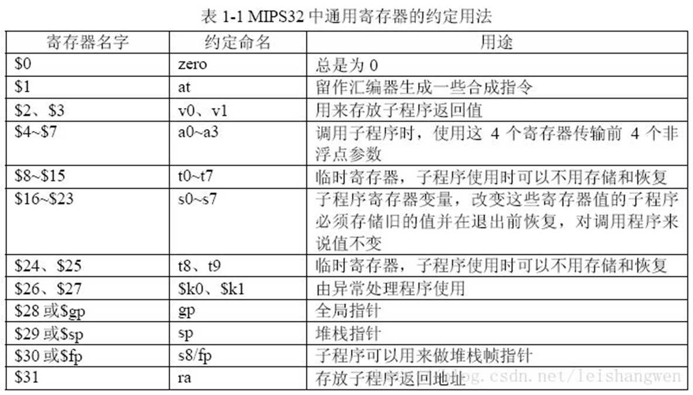
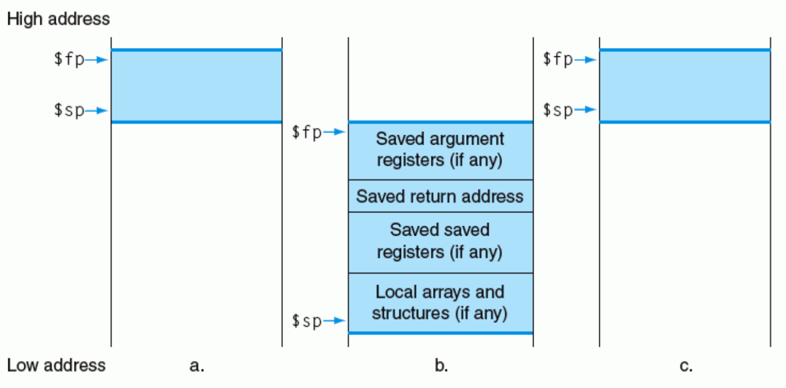
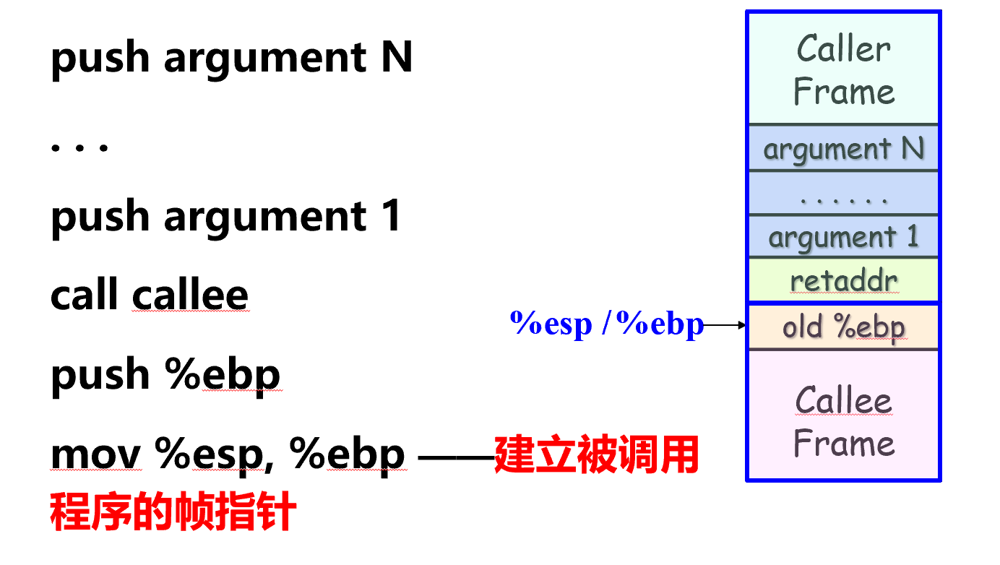
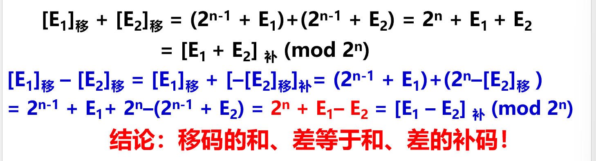
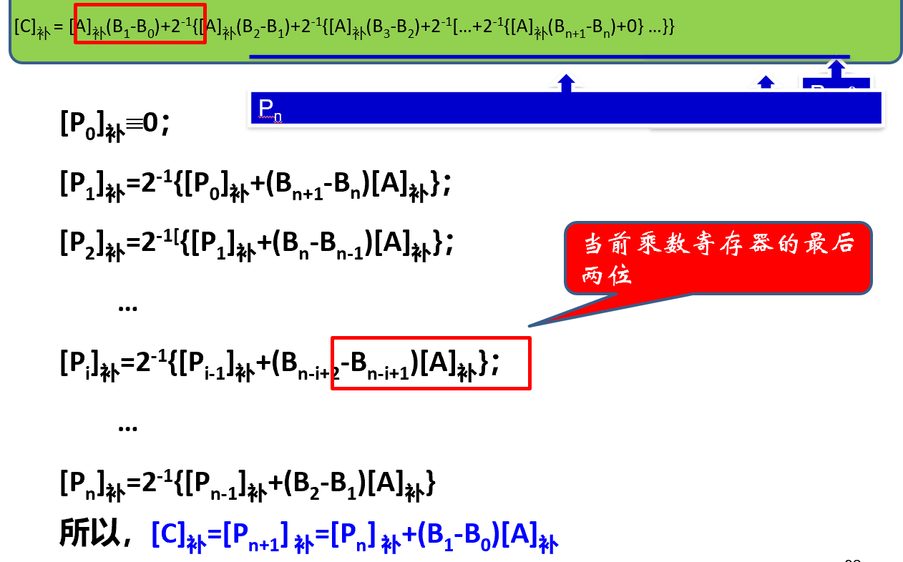
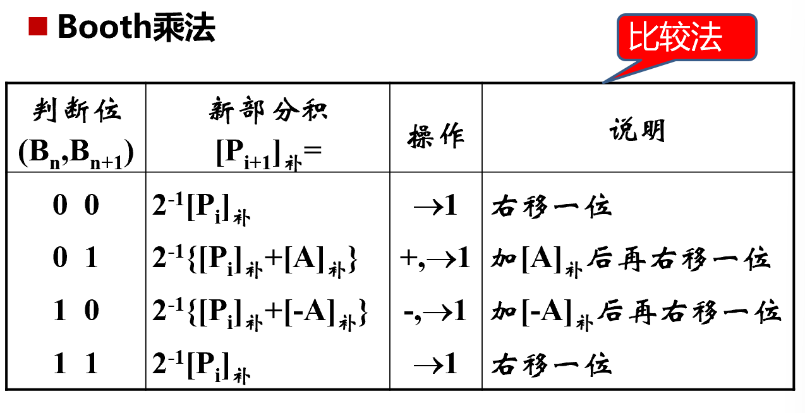
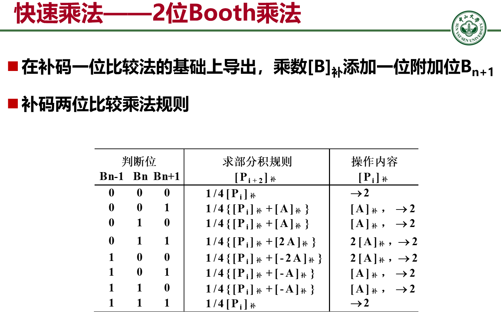
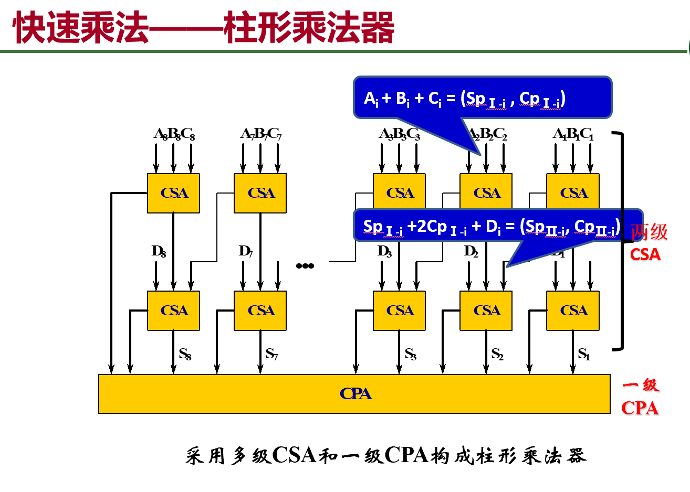

# 2.5 程序的机器级表示 (cont'd)
## 2.5.1 MIPS 指令系统介绍 (cont'd)

### 2. 寻址方式

MIPS32 体系结构中有 32 个寄存器，每个寄存器有不同的用途，二进制表示是 5 位。


## 3. 指令中的操作数

分为三种：
- 寄存器数据指定：
	- 32×32-bit FP Regs (f0 - f31, paired DP)
	- HI、LO、PC：特殊寄存器
- 存储器数据指定：
	- 只能通过Load/Store指令访问存储器数据
	- 字节编址，数据要求按边界对齐
	- Big Endian （大端方式）
	- 可访问空间： 232bytes=4GB
	- 访存地址通过一个32位寄存器内容加16位偏移量得到， 16位偏移量为有符号整数
- 立即数 / 文本 / 位

### 4. MIPS 指令类型

分为四种：
- 算术逻辑运算指令：`add, sub, multiply, divide, and, or, xor,….`
- 数据传输指令: `load, store`
- 条件分支指令：
	- 相等 / 不相等跳转：`beq`, `bne`
	- 小于 / 大于判断：`blt`, `bgt`, `ble`, `bge`（有对应汇编指令，无对应机器指令）
	- 比较结果由 `slt`, `slti` 产生
- 无条件跳转指令：
	- `j label`：直接跳转到目标地址
	- `jal label`：跳转到子程序，并保存返回地址到 `$ra`
	- `jr rs`：跳转到寄存器指定地址（一般用来返回）


条件分支指令中经常通过标志位来进行转移，常用的**标志位**有：
- `SF`：Negative
- `VF(OF)`：Overflow Flag（溢出标志）
	- 表示**有符号数**的运算结果是否超出范围
	- 如果有符号加法溢出（同号相加结果异号），则设为 `1`，否则为 `0`
	- 如果有符号减法溢出（异号相减，结果符号不对），则设为 `1`，否则为 `0`
- `CF`：Carry Flag（进位标志）
	- 表示**无符号数**的运算结果是否超出范围
	- 如果无符号加法产生进位，则设为 `1`，否则为 `0`
	- 如果无符号减法产生借位，则设为 `1`，否则为 `0`
- `ZR`：Zero Flag

### 用栈为函数调用分配空间



分配空间用栈实现。用帧指针 `$fp` 来保存子函数的寄存器地址。

在调用某个子函数的时候，首先更新 `$fp`，然后紧接着保存参数（从后往前）


`call callee`：压完参数后，最后将返回地址压入栈内。这时调用程序的任务完成，决定权从调用程序给了被调用程序。

`push %ebp`：保存旧的帧指针（为了返回时将帧指针返回回来）

### MIPS 内存布局

MIPS 的 32 位地址空间从 `0x00000000` 到 `0xFFFFFFFF`

| 区域                              | 功能             | 地址范围（典型值）                   | 特点                |
| ------------------------------- | -------------- | --------------------------- | ----------------- |
| **Reserved**                    | 保留区 / 操作系统内核空间 | `0x0000_0000 ~ 0x0040_0000` | 不能被用户程序访问         |
| **Text Segment**                | 程序代码段（指令）      | `0x0040_0000 ~ 0x1000_0000` | 存放可执行指令           |
| **Static Data Segment**         | 静态数据区（全局变量）    | `0x1000_0000 ~ 0x1001_0000` | 程序运行前就分配好         |
| **Dynamic Data Segment (Heap)** | 动态数据区（堆）       | `0x1001_0000 ~` 向高地址增长      | 用于 `malloc` 或动态分配 |
| **Stack Segment**               | 栈区             | 从高地址 `0x7FFF_FFFC` 向低地址增长   | 用于函数调用、局部变量       |
| **Kernel space**                | 内核代码 / 数据      | `0x8000_0000` 以上            | 用户态不可访问           |
```
0x0000_0000 ─► Reserved（保留）
0x0040_0000 ─► Text（代码） ← $pc
0x1000_0000 ─► Static Data（静态数据）
0x1000_8000 ─► $gp
     ↑
     │ Dynamic data (heap)
     ↓
0x7FFF_FFFC ─► Stack（栈顶） ← $sp
```

- 静态数据区（Static Data）大约在 `0x1000_0000 ~ 0x1000_FFFF`。
- `$gp` 取其中间值（`0x1000_8000`）方便前后各 32KB 偏移访问。


### 程序的翻译和启动执行

Complier, Assembler, Linker, Loader


# 3.1 概述：基本运算

## 3.1.1 按位运算

**按位与** `&`：用于提取二进制数中的指定位。

**按位或** `|`：用于特定位上的无条件赋值。

**按位取反** `~`：将所有位取反

**按位异或** `^`：将特定位取反，或者实现两数按位的比较

## 3.1.2 逻辑运算

**逻辑与** `&&`、**逻辑或** `||`、**逻辑非** `!`

按位运算结果是一个 01 串，逻辑运算结果是一个逻辑值。

## 3.1.3 移位运算

| 运算类型        | 功能        | 最高位   | 最低位   | 移位操作              | 溢出判断                                  |
| ----------- | --------- | ----- | ----- | ----------------- | ------------------------------------- |
| 算术左移 / 补码左移 | 向高位移动特定位数 | 移出    | 补 `0` | `[signed] << k`   | 若移出的位不等于新的符号位即 $CF \oplus SF = 1$，则溢出 |
| 逻辑左移        | 向高位移动特定位数 | 移出    | 补 `0` | `[unsigned] << k` | 高位移出了 `1`                             |
| 算术右移 / 补码右移 | 向低位移动特定位数 | 补原符号位 | 移出    | `[signed] >> k`   | 不溢出但可能数据丢失                            |
| 逻辑右移        | 向低位移动特定位数 | 补 `0` | 移出    | `[unsigned] >> k` | 不溢出但可能数据丢失                            |

算术右移对于负数补码，得到的结果会**向负无穷取整**而不是向零取整。

如 -3 (`11111101`) 算术右移 1 位得到 -2 (`11111110`) 而不是 -1.

移位运算既可以看作是数学意义上的运算（算术运算），也可以看作是位上的逻辑操作（逻辑运算）

## C 语言中的基本运算


**位扩展和位截断**：发生在强制类型转换时。

| 操作类型 | 操作数  | 操作形式    | 风险        |
| ---- | ---- | ------- | --------- |
| 位扩展  | 无符号数 | 高位补 `0` |           |
| 位扩展  | 有符号数 | 高位补原符号位 |           |
| 位截断  |      | 直接截去高位  | 可能会发生数据溢出 |

有符号数和无符号数加入寄存器的时候，有符号数需要用符号位填充高位（符号扩展），无符号数需要用 `0` 填充高位（0 扩展）

# 3.2 加法和减法

## 原码二进制加法

原则：符号位和数值位分别处理

**同号相加**：数值位相加，符号位不变。若最高位进位则溢出。

**异号相加**：负数取补码与正数相加。此时必然不会溢出。
- 若最高位产生进位，则结果为正数。
- 若最高位没有产生进位，则结果为负数的补码，需要再求补得到结果。
- 原理：对于数值位 $A, B$，其中 $B$ 符号位为 `1`。我们有 $B + [B]_补 = 2^{n + 1}$，那么 $A + [B]_补 = A - B + 2^{n + 1}$，因此如果有进位就是准确的，没有进位就是形成了 $[B - A]_{补} = 2^{n + 1} - [B - A]$ 的形式，需要求补后才能得到准确的值。


## 移码加减运算

移码的加减法：



## 3.3 乘法和除法

### 补码一位乘法

对于 $C = A \times B$，其中 $A, B$ 是定点小数，被乘数采用两位符号位 $A_{01} A_{02}$，乘数的采用一位符号位 $B_0$.

被乘数采用模四补码 $[A] = 2^2 + A \pmod 4$，乘数采用一位补码 $[B] = 2 + B \pmod 2$.

若 $A<0$，则 $[A] = 11.A_0^\sim A_1^\sim A_2^\sim \cdots$，若 $A > 0$，则 $[A] = 00.A_0A_1A_2\cdots$

若 $B<0$，则 $[B] = 1.B_0^\sim B_1^\sim B_2^\sim \cdots$，若 $B > 0$，则 $[B] = 0.A_0A_1A_2\cdots$


| $A$       | $B$       | $[A]\times[B]$                                                                                                                                                                                                        |
| --------- | --------- | --------------------------------------------------------------------------------------------------------------------------------------------------------------------------------------------------------------------- |
| $A \ge 0$ | $B \ge 0$ | $[A] = A, [B] = B$                                                                                                                                                                                                    |
| $A < 0$   | $B \ge 0$ | $[A] \equiv 2^{2} + A \equiv 2^{n + 2} + A \pmod 4$<br>$[A]\times [B] \equiv [A] \times B \equiv (2^{n+2}+A)B \equiv 2^2 + AB  = [AB]\pmod 4$<br>其中 $2^{n+2}B$ 是 $4$ 的倍数，可约去                                          |
|           | $B < 0$   | $B = [B] - 2 = 0.B_1^~B_2^~B_3^~\cdots - 1$（这里 $B_i$ 是补码）<br>$\begin{aligned}\ [AB] &= [A(0.B_1^~B_2^~B_3^~\cdots) - A] = [A]\times 0.B_1^~B_2^~B_3^~\cdots + [-A] \\&= [A] \times [B]_{mantissa} +[-A]\end{aligned}$ |
|           |           | $[AB] = [A] \times [B]_{mantissa} + [-A] \times B_0$                                                                                                                                                                  |









## 3.4 除法运算

# 3.5 浮点数运算

浮点数加减法（阶码对齐，注意溢出的问题）