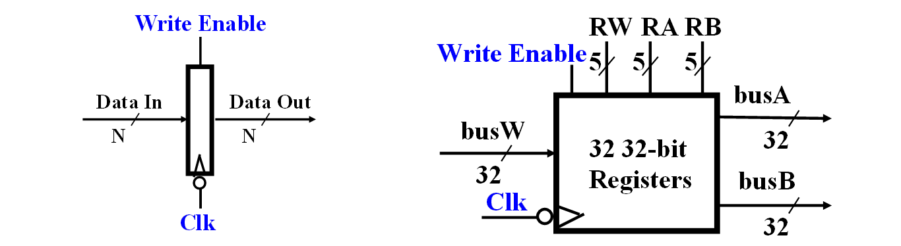
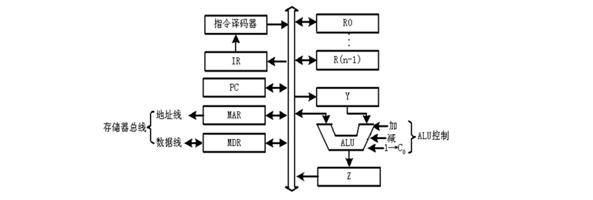
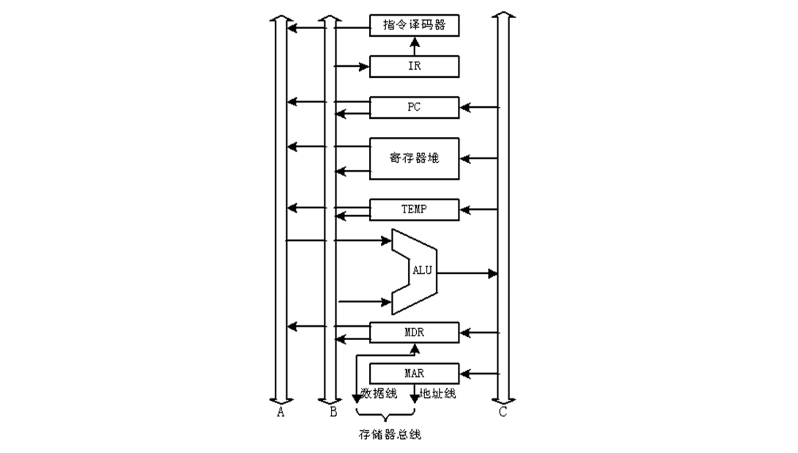
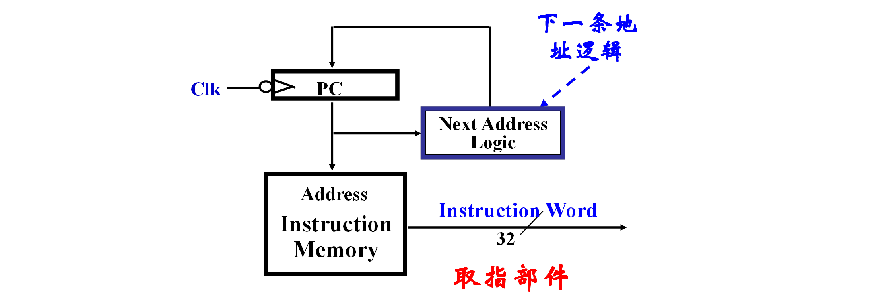
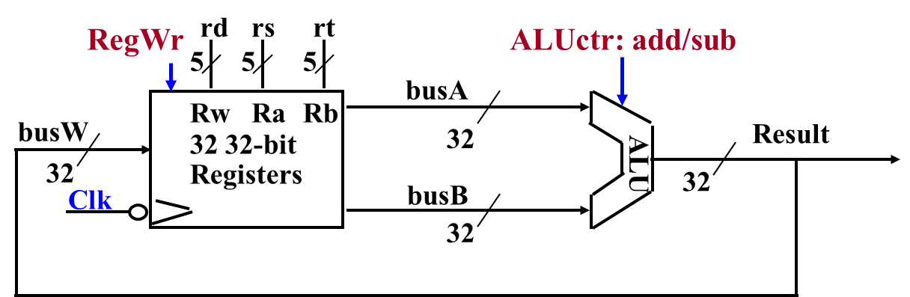
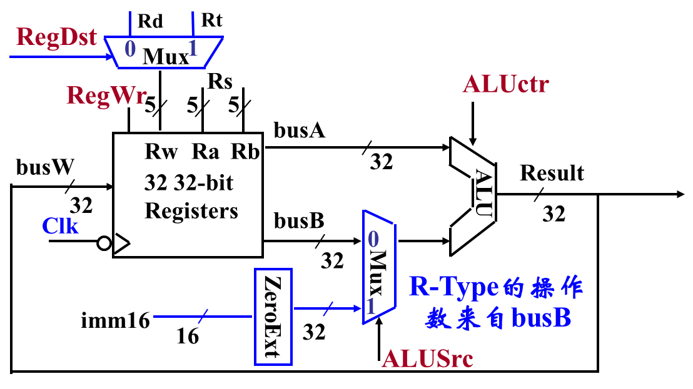
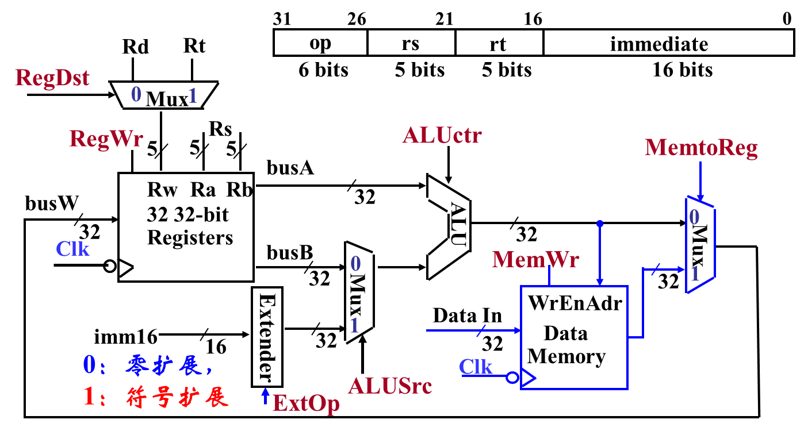
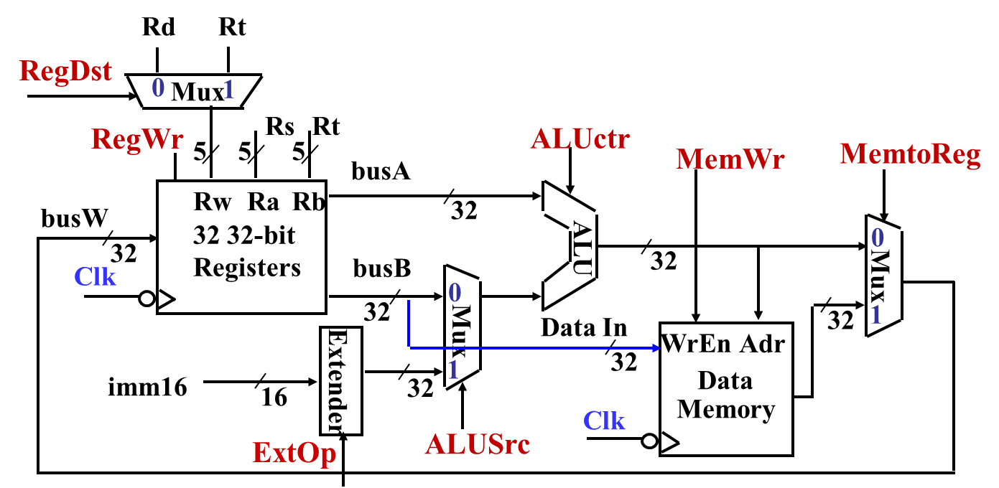
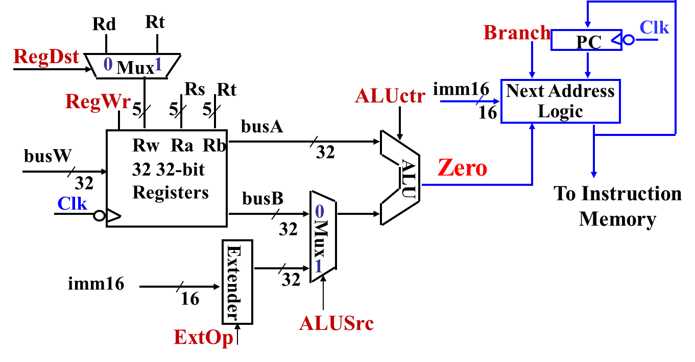
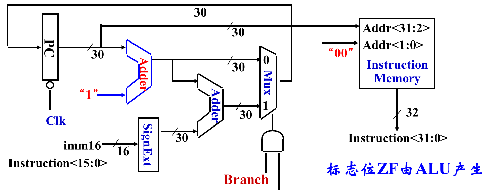

考压轴题（20'），对数据通路的各个阶段很了解，将通路映射到流程图上、对于每个指令对应的数据通路非常清楚，考察非常灵活
# 4.1 概述

计算机的处理器中，有数据通路和控制器两部分：
- **数据通路 / 运算器**：指令执行过程中，数据通过的路径，是指令的执行部件。
- **控制器**：对指令译码，生成控制信号，控制数据通路，对指令执行部件发出控制信号。

**控制器的基本功能**：
- 取指令：将指令从存储器中读入（PC）
- 分析指令：对指令译码（IR）
- 执行指令，发出各种操作命令（REGs 和 ALU）
- 确定下一条指令的地址（PC）
- 执行环境的建立和保护：建立程序运行所需的状态，并在中断、切换或异常时保存和恢复这些状态（FLAGs / PSW）

| 缩写          | 全称                          | 中文名称          | 主要功能          |
| ----------- | --------------------------- | ------------- | ------------- |
| PC          | Program Counter             | 程序计数器         | 指示下一条指令地址     |
| IR          | Instruction Register        | 指令寄存器         | 保存当前指令并译码     |
| REGs        | Registers                   | 通用寄存器组        | 暂存操作数与结果      |
| ALU         | Arithmetic Logic Unit       | 算术逻辑运算单元      | 执行运算操作        |
| FLAGs / PSW | Flags / Program Status Word | 标志寄存器 / 程序状态字 | 记录运算状态、控制执行环境 |
# 4.2 逻辑设计规则

**数据通路**由两类部件通过**总线式连接或分散式连接**而成：
- 组合逻辑元件 / 操作元件（ALU）
- 存储元件 / 状态元件（寄存器、指令存储器、数据存储器）

**数据通路的功能**：数据存储、处理、传送。

数据通路由「**状态原件 + 操作原件 + 状态原件**」组成，其中状态原件存储信息，操作原件处理信息，将输出信息写入另一个状态原件中。并且由**时序信号**控制操作。

## 操作元件

**操作元件**：加法器 (Adder)、多路选择器 (MUX)、算术逻辑部件 (ALU)、译码器 (Decoder)

它们都是组合逻辑元件，**特点**：
- 输出只取决于当前输入
- 无需时钟信号定时，只有逻辑门延迟。

## 状态元件 / 存储元件

状态元件都是时序逻辑电路，**特点**：
- 具有存储功能，在时钟控制下，输入状态写入，直至下一个时钟信号到达
- 输出端状态随时可读出
- 通常是边缘触发：分为上升沿触发和下降沿触发。

### 寄存器 (Register)

| 信号名              | 位宽    | 方向  | 含义              |
| ---------------- | ----- | --- | --------------- |
| **Data In**      | N bit | 输入  | 要写入寄存器的新数据      |
| **Data Out**     | N bit | 输出  | 要写入寄存器的新数据      |
| **Write Enable** | 1 bit | 输入  | 写使能信号，=1 时允许写操作 |
| **Clk**          | 1 bit | 输入  | 时钟信号，上升沿触发写入    |

### 寄存器组 (Register File)
- 共有 32 个寄存器 (Register 0 ~ 31)，地址码需要 5 位。
- **时序逻辑写入**：当 Write Enable = 1 且时钟上升沿到达时，在 busW 中的数据会写入 RW 对应的寄存器中。所有写入的信号需要提前稳定一段时间 (Setup Time) 才能正确写入。经过一个 Clk-to-Q 时间的实现，输入信号写入寄存器。用 32-to-1 Decoder 来实现。 
- **组合逻辑读出**：busA, busB 立即取出读入地址 RA, RB 对应的数据（无需在时钟前稳定一段时间），经过一个**取数时间** (Access Time) 后才有效（组合逻辑立即完成的）。用两个32 位 MUX 来实现。

| 信号名              | 位宽     | 方向  | 含义                      |
| ---------------- | ------ | --- | ----------------------- |
| **RA**           | 5 bit  | 输入  | 指定要读出的第一个寄存器编号（对应 busA） |
| **RB**           | 5 bit  | 输入  | 指定要读出的第二个寄存器编号（对应 busB） |
| **RW**           | 5 bit  | 输入  | 指定要写入的寄存器编号             |
| **busA**         | 32 bit | 输出  | 输出 RA 对应寄存器的内容          |
| **busB**         | 32 bit | 输出  | 输出 RB 对应寄存器的内容          |
| **busW**         | 32 bit | 输入  | 要写入 RW 指定寄存器的值          |
| **Write Enable** | 1 bit  | 输入  | 写使能信号，=1 时允许写操作         |
| **Clk**          | 1 bit  | 输入  | 时钟信号，上升沿触发写入            |

## 指令的基本操作

每条指令可以分解为若干**基本操作**：
- 读取主存单元内容，装入某个寄存器
- 将某个寄存器的内容存入给定主存单元中
- 将一个数据从一个寄存器送到另一个寄存器 / ALU
- 进行某种 算术或逻辑运算，将结果送入某个寄存器

寄存器传输语言 (Register Transfer Language, **RTL**) 语法：
- `R[r]`：寄存器 $r$ 的内容
- `M[addr]`：主存单元中 $addr$ 的内容
- `←`：传送方向，从右到左
- `PC`：Program Counter，程序计数器
- `OP[data]`：对数据 $data$ 进行 $op$ 操作

## 早期累加器型指令数据通路

- **程序控制单元**：

| 元件                               | 全称       | 功能                   |
| -------------------------------- | -------- | -------------------- |
| PC（Program Counter）              | 程序计数器    | 保存**下一条指令的地址**       |
| MAR（Memory Address Register）     | 存储器地址寄存器 | 暂存要访问的**主存地址**       |
| MBR（Memory Buffer Register）      | 存储器缓冲寄存器 | 暂存从内存读出的或要写回的数据      |
| IR（Instruction Register）         | 指令寄存器    | 保存当前正在执行的指令          |
| IBR（Instruction Buffer Register） | 指令缓冲寄存器  | 暂存下一条指令（某些机器一次取两条指令） |
- **算术逻辑单元**：

| 元件                             | 功能            |
| ------------------------------ | ------------- |
| AC（Accumulator）            | 累加器，保存运算的中间结果 |
| MQ（Multiplier Quotient）    | 乘/除法时暂存寄存器    |
| ALU（Arithmetic Logic Unit） | 执行算术和逻辑运算     |

- **主存储器** (Memory, M)，存放程序和数据，按地址访问，通过 MAR / MBR 与 CPU 交互。

**数据通路的两大阶段**：都是「取指 → 译码 → 取数 → 运算 → 写回」的模式，数据依次流经 **PC → MAR → MBR → IR/AC/ALU → M**。

|阶段|数据通路描述|关键寄存器|
|---|---|---|
|取指令|PC → MAR → M → MBR → (IBR, IR)|PC, MAR, MBR, IR|
|执行指令|M → MBR → ALU ← AC → MBR → M|MAR, MBR, AC, ALU|
## 单总线数据通路

**单总线结构**：
- 所有寄存器、ALU、PC、IR 等共用一条数据总线。
- 同一时刻只有一个寄存器将内容送上总线 (`Rout`)，一个寄存器从总线取数据 (`Rin`)

**四种基本操作时序**：

| 类型     | 示例           | 控制信号序列（时序）                                                | 含义       | 时钟周期数                            |
| ------ | ------------ | --------------------------------------------------------- | -------- | -------------------------------- |
| 寄存器间传送 | R0 → Y       | R0out, Yin                                                | 把R0内容送入Y | $1$ 个周期                          |
| 算术逻辑运算 | R3 ← R1 + R2 | (1) R1out, Yin (2) R2out, Add, Zin (3) Zout, R3in   | 用ALU执行加法 | $3$ 个周期                          |
| 从主存取字  | R2 ← M[R1]   | (1) R1out, MARin (2) Read, *WMFC* (3) MDRout, R2in  | 访存读操作    | $\ge 3$ 个周期 其中 Read 可能需要多个周期  |
| 写字到主存  | M[R1] ← R2   | (1) R1out, MARin (2) R2out, MDRin (3) Write, *WMFC* | 访存写操作    | $\ge 3$ 个周期 其中 Write 可能需要多个周期 |

其中 **WMFC** (Wait Memory Function Complete) 表示等待主存取出 / 写入数据完毕。实现方式：

| 方式       | 时期  | 特点                                                                                 | 是否需要应答信号                           |
| -------- | --- | ---------------------------------------------------------------------------------- | ---------------------------------- |
| **异步方式** | 早期  | CPU 与内存速度不匹配，CPU 需等待内存完成                                                           | **MFC (Memory Function Complete)** |
| **同步方式** | 现代  | 使用 Cache 访存，大部分操作都能命中 Cache，因此可以按照固定 $N$ 个时钟周期运行。 未命中时，暂停若干个时钟周期等待（多周期 / stall） | 不需要                                |

**时钟周期宽度的确定**：
- 时钟周期宽度等于系统中执行**最慢**的微操作的所需时间。
- 如果没有 Cache，直接访存，则以主存访问时间为准 (`Read / Write`)
- 如果有 Cache，同步工作，则以 CPU 内部寄存器 / ALU 操作时间为准。

**寄存器与总线连接电路**：

- `Rin` 控制**多路选择器**：若为 `1` 则将总线数据送到 D 触发器，否则将 `Q` 原样送到 D 保持器，即保持。
-  `Rout` 控制三态门：若为 `1` 则打开，将 D 触发器的输出送到主线，否则断开。
- 时钟控制同步更新

## 三总线数据通路

使用多条总线，就可以在同一时钟周期，并行传送不同的数据。

| 总线编号     | 功能       | 连接方向                 |
| -------- | -------- | -------------------- |
| **A 总线** | 传送第一个操作数 | 从寄存器堆 → ALU 输入端 A    |
| **B 总线** | 传送第二个操作数 | 从寄存器堆 → ALU 输入端 B    |
| **C 总线** | 传送运算结果   | 从 ALU 输出 → 寄存器堆、存储器等 |

相比于单总线数据通路：
- Y， Z 寄存器可以取消，因为不再需要保存中间结果。
- 寄存器需要支持同时输出两个数据，并且同时接受一个结果，因此要求寄存器具有多个读口和一个写口。

缺点：
- 硬件复杂，成本高（多路驱动、多口寄存器）
- 难以实现指令流水线

现代 CPU 普遍采用**流水线和 Cache** 提升性能。

# 4.3 数据通路的建立

## 取指部件 (Instruction Fetch Unit)
每条指令都会有的公共操作。
1. 取指令：`M[PC]`
2. 更新 PC：
	- 如果是转移指令，则 `PC <- 转移目标地址`
	- 否则，`PC <- PC + 4`.

对于各种指令的流程非常清楚
## 加减指令（Add, Sub）

**格式**：
**指令执行流程（`add/sub rd rs rt`）**

| 指令                        | 解释                |
| ------------------------- | ----------------- |
| `M[PC]`                   | 取指令               |
| `R[rd] <- R[rs] op R[rt]` | 取数相加/减，将结果写入对应寄存器 |
| `PC <- PC + 4`            | PC 指向下一条指令        |

**指令执行阶段的数据通路**：

- **ALUctr**（ALU Control，算数单元控制信号）：告诉 ALU 这一条指令应该执行哪种运算（功能码）。在这里 `ALUctr = add / sub`.
- **RegWr** (Register Write Enable，寄存器写使能信号)：告诉寄存器堆是否要在本周起进行写操作。在这里 `RegWr = 1`.

## 带立即数的逻辑指令

**格式**：
**指令执行流程（`ori rt rs imm16`）**：

| 指令                                 | 解释                       |
| ---------------------------------- | ------------------------ |
| `M[PC]`                            | 取指令                      |
| `R[rt] <- R[rs] op ZeroExt(imm16)` | 取数，立即数**零扩展**，取或，写入对应寄存器 |
| `PC <- PC + 4`                     | PC 指向下一条指令               |
- **ZeroExt**（Zero Extension，零扩展）：高 16 位全部补零，低 16 位不变，用于无符号数。
- **SignExt**（Sign Extension，符号扩展）：高 16 位全部补符号位（`imm16[15]`），低 16 位不变，用于有符号数。

**指令执行阶段的数据通路**：

| 信号名        | 全称                    | 含义                                     | `ori` 时取值 |
| ---------- | --------------------- | -------------------------------------- | --------- |
| **ALUSrc** | ALU Source            | 选择 ALU 的第二个输入： `0 → busB`，`1 → 立即数` | `1`       |
| ALUctr     | ALU Control           | 控制 ALU 执行何种操作                          | `"OR"`    |
| **RegDst** | Register Destination  | 控制写回哪个寄存器： `0 → rt`，`1 → rd`        | `0`       |
| RegWr      | Register Write Enable | 是否允许写回寄存器堆                             | `1`       |

## 访存指令中的数据装入指令（Load Word）

**格式**：

**指令执行流程（`lw rt rs imm16`）：**

| 指令                               | 解释                        |
| -------------------------------- | ------------------------- |
| `M[PC]`                          | 取指令                       |
| `Addr <- R[rs] + SignExt(imm16)` | 取基地址，立即数进行符号扩展，相加，写入地址寄存器 |
| `R[rt] <- M[Addr]`               | 从存储器中取出数据，装入到寄存器当中        |
| `PC <- PC + 4`                   | PC 指向下一条指令                |

**指令执行阶段的数据通路**：

| 控制信号         | 全称                  | 相关指令               | 取值含义                                    | 取值  |
| ------------ | ------------------- | ------------------ | --------------------------------------- | --- |
| **ExtOp**    | Extension Operation | `SignExt(imm16)`   | 0 → 零扩展 (ZeroExt) 1 → 符号扩展 (SignExt) | `1` |
| **MemWr**    | Memory Write Enable | `R[rt] <- M[Addr]` | 0 → 读存储器 1 → 写存储器                    | `0` |
| **MemtoReg** | Memory to Register  | `R[rt] <- M[Addr]` | 0 → 来自 ALU 输出 1 → 来自 Memory 输出       | `1` |
## 访存指令中的存数指令（Store Word）
**格式：**
**指令执行流程（`sw rt rs imm16`）：**

| 指令                               | 解释                        |
| -------------------------------- | ------------------------- |
| `M[PC]`                          | 取指令                       |
| `Addr <- R[rs] + SignExt(imm16)` | 取基地址，立即数进行符号扩展，相加，写入地址寄存器 |
| `M[Addr] <- R[rt]`               | 将寄存器中的内容存到内存单元            |
| `PC <- PC + 4`                   | PC 指向下一条指令                |

**指令执行阶段的数据通路**：

## 分支指令（Branch if Equal）
**格式：**
**指令执行流程（`beq rt rs imm16`）：**

| 指令                                    | 解释              |
| ------------------------------------- | --------------- |
| `M[PC]`                               | 取指令             |
| `Cond <- R[rs] - R[rt]`               | 将两寄存器的内容做减法     |
| `if (COND eq 0):`                     | 如果结果为零          |
| `PC <- PC + 4 + (SignExt(imm16) * 4)` | 转移执行：计算跳转的地址    |
| `else:`                               | 否则              |
| `PC <- PC + 4`                        | 顺序执行：PC 指向下一条指令 |

**指令执行阶段的数据通路**：
**下一条地址计算逻辑（Next Address Logic）的设计**：
由于 MIPS 按照字节编址，每条指令 4 个字节，因此 PC 总是 4 的倍数，可以不计低 2 位。
- 顺序执行：`PC[31:2] <- PC[31:2] + 1`
- 转移执行：`PC[31:2] <- PC[31:2] + 1 + SignExt(imm16)`
- 取指令 ：`M[PC[31:0)`

**Next Address Logic 的电路图**：
## 无条件转移指令（Jump）
**格式：**

**指令执行流程（`j target`）：**

| 指令                                      | 解释                                      |
| --------------------------------------- | --------------------------------------- |
| `M[PC]`                                 | 取指令                                     |
| `PC[31:2] <- [PC[31:28], target[25:0)` | 将 PC 高 4 位与 target 拼接，得到跳转地址 **（绝对寻址）** |

**指令执行阶段的数据通路**：
## 最终数据通路
