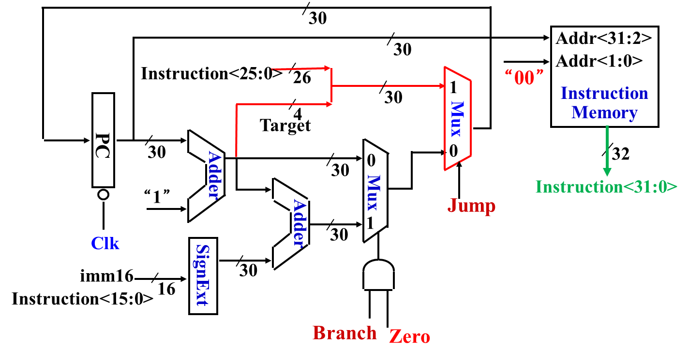
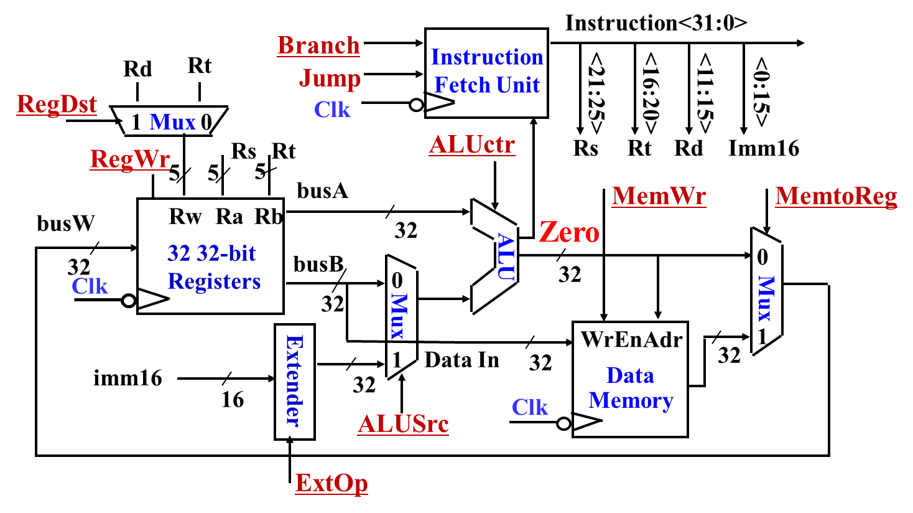
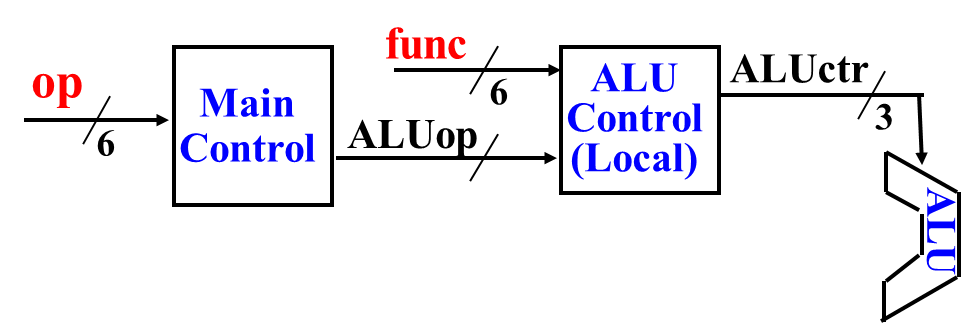
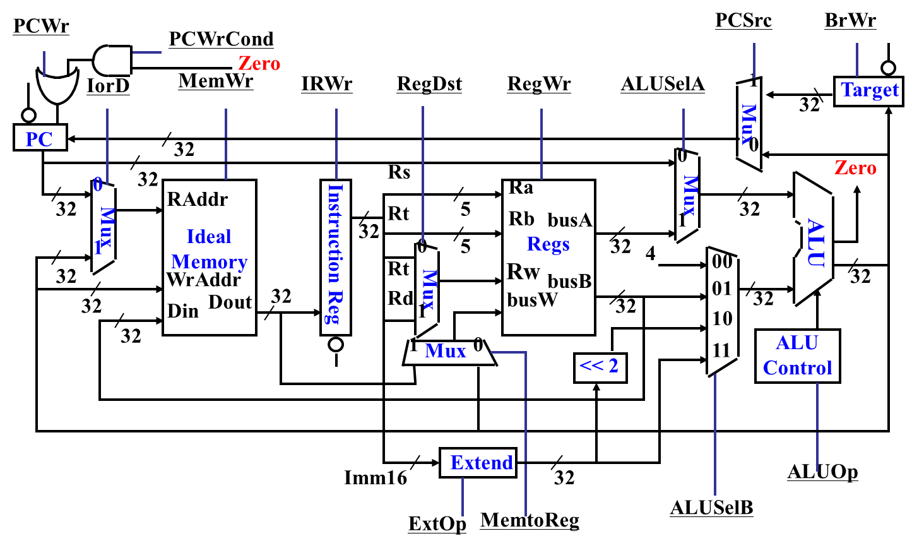
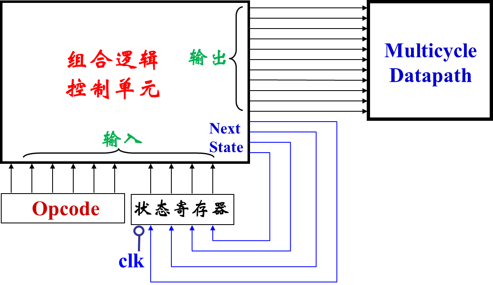

每个阶段不同信号的设置，容易忽略写使能信号
# 4.4 单周期控制器的实现

回顾**Next Address Logic 的电路图**：

回顾**最终数据通路**：

## 指令数据通路

| 指令（`add/sub rd rs rt`）    | 数据通路                                                            | 指令延迟                                                                           |
| ------------------------- | --------------------------------------------------------------- | ------------------------------------------------------------------------------ |
| `M[PC]`                   | `PC -> InstMem -> Inst -> rs,rt,rd`                          | `PC` 存在 Clk-to-Q 延迟 `InstMem` 存在 Access Time 延迟                             |
| `R[rd] <- R[rs] op R[rt]` | `rs,rt,rd -> REGs -> busA,busB -> ALU(add/sub) -> busW -> REGs` | `ALUctr,RegWr` 存在控制逻辑延迟 `busA,busB` 存在 Access Time 延迟 `busW` 存在 ALU 计算延迟 |
| `PC <- PC + 4`            | `PC[31,2],1 -> Adder -> PC`                                     | `Adder` 存在计算延迟                                                                 |

| 指令（`ori rt rs imm16`）              | 数据通路                                                                                      |
| ---------------------------------- | ----------------------------------------------------------------------------------------- |
| `M[PC]`                            | `PC -> InstMem -> Inst -> rs,rt,imm16`                                                    |
| `R[rt] <- R[rs] op ZeroExt(imm16)` | `rs -> REGs -> busA` `imm16 -> Extender` `busA,Extender -> ALU(or) -> busW -> REGs` |
| `PC <- PC + 4`                     | `PC[31,2],1 -> Adder -> PC`                                                               |

| 指令（`lw rt rs imm16`）             | 数据通路                                                                           | 指令延迟（最长）                                                             |
| -------------------------------- | ------------------------------------------------------------------------------ | -------------------------------------------------------------------- |
| `M[PC]`                          | `PC -> InstMem -> Inst -> rs,rt,imm16`                                         | `PC` 存在 Clk-to-Q 延迟 `InstMem` 存在 Access Time 延迟 逻辑生成各项控制信号存在延迟 |
| `Addr <- R[rs] + SignExt(imm16)` | `rs -> REGs -> busA` `imm16 -> Extender -> busB` `busA,busB -> ALU(add)` | `busA` 存在寄存器 Access Time 延迟 `busB` 存在延迟 `ALU` 计算延迟             |
| `R[rt] <- M[Addr]`               | `ALU(add) -> DataMem(Read) -> busW -> REGs`                                    | `DataMem` 存在 Access Time 延迟                                          |
| `PC <- PC + 4`                   | `PC[31,2],1 -> Adder -> PC`                                                    | `Adder` 存在计算延迟                                                       |

| 指令（`sw rt rs imm16`）             | 数据通路                                                                       |
| -------------------------------- | -------------------------------------------------------------------------- |
| `M[PC]`                          | `PC -> InstMem -> Inst -> rs,rt,imm16`                                     |
| `Addr <- R[rs] + SignExt(imm16)` | `rs -> REGs -> busA` `imm16 -> Extender` `busA,Extender -> ALU(add)` |
| `M[Addr] <- R[rt]`               | `ALU(add),busB -> DataMem(Write)`                                          |
| `PC <- PC + 4`                   | `PC[31,2],1 -> Adder -> PC`                                                |

| 指令（`beq rt rs imm16`）                 | 数据通路                                                                                      |
| ------------------------------------- | ----------------------------------------------------------------------------------------- |
| `M[PC]`                               | `PC -> InstMem -> Inst -> rs,rt,imm16`                                                    |
| `Cond <- R[rs] - R[rt]`               | `rs,rt -> REGs -> busA,busB -> ALU(sub) -> ZR`                                            |
| `if (COND eq 0):`                     | `MUX(Branch and ZR)`                                                                      |
| `PC <- PC + 4 + (SignExt(imm16) * 4)` | `PC[31:2],1 -> Adder_1` `imm16 -> SignExt` `Adder_1,SignExt -> Adder_2 -> PC[31:2]` |
| `else:`                               |                                                                                           |
| `PC <- PC + 4`                        | `Adder_1 -> PC`                                                                           |

| 指令（`j target`）                          | 数据通路                                          |
| --------------------------------------- | --------------------------------------------- |
| `M[PC]`                                 | `PC -> InstMem -> Inst -> rs,rt,imm16`        |
| `PC[31:2] <- [PC[31:28], target[25:0)` | `concat(PC[31:28], target[25;0]) -> PC[31:2]` |

## 指令与控制信号逻辑关系

**指令与控制信号逻辑关系表**：用组合逻辑来实现。

**`ALUctr` 的值的生成逻辑：**
- `op`：指令高六位，决定指令类型
- `func`：R 型指令最低六位，决定具体操作
- `op -> MainControl -> ALUop`：输出中间信号，告诉 ALU 控制器大概要做什么操作
- `func,ALUop -> ALUControl -> ALUctr`：最终信号，告诉 ALU 执行什么操作

总转换逻辑表：`ALUctr = f(ALUOp, func[3:0])`，用组合逻辑即可。

| 来源指令    | ALUOp | func 字段    | 最终 ALUctr                               | 运算                 |
| ------- | ----- | ---------- | --------------------------------------- | ------------------ |
| R-type  | `11`  | 由 funct 决定 | 根据 func → `000`/`001`/`010`/`011`/`111` | add/sub/and/or/slt |
| lw / sw | `00`  | 无          | `000`                                   | add（计算地址）          |
| beq     | `01`  | 无          | `001`                                   | sub（比较相等）          |
| ori     | `10`  | 无          | `011`                                   | or（按位或）            |

## 单周期处理器的性能

单周期处理器以最慢的 `lw` 指令时间作为一个时钟周期。

单周期处理器的 **CPI**（Clock Cycles Per Instruction，平均每条指令所需时钟周期数）为 1，或者说时钟周期对于所有指令等长。

这样造成许多指令本可以在更短的时间内进行。

# 4.5 多周期控制器的实现

**多周期处理器的特点**：
- 时钟周期短
- 不同指令的周期数不同
- 允许同一功能部件在一条指令执行的不同周期中被重复利用

### 完整数据通路

| 控制信号         | 含义（全称）                     | 控制对象                    | 典型取值说明                                 |
| ------------ | -------------------------- | ----------------------- | -------------------------------------- |
| **PCWr**     | Program Counter Write      | 控制 PC 是否更新              | =1 表示允许写入新地址                           |
| **PCWrCond** | PC Write Conditional       | 条件更新 PC（如 beq 时）        | 与 Zero 信号配合使用                          |
| **IorD**     | Instruction or Data        | 选择 Memory 地址来源          | 0→PC（取指），1→ALU 输出（数据访存）                |
| **MemWr**    | Memory Write               | 控制存储器写操作                | =1 时写入 Din 数据                          |
| **IRWr**     | Instruction Register Write | 是否将 Memory 输出写入指令寄存器 IR | 取指周期时=1                                |
| **RegDst**   | Register Destination       | 选择写回寄存器号                | 0→Rt（I型），1→Rd（R型）                      |
| **RegWr**    | Register Write             | 控制寄存器堆写操作               | =1 时将数据写回寄存器                           |
| **ALUSelA**  | ALU Source A Select        | ALU 第一个输入选择             | 0→PC，1→寄存器 busA                        |
| **ALUSelB**  | ALU Source B Select        | ALU 第二个输入选择             | 00→busB，01→4，10→立即数扩展，11→扩展后左移两位       |
| **ALUOp**    | ALU Operation              | ALU 运算控制信号              | 告诉 ALU Control 执行哪种运算                  |
| **PCSrc**    | PC Source                  | 选择下一条 PC 来源             | 00→ALUResult，01→ALUOut，10→Target（跳转地址） |
| **BrWr**     | Branch Write               | 分支目标寄存器是否更新             | 控制 Target 寄存器写入                        |
| **ExtOp**    | Extend Operation           | 立即数扩展控制                 | 0→零扩展，1→符号扩展                           |
| **MemtoReg** | Memory to Register         | 选择写回寄存器的数据来源            | 0→ALU结果，1→Memory 输出                    |
| **Zero**     | ALU Zero Flag              | 来自 ALU 的标志信号            | 结果为 0 时为 1（用于 beq）                     |

- 指令按多个阶段按顺序执行，上一个阶段输出作为下一个阶段的输入
- 同一阶段的操作可以同时发生
- 每个阶段的结果保存在内部寄存器当中

| 阶段                    | 微操作                                                                   | 数据通路                                                                                                                                                                                                                                                                                                                                                                                   |
| --------------------- | --------------------------------------------------------------------- | -------------------------------------------------------------------------------------------------------------------------------------------------------------------------------------------------------------------------------------------------------------------------------------------------------------------------------------------------------------------------------------- |
| 1. 取指                 | `IR <- M[PC]` `PC <- PC + 4`                                       | `[IorD = 0, MemWr = 1] PC -> InstMem.RAddr -> InstMem.Dout` `[IRWr = 1] InstMem.Dout -> IR` `[ALUSelA = 0, ALUSelB = 00, ALUOp = add] PC,4 -> ALU` `[PCWr = 1, PCSrc = 0] (end of cycle) ALU -> PC`                                                                                                                                                                           |
| 2. 译码                 | `busA <- REGs[rs]` `busB <- REGs[rt]` `Decoder <- Op, Func`  | `[IRWr = 0, RegWr = 0] (IR kept) IR -> Rs,Rt -> REGs.Ra,REGS.Rb -> REGS.busA,REGS.busB` `IR -> Op, Func -> Decoder -> Beq/Rtype/Ori/Memory`  **投机计算：** $ALU \leftarrow PC + (SignExt(Imm) << 2)$ `[ALUSelA = 0, default] REGS.busA -> ALU` `[ExtOp = 1, ALUSelB = 10, default] IR -> Imm -> Extend -> <<2 -> ALU` `[ALUSelA = add, BrWr = 1, default] ALU -> Target` |
| 3. 执行 **(j)**         | `PC <- [PC[31:28], target[25:0] * 4]`                                 | `[PCSrc = 10, PCWr = 1] ALUOut, IR -> Target(JumpAddrConcat) -> PC`                                                                                                                                                                                                                                                                                                                    |
| 3. 执行 **(beq)**       | `if busA == busB then` `PC <- Target`                              | `[ALUSelA = 1, AlUSelB = 01, ALUop = sub] busA,busB -> ALU -> ZR` **投机计算成功**：`[PCSrc = 1, PCWrCond = 1, ZR determine] Target -> PC`                                                                                                                                                                                                                                                 |
| 3. 执行 **(R-Type)**    | `ALUOutput <- busA op busB`                                           | `[ALUSelA = 1, AlUSelB = 01, ALUop = RType] busA,busB -> ALU` **避免竞争**：`[RegDst = 1, RegWr = 0] Rd -> REGs.Rw` 让地址在写使能前先稳定。                                                                                                                                                                                                                                                         |
| 4. 完成 **(R-Type)**    | `R[rd] <- ALUOutput`                                                  | **在 ALU 输出和地址稳定前提下写入**： `[ALUSelA = 1, AlUSelB = 01, ALUop = RType] [RegDst = 1, RegWr = 1, MemtoReg = 0] ALU -> REGs.busW`                                                                                                                                                                                                                                                         |
| 3. 执行 **(ori)**       | `ALUOutput <- busA or ZeroExt(Imm16)`                                 | `[ALUSela = 1] busA -> ALU` `[ExtOp = 0, ALUSelB = 11] Imm -> Extend -> ALU` `[ALUop = or]` **避免竞争**：`[RegDst = 0, RegWr = 0] Rt -> REGs.Rw` 让地址在写使能前先稳定。                                                                                                                                                                                                                     |
| 4. 完成 **(ori)**       | `R[rt] <- ALUOutput`                                                  | **在 ALU 输出和地址稳定前提下写入**： `[ALUSelA = 1, AlUSelB = 01, ALUop = or] [RegDst = 0, RegWr = 1, MemtoReg = 0] ALU -> REGs.busW`                                                                                                                                                                                                                                                            |
| 3. 内存地址计算 **(lw/sw)** | `ALUOutput <- busA + SIgnExt(imm16)`                                  | `[ALUSelA = 1] busA -> ALU` `[ExtOp = 1, ALUSelB = 11] Imm -> Extend -> ALU` `[ALUOp = add, MemWr = 0] ALU -> Mem.WrAddr`                                                                                                                                                                                                                                                        |
| 4. 存数 **(sw)**        | `M[ALUOutput] <- busB`                                                | `[ALUSelA = 1, ExtOp = 1, ALUSelB = 11, ALUOp = add]` 保证 `WrAddr` 稳定 `[MemWr = 1] busB -> Mem.Din`                                                                                                                                                                                                                                                                                  |
| 4. 取数 **(lw)**        | `MDR <- M[ALUOutput]`                                                 | `[IorD = 1] ALU -> Mem.RAddr` **避免竞争**： `[RegDst = 1] Rt -> REGs.Rw` `[MemtoReg = 1] Mem.Dout -> REGs.busW` `[RegWr = 0]` 让地址在写使能前保持稳定                                                                                                                                                                                                                                     |
| 5. 回写 **(lw)**        | `R[rt] <- MDR`                                                        | `[ALUSelA = 1, ExtOp = 1, ALUSelB = 11, ALUOp = add]` 保持 `ALUOutput` 稳定 `[IorD = x]` `Memory` 空闲 `[RegDst = 0, MemtoReg = 1]`保持地址稳定 `[RegWr = 1] busW -> R[Rw]` 写存                                                                                                                                                                                                            |

### 多周期控制器的实现

每个控制信号的取值构成了当前 CPU 的状态，可视作一个节点。状态与状态的转换是图上两个节点的有向边。节点与边构成了 CPU 状态的自动机。

| 方式  | 硬连线控制器                                                           | 微程序控制器                                                                                              |
| --- | ---------------------------------------------------------------- | --------------------------------------------------------------------------------------------------- |
| 流程  | 1. 画出完整有限状态机 2. 写出下一状态函数 3. 写成布尔方程/真值表 4. 使用 PLA/组合逻辑实现 | 1. 将每个状态写成微指令 2. 使用微程序计数器读取下一条微指令，遇到分治则跳到对应微程序 3. 将跳转关系写成真值表，存在 ROM 里 4. 将 ROM 输出各子段连到数据通路 |
| 优点  | 速度快、成本低、功耗小                                                      | 可编程、可扩展、维护方便                                                                                        |
| 缺点  | 灵活性差、扩展困难、适合指令系统简单的设计                                            | 速度较慢、需要一块控制存储                                                                                       |

**时序控制**；由时钟、当前状态、操作码确定下一个状态，不同状态输出不同控制信号值。

### 多周期计算机的性能
$$CPI = \sum_{指令类型} 指令类型出现频率 \times 指令类型所需时钟周期$$每种指令需要的时钟周期数：Load(5), Store(4), R-Type(4), Branch(3), Jump(3)