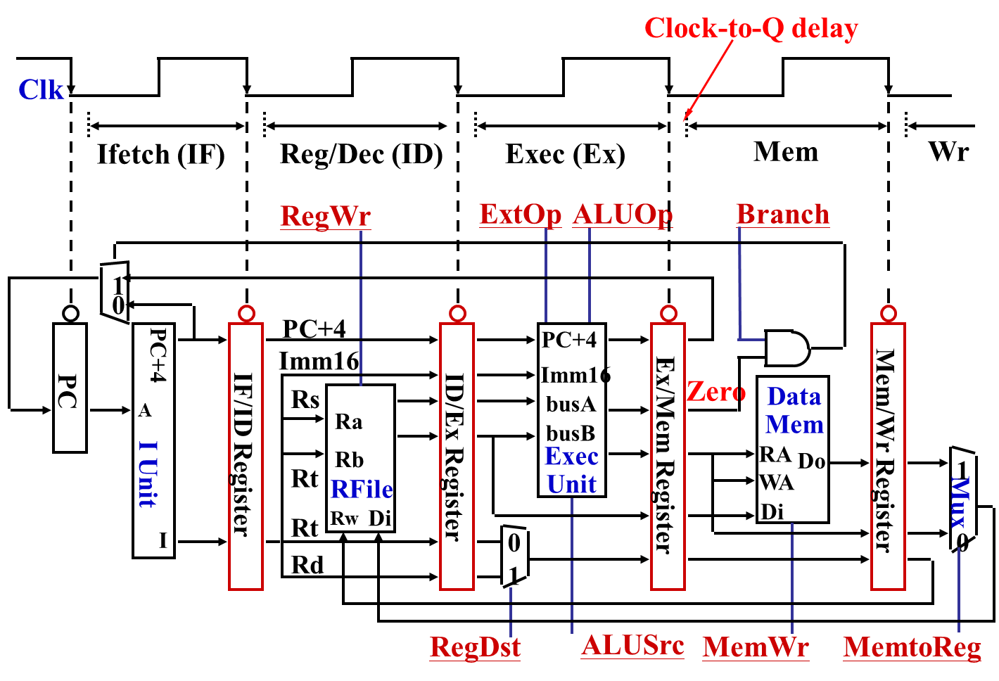

# 4.6 流水线数据通路和控制

**多周期处理器的缺点**：指令按顺序执行，下一条指令必须要在前一条指令完成后才能进行。

**解决思路**：
- 指令执行分成多个阶段
- 每个阶段设置相应的存储元件，执行结果在下个时钟开始时保存到相应的存储单元内。
- 多条指令以流水线方式控制并行执行，每个时钟周期能够得到一条指令的执行结果。

**利于流水线执行的指令集**：
- 指令长度尽量一致：有利于简化取指令和指令译码操作
- 指令格式少，源寄存器位置相同
- 只有 load/store 指令才能访问存储器，有利于减少操作步骤
- 数据和指令在内存中对齐存放，有利于减少访存次数

**结构冒险 / 资源冲突**：在流水线中，一个功能部件同时被多条指令使用的现象。

解决办法：
- 每个功能部件每条指令只能用一次
- 每个功能部件必须在相同阶段被使用

解决方案：
- 在流水线中插入 bubble.
- 指令中添加空阶段，使得每个指令都有相同的五个阶段：取指、译码、执行、访存、回写

**五级流水线的数据通路**：
**流水寄存器**：为了让每一条指令在自己的阶段里看到属于自己的中间结果和控制位，因此必须要在每个阶段边界放流水寄存器来锁存。

锁存时会有一个 Clock-to-Q delay，因此设计时钟周期的时候要考虑这个延迟。

# 4.7-4.8 冒险

**冲突 / 冒险 (Hazard)**：流水线遇到了无法正确执行后续指令或执行了不该执行的指令的现象。分类：

| 类型       | 结构冒险 (Structural Hazard)                                                                                            | 数据冒险 (Data Hazard)                                                                                                                                                                                                                                        | 控制冒险 (Control Hazard)                                                                                                                                                                                                                |
| -------- | ------------------------------------------------------------------------------------------------------------------- | --------------------------------------------------------------------------------------------------------------------------------------------------------------------------------------------------------------------------------------------------------- | ------------------------------------------------------------------------------------------------------------------------------------------------------------------------------------------------------------------------------------ |
| **描述**   | 同一部件同时被不用指令所使用                                                                                                      | 后面指令需要用到前面指令的结果，但结果还没产生                                                                                                                                                                                                                                   | 转移指令或异常处理改变了程序顺序执行流程，但是顺序执行指令在目标地址产生之前已被取出                                                                                                                                                                                           |
| **例子**   | `IF` 需要访存取指令，`Mem` 阶段需要访存读写数据。 `WB` 需要写回寄存器，`ID` 阶段需要读寄存器。                                                       | **Load 指令造成的数据冒险 / 数据相关**：对于 load 指令，在 load 指令开始的第五个周期 `Wr` 阶段才能写入寄存器。如果后面的指令需要用到该寄存器，其第二个阶段 `Reg/Dec` 需要在 load 指令的 `Wr` 阶段才能使用，造成三个指令的不必要延迟。  **Load-use 数据冒险**：当 `lw` 后的一条指令立即使用该寄存器的值，因为 `lw` 只有在 `Mem` 阶段才能结束，而随后命令需要在 `Ex` 阶段使用该寄存器，具有一个周期的延迟。 | **Branch 指令造成的控制冒险 / 分支冒险 / 转移冒险**：对于 beq 指令，如果需要跳转指令，目标地址在 beq 指令开始的第四个周期 `Mem` 阶段才能存入 PC，从而会有三条指令被错误取出，造成不必要的延迟。                                                                                                                   |
| **解决办法** | **分开存储器**：将 `InsMem` 和 `DataMem` 分开（*哈佛结构*）。 **读写口分离**： `REGs` 设计为两个独立读端口和一个独立写端口（*三端口寄存器堆*）。 写/读在时钟上/下半拍。 | **硬件阻塞 (Stall)**：添加气泡，阻止后续指令执行。（特别是 Load-use 数据冒险） **插入无关指令**：添加无用的指令，阻止后续指令执行。 **转发 (Forwarding) / 旁路 (Bypassing)**：将上条指令的 `ALU` 输出或 `MEM/Wb` 的流水寄存器直接送入下一条指令的 `ALU` 输入端。 编译优化，拉大数据冒险指令的距离，减少停顿 **编译器优化指令调度**                                | **硬件阻塞 (Stall)** **插入无关指令** **静态预测**：总是预测条件不满足，继续执行后续指令。预测失败，则需要丢弃取错的指令。 **动态预测**：根据程序执行历史情况，预测下一次可能发生的转移。 使用 *分支历史记录表 BHT*（指令地址 + 预测位 + 转移目标地址） 查找→预测→选择→修正 指令静态调度 **编译优化指令顺序，实现分支延迟**：把分治指令前面无关的指令调到分支指令后面执行。 |

**不同预测器的原理和使用场景：**

| 名称           | 原理                                      | 使用场景                     |
| ------------ | --------------------------------------- | ------------------------ |
| 2位饱和计数预测器    | 用2位状态机记录分支的倾向，根据状态预测跳转或不跳转，连续两次错误才改变方向  | 分支行为稳定、简单if或循环判断         |
| 相关预测器（全局预测器） | 使用全局历史寄存器记录最近n次分支结果，根据全局模式从多个2位预测器中选择一个 | 多个分支之间存在依赖或关联关系          |
| 局部预测器        | 为每条分支维护独立的局部历史，根据该分支自身模式选择对应的预测器        | 某条分支具有周期性或自身规律明显         |
| 竞争预测器        | 同时使用全局和局部预测器，由选择器动态决定采用哪一个              | 程序模式复杂，既有全局关联又有局部规律的混合场景 |
