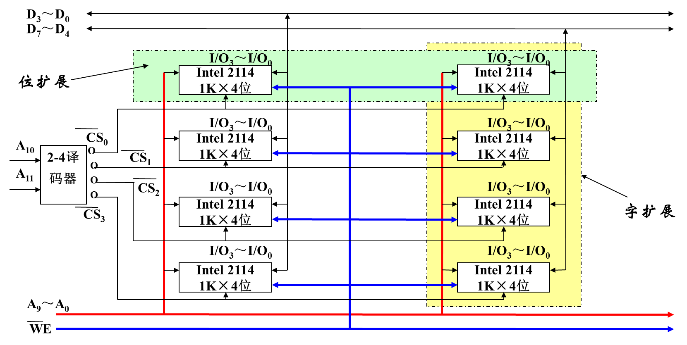

# 5.1 概述

## 5.1.1 计算机中的存储器

存储器的**分类**：
- **主存**：本意为“记忆装置”。多指存储器的整体(包括：记录介质，有关电路和其他部件)
- **辅存**：本意为“仓库”。多指记录介质本身(包括：磁盘、固态盘、磁带、存储阵列等)

存储器的**层次结构**：
- 寄存器、SRAM、DRAM、本地磁盘、远程二级存储
- 速度从快到慢 / 容量从小到大 / 价格从高到低

## 5.1.2 存储器分类

易失/非易失，对应存储器

| 分类标准        | 类型                                                                                                                     |
| ----------- | ---------------------------------------------------------------------------------------------------------------------- |
| 在计算机中的作用    | 寄存器型（触发器） 高速缓冲存储器（SRAM） 主存储器（DRAM） 辅助存储器（磁、光） 控制存储器、表格存储器、字库、数据缓冲存储器                                       |
| 存储介质        | 半导体存储器（触发器、电容，用作内存） 磁表面存储器（陶瓷玻璃、非磁性金属或塑料载磁体磁化后有两种剩磁状态，用作外存） 光盘存储器（有机玻璃磁化后晶态/非静态表示信息，存储速度比硬盘慢） 铁电、相变、阻变存储器  |
| 存储方式        | 随机存储器（RAM，主存和Cache） 只读存储器（ROM） 相联存储器（CAM，Cache中的快表） 直接存储存储器（DAS，慢，磁盘） 顺序存储器（SASA，磁带）                       |
| 存储器中信息是否可保存 | *断电后是否丢失*：挥发性存储器（SRAM, DRAM）、非挥发性存储器（ROM, 磁盘，闪存） *读出后是否保持*：破坏性存储器（DRAM）、非破坏性存储器（SRAM）                               |

## 5.1.3 内存的指标

存储容量：存储 bit 的数量。
存取时间 $T_A$：存数据/取数据操作的所用时间。
存储周期 $T_S$：连续两次存储操作中间的间隔时间。
$T_A < T_S$

存储宽度：一次访存操作可存取的数据位数。
存储带宽：一秒的最大传输 bit 量。

可靠性：MTBF 两次故障的平均时间间隔。

功耗：$P=UI$，分维持功耗和工作功耗。
集成度：单个存储芯片的存储容量。

|       | 内存      | 外存     |
| ----- | ------- | ------ |
| 速度    | 慢       | 快      |
| 成本    | 低       | 高      |
| 容量    | 大       | 小      |
| CPU访问 | 不可以     | 可以直接   |
| 易失    | 非易失性存储器 | 易失性存储器 |

## 5.1.4 随机存取存储器（RAM）

SRAM/DRAM 的特点、应用、区别

SRAM通过触发器互补两个状态（六管静态MOS电路）
- 分为位线 $D_0, D_1$ 和字线 $W$，读写时设置字线 $W = 1$，位线读写信息。
- 只要供电，数据就会保持，无需刷新
- 通常使用**线选法**：字线输入一维地址（行），位线选择对应的列，来读写。

DRAM通过电容充放电（单管动态MOS电路）
- 结构：一个电容+一个晶体管，有一个字线、位线和记忆电容。
- 写数据：位线上加高/低电平，让记忆电容对数据线充放电。
- 读数据：位线读出电压，让数据线放电。
- 电容中的电荷易失，定义在 2ms 内刷新。
- 优点：原件小、功耗小、集成度高。
- 通常使用**位片式**：每行每列都有字线，二维地选择地址，位线选择对应位置读写。需要复用地址引脚，输入两次地址。

|      | DRAM    | SRAM    |
| ---- | ------- | ------- |
| 存储原理 | 电容      | 触发器     |
| 集成度  | 高       | 低       |
| 芯片引脚 | 少       | 多       |
| 速度   | 慢(10X)  | 快(1X)   |
| 价格   | 低(1X)   | 高(100X) |
| 刷新   | 有       | 无       |
| 应用   | 主存、帧缓冲区 | 高速缓存存储器 |

## 5.1.5 只读存储器（ROM）

**ROM**：按地址寻址，只能被随机读而不能随机写的半导体存储器
**特点**：
- 在工作过程中，信息只能读不能写
- 非破坏性随机存取，无需再生
- 信息用特殊方式写入，非易失性存储器

| 分类               | 描述                                  |
| ---------------- | ----------------------------------- |
| 固定掩膜 MROM        | 厂家写入数据，制作完成后不能再改变 价格便宜，结构简单，集成度高 |
| 可编程 ROM，PROM     | 脱机编程写入 写入 1 时在行列交叉点熔断熔丝，熔断之后信息改变 |
| 可多次改写 ROM，EPROM  | 用紫外线编程写入，可以多次读写 封装时需要遮光处理，避免光擦除  |
| 可多次改写 ROM，EEPROM | 可在线擦除和编程，无需遮光处理 缺点：速度慢、集成度低      |

# 5.2 主存储器

## 5.2.1 主存储器逻辑设计

CS：片选信号
WE：写使能信号

存储器的字扩展、位扩展，熟悉怎么设计，如何接线、地址的范围、空间的范围

| 存储容量扩展类型                              | 特点                                                | 引脚连接                                                                        |
| ------------------------------------- | ------------------------------------------------- | --------------------------------------------------------------------------- |
| 位扩展 $mk \times n \to mk \times N$  | 字数不变，位数扩展 需要 $\lceil N/n\rceil$ 片芯片            | 地址端、CS、WE 分别并接（同时读/写） 数据读写端：单独引出（不同的位置）                                  |
| 字扩展 $mk\times n \to Mk\times n$    | 字数扩展，位数不变 需要 $\lceil M/m\rceil$ 片芯片            | 地址端（对应实际的低位地址码）、WE、数据读写端分别并接 CS：和高位地址码的译码结果连接                            |
| 字位同时扩展 $mk\times n \to Mk\times N$ | both 需要 $\lceil N/n\rceil\lceil M/m\rceil$ 片芯片 | 地址端（对应实际的低位地址码）、WE 分别并接 CS：和高位地址码的译码结果连接，同一行并接同一个译码结果 数据读写端：同一列并接到同一位 |

