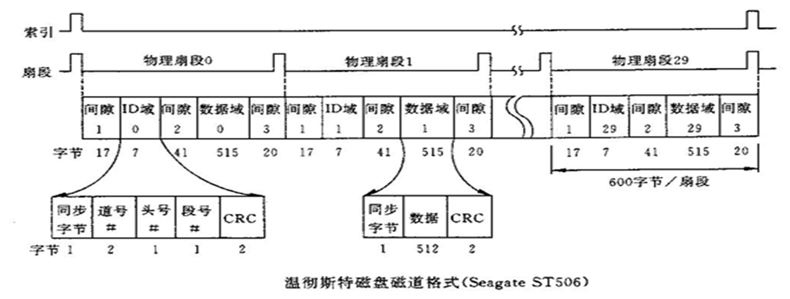

# 6.3 磁盘

## 6.3.2 磁盘的组织结构

磁盘氛围步进电机、传动手臂、读写磁头、磁盘盘片和主轴。
- 步进电机控制读写磁头定位到每个磁道
- 主轴将磁盘盘片固定
- 在电动马达的驱动下，磁盘盘片高速转动。

## 6.3.3 磁盘的工作原理

**磁盘的组织**：
- 磁道：每个同心圆是一个磁道
- 扇区：每个磁道分为等长圆弧
- 柱面：多个盘面上等半径的磁道的组合。

扇区之间留有空隙的原因：
- 区分不同信息区
- 为各种操作提供缓冲时间
- 增强鲁棒性

读写磁头：实现 *电脉冲信号* 和 *介质磁化* 状态的转换。

磁盘盘片：含有一层磁性材料区，其磁化方向代表着二进制信息。

**磁盘基本操作**：
- 数据写入：通过读写磁头将电脉冲信号改变盘片上的磁性粒子簇的极性
- 数据读取：通过读写磁头，盘片上的磁性粒子簇和读写磁头的磁感应物质相互作用，产生感应电压，转换为二进制信号。

## 6.3.4 磁盘的指标性能

**记录密度**：
- 道密度：单位半径有多少个磁道，tpm / tpi
- 位密度：单位长度磁道能记录的二进制位数，bpm / bpi，通常指内圈磁道的位密度。越往外位密度越低，外圈出错概率低，常用于记录系统重要信息。
- 面密度：单位面积记录的二进制位数，$bpm^2 / bpi^2$，$面密度 = 道密度 \times 位密度$

增大记录密度的方法：
- 提高道密度：增加磁道数目
- 增加位密度：增加总扇区数，现代磁盘中内道和外道的位密度相同，外区扇区数比内区扇区数多，可以提高平均位密度。

**磁盘容量**：能记录的二进制信息总量。
- 格式化容量：格式化后能记录的信息量
- 非格式化容量：完全从记录密度考虑的信息量
- 格式化容量的比例大概为 $0.7 \sim 0.9$.

**存取时间**：$t_a = t_S + t_W + t_{WR}$
- 寻道时间 $t_S$：磁头要从当前磁道转移到目的磁道
- 旋转等待时间 $t_W$：磁头要等待盘面旋转使得目标扇区移动到磁头处
  最大旋转延迟 $t_{max\ rotation} = 1 / v_{磁盘转速}$
  平均旋转延迟 $t_{avg rotation} = \frac{1}{2} t_{max\ rotation}$
- 数据传输时时间 $t_{WR}$：完成读写操作。
- 存取时间主要来自寻道时间和旋转延迟。

**误码率**：读数据出错位数占总位数的比例
- 软错误：读写的随机错误，偶然性错误，概率 $< 10^{-9}$
- 硬错误：磁盘上的永久错误，概率 $< 10^{-12}$

# 6.4 闪存存储器 (Flash Memory)

**闪存的特点和优势**：
- 电可擦写、可编程、只读、非易失性存储器 $E^2PROM$，速度比 DRAM 慢
- 尺寸小、功耗低、抗震好，访问延迟是磁盘的 $0.1 \\\% \sim 1 \\\%$
- 成本低 $< ￥1 / GB$

**闪存分类**：

| 类型  | NOR Flash  | NAND Flash |
| --- | ---------- | ---------- |
| 访问  | 随机访问，按字节访问 | 块级IO访问     |
| 读写  | 随机读较快      | 擦除和写更快     |
| 应用  | 存储程序代码     | 存储数据较快     |

**单元电路结构**：由一个带浮栅的晶体管构成，有电荷则导电表示 $0$，无电荷则不导电表示 $1$.

**工作原理**：
- 读：加正电压，检测到电流表示  $0$，检测不到电流表示 $1$
- 写：编程则写入 $0$.
- 擦除：整块写入 $1$.
- 反复擦写后，电子会泄露，从而无法区分二进制状态

**特殊问题**：
- page 是最小写入单位，block 是最小擦除单位
- 数据更新不能在原位置进行，只能将新数据写入空闲页
- 需要进行进一步的存储管理：*地址映射、垃圾回收、损耗均衡*。

# 6.6 并行 IO：RAID 盘阵

**廉价磁盘冗余阵列（RAID）**：将多个廉价磁盘按照某种方式组织成一个磁盘阵列，以提高存储容量，读写速度，可靠性。

# 6.7 IO 控制方式

## 无条件传送方式

描述：无需判断 IO 设备状态，直接传送数据。

特点：
- 只需一条 IO 指令
- 只有一个数据缓冲寄存器
- 在动作时间 *固定、已知* 的条件下使用
- 对 CPU 干扰大，效率低，很少使用
## 程序查询方式（I/O Polling）

描述：IO 设备将自己的状态放到状态寄存器中，系统 *主动查询* 状态寄存器的特定状态来决定下一步的动作。

特点：
- IO 操作完全处于 CPU 的指令控制下
- 数据传递在 CPU 的寄存器和外设的数据缓冲寄存器之中进行，IO 不直接访问内存
- 在 CPU 查询到的状态满足条件的时候，才执行本次传送。
- 效率低，速度慢，CPU 需要等待外设完成，不适合高速外设数据传送
- CPU 和外设不能并行工作
- 工作方式是完全串行或部分串行

接口：
- 数据缓冲寄存器 (Data Buffer Register, DBR)
- 程序状态与控制寄存器 (Status and Control Register, SCR)：寄存发送给外设的命令，以及外设的状态信息
- 设备地址译码器：用于识别外设

## 程序中断方式（I/O Interrupt）

描述：当 IO 设备需要 CPU 干预时，通过中断请求通知 CPU。然后 CPU 终止当前程序的执行，跳到中断处理程序来执行。最后返回到被终止的程序继续执行。

CPU 响应中断：
- 保护断点和程序状态
- 识别异常事件
- 切换到异常处理程序执行
- 回到被终止的程序继续执行

**中断控制器的功能**：为了解决多个外设同时请求中断的问题，需要一个中间层的硬件来记录请求、决定是否响应、决定优先级、告诉 CPU 要跳到哪里。

中断请求的处理：
- 外设产生中断请求，放在中断请求寄存器（Interrupt Request Register, IRR）
- CPU 设置屏蔽寄存器（Interrupt Mask Register, IMR）
- 多个有效中断同时存在时，判优电路选择当前优先级最高的一个
- 生成中断向量，并通过 INTR 控制信号线发出中断请求
- CPU 在每条指令的最后一个时刻检查 INTR，若有效则执行响应中断的流程。

**中断过程的两个阶段**：
- 中断响应（由硬件完成）：CPU 在每条指令的最后一个时刻检查未屏蔽的中断请求，然后关中断、保存现场、跳转到中断服务程序入口
- 中断处理（由软件完成）：执行中断服务程序，由操作系统和驱动程序决定

多重中断：当执行中断服务程序过程中，又有新的中断请求产生，并且新中断优先级高于正在执行的中断，则要终止现在的程序转而处理新的中断。这要用 *堆栈* 来实现。

两种响应优先级：
- 中断响应优先级：多个中断同时出现时，CPU 选择处理哪个中断
- 中断处理优先级：CPU 在执行中断服务程序的时候，允许那些更加优先的中断再次打断当前的处理

特点：
- 可以提高主机的效率，不必一直等待外设完成
- CPU 和外设可以部分地并行工作
- 对 IO 请求响应慢，需要等待外设的中断请求，增加了许多中断响应和中断处理
- 数据传送速度慢，由软件完成，可能造成数据丢失

## 直接存储器访问方式 (Direct Memory Access, DMA)

描述：
- 这是磁盘等高速外设特有的 IO 方式
- 磁盘和主存进行数据交换的时候，需要专门的 DMA 控制器控制总线，完成数据传送
- 外设准备好数据之后，向 DMA 控制器发送 DMA 请求信号，DMA 向 CPU 发送总线请求，申请总线使用权，然后由 DMA 控制器控制总线进行传输。
- DMA 控制器的总线使用权优先级比 CPU 高
- DMA 传送前需要通过"中断"告知 CPU，传送后通过DMA结束中断告知CPU

DMA 的工作方式：
- CPU 停止法：FMA传输期间，CPU 完全暂停对总线的访问。

特点：
- 适用于高速设备如磁盘、光盘等
- 适用于成批数据交换，并且单位数据间的时间间隔较短
