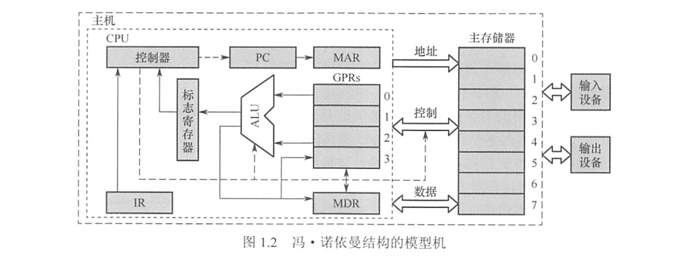
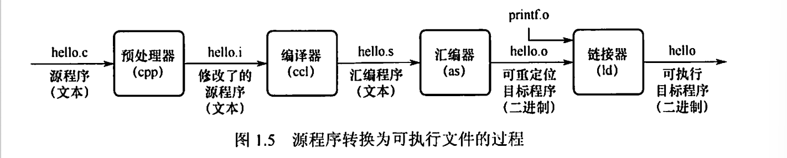
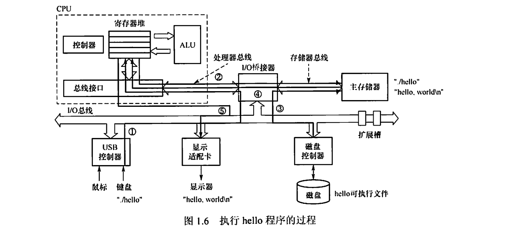

>**重点内容**：
>
>冯诺依曼计算机 & 存储程序思想（**概念题 / 背景题**）
>
>性能指标：MIPS / CPI / 安姆达定律
>
>程序 → 指令的编译过程

# \*1.1 计算机发展历程

> 硬软件的发展

第一台电子数字计算机：1946 ENIAC

电子管 →晶体管 → 中小规模集成电路 → 超大规模集成电路

CPU 发展（摩尔定律）、半导体存储器、微处理器
# 1.2 计算机系统层次结构

> 组成、硬件软件、层次结构、系统工作原理

## 硬件

$$\bigstar \mathbf{IMPORTANT}\bigstar$$
**冯诺依曼“存储程序”思想**：将编制好的程序和数据送入主存后，就能无需干预地逐条执行指令直至执行结束。

**冯诺依曼机特点**：
- 采用存储程序的工作方式
- 计算机硬件由五大部件组成：**运算器、存储器、控制器、输入设备、输出设备**
- 指令和数据同等形式地存储在存储器中，但是计算机能区别
- 指令和数据都用二进制表示

存储器分为主存储器（内存）+辅助存储器（外存）

CPU能直接访问主存，辅存要调入主存。

**主存**包括：
- 存储体：由存储单元组成，每个存储单元包含若干存储元件（0/1），存储单元的位数为 **(存储)字长**（8 的整数倍，或者说字节的整数倍）
- 地址寄存器（MAR）：存放访存地址，$存储单元数 = 2^{MAR 位数}$，$MAR位数 = PC长度$
- 数据存储器（MDR）存放读写的数据，一般情况下 $MDR 位数 = 字长$
- 必要的时序控制逻辑。

**运算器**：核心是算术逻辑单元（ALU），包含若干通用寄存器
- 累加器ACC：保存运算的主要操作数和结果
- 乘商寄存器MQ：为乘法（低位结果）、除法（商）提供存储空间
- 操作数寄存器X：暂存从内存取来的第二个操作数
- 变址寄存器IX：支持数组/循环等的地址计算
- 基址寄存器BR：存放基准地址
- 浮点寄存器FPR：存放浮点数（服务于浮点运算单元 FPU）

**控制器**：
- 程序计数器 PC：自动加一获得下一条指令，连向 MAR
- 指令寄存器 IR：存储当前指令，来自MDR，连向CU
- 控制单元 CU：分析指令并发出各种微操作指令

**CPU**：控制器和运算器。也包含 PC、IR、MAR, MDR, Cache，和通用寄存器组 GRPs，虽然它们是存储器一部分。
- CPU中 IR、MAR、MDR 对于各类程序员都是透明的。
- 通用寄存器组（GRPs）：存放中间结果、内存地址、参数、指针
- 一个寄存器由若干个触发器组成，数量等于寄存器存储的字长。

CPU 和主存通过一组总线相连，总线中有三条线：
- 地址线：MAR的地址信息送到地址线，指向主存存储单元
- 控制线：有读写信号线，表示是写入主存还是写到MDR
- 数据线：负责MDR和主存之间的数据传送。

外部设备：能被 CPU 直接访问并参与指令执行的设备。如运算器、控制器、寄存器、Cache、主存。

内部设备：不能被 CPU直接访问，要通过 IO 接口或控制器。如外存、输入输出设备。

## 软件

**两种软件**

- 系统软件：基础软件（操作系统 OS、数据库管理系统 DBMS、语言处理程序等等）
- 应用软件：为解决某个问题而编制的程序（科学计算、工程设计、数据统计与处理等等）

**三种语言**

- 机器语言：二进制代码语言，是计算机唯一可以直接识别和执行的语言
- 汇编语言：用英文单词或缩写表示的指令代码，要经过 *汇编程序* 翻译为机器语言
- 高级语言：如 C/C++/Java 等，需要经过 *编译程序* 编译成汇编程序。

三种编译程序：汇编器、解释器、编译器

若一个功能（如算术、逻辑运算）既可以由硬件实现又可以由软件实现，则硬件实现的性能要优于软件实现的性能。

## 指令执行过程

$$\bigstar \mathbf{IMPORTANT}\bigstar$$

对于取数指令，信息流程：
- 取指：`PC → MAR → M → MDR → IR`，然后 `(PC) + 1 → PC`
- 分析指令：`OP(IR) → CU`，其中 `OP(IR)` 指 IR 中指令的操作码
- 执行指令：`Ad(IR) → MAR → M → MDR → ACC`，其中 `OP(IR)` 指 IR 中指令的地址码

# 1.3 计算机的性能指标

> 性能指标、相关专业术语

**(机器)字长**：
- 一次定点整数运算能处理的二进制数据位数，CPU内部用于整数运算的数据通路的宽度。
- **机器字长等于通用寄存器（GPR）的位数，ALU一次能计算的位数，CPU内部数据通路的宽度。**
- 字长越长，表示范围越大计算精度越高
- 字长一般为字节（8位）的整数倍

**指令字长**：一个指令中包含的二进制位数。

**存储字长**：一个存储单元中的二进制位数。

取一条指令的访存周期数等于 $\displaystyle \frac{指令字长}{存储字长}$。

**数据通路带宽**：
- 外部数据总线一次能并行传送信息的位数
- 一般情况下，外部数据通路带宽等于 **数据字长**。
- 各个系统通过数据总线连接形成的数据传送路径称为数据通路。

**主存容量**：
- 主存的最大容量，常用字数×字长=字节数来衡量
- MAR的位数反映存储单元数，反映可寻址范围的最大值。
- MDR的位数反映**存储字长**

**运算速度**：
- 吞吐量：系统在单位时间内处理请求的数量，主要取决于主存的存取周期
- 响应时间：用户向计算机发出请求到系统响应所需的等待时间，包括CPU时间和等待时间。
- CPU 时钟周期：CPU最小的时间单位。执行指令的每个动作至少需要1个时钟周期。
- 主频/CPU时钟频率：机器内部时钟的频率。同一类型的计算机，主频越高，执行步骤时间越短。常见主频：$1.8GHz,\ 2.4GHz,\ 2.8GHz$.
- $$CPU时钟周期 (s) = \frac{1}{主频 (Hz)}$$

$$\bigstar \mathbf{IMPORTANT}\bigstar$$

- CPI (Clock cycle per Instruction)，执行一条指令所需的 *平均* 时钟周期数。
  CPI 和时钟频率无关，和指令集、系统机构、计算机组织等实现方式有关。
  如果两台计算机的 "体系结构" 完全相同，那么它们的 CPI 相等。
- $$CPU执行时间 = \frac{CPU时钟周期数}{主频} = \frac{指令条数 \times CPI}{主频} = 指令条数 \times CPI \times 时钟周期$$
- MIPS (Million Instructions Per Second)：每秒执行多少百万条指令。如果指令集系统改变，那么同一程序所需的指令数会发生变化，并不能真正反映真实性能。
  $$MIPS = \frac{指令条数}{执行时间 \times 10^6} = \frac{主频}{CPI \times 10^6}$$
- MFLOPS 、 GFLOPS 、 TFLOPS 、 PFLOPS 、 EFLOPS 和 ZFLOPS 。
  每秒执行多少次浮点运算，前缀是量级的缩写。
  $$FLOPS = \frac{浮点操作次数}{执行时间}$$
**影响因素**：

- 算法不同：相同任务的指令数不同
- 编程语言不同：编译器生成的指令模式不同，影响 CPI
- 编程程序：优化好的话，总指令数就少；生成的指令类型不同，会影响平均 CPI
- 指令集体系结构 （ISA）：决定任务要用多少指令，还会影响 CPI，还影响电路实现
- 计算机组成：流水线等 → 降低 CPI。数据通路设计、并行度、寄存器数目 → 决定能否提高主频（缩短时钟周期时间）。
- 实现技术：半导体工艺能让晶体管更快，缩短时钟周期

**阿姆达尔(Amdahl)定律**：并行计算的加速比受限于程序中的串行部分。假设有 $P$ 部分可加速 $N$ 倍，那么加速比 $$S = \frac{T_{old}}{T_{new}} = \dfrac{1}{(1 - P) + \dfrac{P}{N}}$$
- 即使可加速部分被优化到极致，加速比最多也只有 $\displaystyle \lim_{N \to \infty} S = \frac{1}{1-P}​$.

**基准程序**：用于性能评价的程序，反映机器的实际负载的性能。

