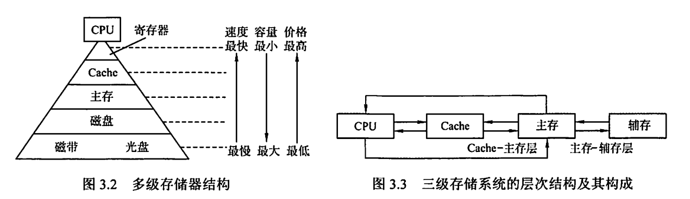
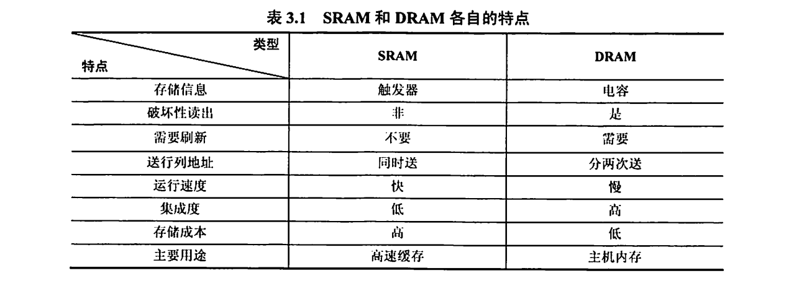
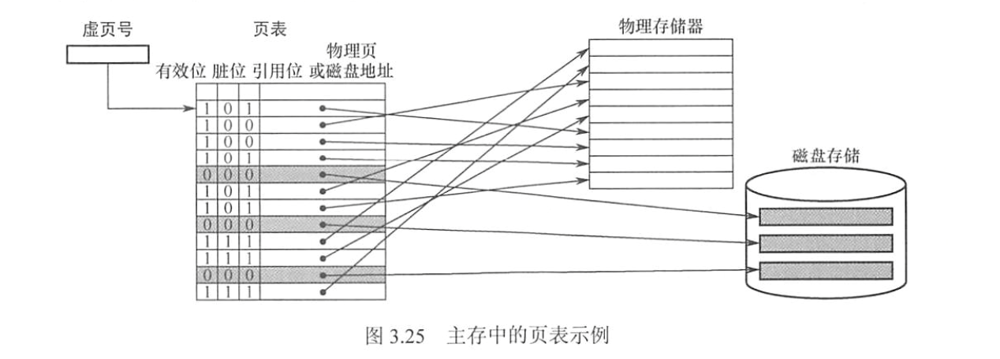
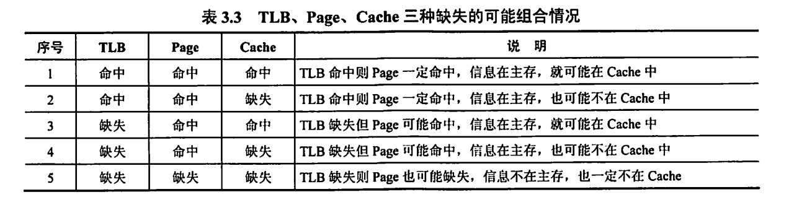

> **重点内容**：
> 
> 存储基本概念（易失性、是否刷新、器件类型）
> 
> 字扩展/位扩展及其连线
> 
> 程序的局部性分析
> 
> Cache 总容量计算（涉及valid/dirty/tag/LRU位的考虑）
> 
> Cache 性能公式
> 
> 三种映射方式具体分析
> 
> Cache 块长与效率关系分析
> 
> 缺失类型分析
> 
> Cache 的写策略、替换策略
> 
> 页表结构
> 
> 页表/TLB 完整访存链路
> 
> 3种hit/miss及其组合的分析

# 3.1 存储器概述

> 分类、性能指标、多层次

## 3.1.1 存储器的分类
$$\bigstar \mathbf{IMPORTANT}\bigstar$$

| 分类标准         | 名称              | 说明                                                                                                  |
| ------------ | --------------- | --------------------------------------------------------------------------------------------------- |
| **在计算机中的作用** | 主存储器 / 主存 / 内存  | 存放所需的程序和数据 CPU 可随机访问，可与 Cache/辅存 交换数据 容量小，速度快，价格高                                             |
|              | 辅助存储器 / 辅存 / 外存 | 存放暂时不用的程序和数据，永久性信息 需要调入主存后才能被 CPU 访问 容量大、速度慢、成本低                                              |
|              | 高速缓冲存储器 / Cache | 存放 CPU 经常使用的指令和数据 CPU 能高速访问它们 容量小、价格高，制作在 CPU 中                                               |
| **存取方式分类**   | 随机存储器 / RAM     | 每个存储单元可以随机存储 读写方便、使用灵活 用作**主存或 Cache** 分为**静态 RAM（SRAM）和动态 RAM（DRAM）**                     |
|              | 只读存储器 / ROM     | 可随机读，（不能写入或写入很慢） 信息写入则固定不变，断电不消失 存放固定不变的程序、常数、字库 可作为**主存的一部分** 广义上仍然保留断电保留、随机读取、写比读要慢得多 |
|              | 串行访问存储器         | 读写需要按照物理位置先后寻址 如顺序存取存储器（磁带，存取速度慢）、 **直接存取存储器**（**磁盘、光盘**，速度介于顺序存取存储器和随机存取存储器之间）               |
| **存储介质分类**   | 磁表面存储器          | 如磁带、磁盘                                                                                              |
|              | 磁芯存储器           |                                                                                                     |
|              | **半导体存储器**      | 如MOS 型存储器、双极型存储器 **包括 SRAM，DRAM**                                                                |
|              | 光存储器            | 如光盘                                                                                                 |
| **可保存性分类**   | 易失性存储器          | 断电后存储信息消失 如 **RAM**                                                                              |
|              | 非易失性存储器         | 断电后存储信息仍然保持 如 **ROM、磁表面存储器、光存储器** 若破坏性读出，则每次读出之后需要紧接一个再生操作                                 |
## 3.1.2 存储器的性能指标
- **存储容量**：$存储容量 = 存储字数 \times 字长$，其中字数表示存储单元空间大小，字长表示一次存取的数据量
- **单位成本**：$每位价格 = 总成本 / 总容量$
- **存取速度**：$数据传输率（存取带宽） = 数据宽度 / 存储周期$
  
  存取周期 $T_m$ 包括存取时间 $T_n$ 和恢复时间 $T_r$ 
  
  $T_m（存取周期） = T_n（存取时间） + T_r（恢复时间）$
  
## 3.1.3 多层次存储系统

存储层次结构的高效性，依赖于**程序的局部性原理**。  
- 在 CPU–主存层，**Cache 机制**通过保存热点数据，**加速存取速度**，使其接近 Cache，容量和价格接近于主存。这里面的数据调动是硬件自动完成的，对**所有程序员**都是透明的。
- 在 主存–辅存层，**虚拟存储的页式管理**通过页面调度，使存取速度接近于主存，**扩大容量**和价格接近于辅存。这里面的数据调动是硬件和操作系统共同完成，对**应用程序员**透明。
- *在逻辑上*，Cache 中的数据一定来自主存，主存中的数据一定来自辅存。

# 3.2 主存储器

> SRAM、DRAM、RAM、主存

## 3.2.1 SRAM 和 DRAM

SRAM 的存储元是双稳态触发器（六晶体管 MOS），读出是非破坏性的，不需要再生。

SRAM 存储速度快、集成度低、功耗大、价格昂贵，多用于 Cache。

DRAM 的存储元是晶体管，用栅极电容上的电荷来存储信息，需要定期刷新。

DRAM 容易集成，价格低，容量大，功耗低，存取速度比 SRAM  慢，多用于主存。
$$\bigstar \mathbf{IMPORTANT}\bigstar$$
DRAM 电容上的电荷需要隔一段时间刷新，通常取 **刷新周期** $2ms$：
- **集中刷新**：一个刷新周期内，利用一段固定的时间（*死时间*），对所有行逐一再生，停止读写操作。缺点是有死时间。
- **分散刷新**：每个工作周期前半部分读写/保持，后半部分用于刷新。这样增加了系统的存取周期。缺点是访存变慢。
- **异步刷新**：按照 $t = 2ms / R(行数)$ 定期发刷新请求，让系统找机会刷新。效果最好。

DRAM 刷新的**特点**：
- 刷新对 CPU 是透明的
- 刷新单位是行，让 DRAM 内部自行生成行地址（一次行选通信号）
- 刷新操作类似于读操作，而又不同
- 刷新操作时，所有芯片对应的行并行更新，无需选片。

| 项目   | 读周期      | 写周期       |
| ---- | -------- | --------- |
| WE   | 高        | 低         |
| 行地址  | RAS 有效前送 | 同         |
| 列地址  | CAS 有效前送 | 同         |
| 数据方向 | 芯片 → 外部  | 外部 → 芯片   |
| 数据要求 | 等待有效窗口采样 | CAS 前必须稳定 |
| 周期参数 | tRC      | tWC       |

**存储器芯片的构成**：存储体矩阵（二维）、行选择线、列选择线、地址译码器（二进制转行/列选择）、片选控制信号、读写控制信号

## 3.2.2 只读存储器

ROM 的**特点**：
- 结构简单，位密度比 RAM 高；
- 非易失性，可靠性高。

ROM 的**类型**：
- **掩模式只读存储器（MROM）**：生产芯片时写入内容，之后无法修改
  可靠性高、集成度高、价格便宜、灵活性差
- **一次可编程只读存储器（PROM）**：允许用户通过专门设备写入程序，之后无法修改
- **可擦除可编程只读存储器（EPROM）**：允许用户通过专门设备写入程序，可以多次改写，不过编程次数优先。
- **Flash 存储器**：可以在线进行快速擦除和重写
- **固态硬盘（SSD）**：使用固态电子存储芯片阵列制成的硬盘，可以长期保存信息、快速擦除和重写。

## 3.2.3 主存的基本组成

存储体矩阵、地址寄存器、地址译码器、读写控制电路

## 3.2.4 多模块存储器

**单体多字存储器**：每个存储单元存储 $m$ 个字，一次并行取出 $m$ 个字，地址是顺序排列的。
对于连续地址取指的情形下，存取周期缩短。

**多体并行存储器**：多块芯片组合在一起。
- **高位交叉编址**：高位地址是体号，低位地址是体内地址。这样访问连续地址时，会总是在同一个体内访问，无法提高吞吐率。
- **低位交叉编址**：高位地址是体内地址，低位地址是体号。这样访问连续地址是，将会可以采用流水线的方式进行存取，提高存储器带宽。
	- 交叉存取度的条件是 $m \ge \frac{T_m}{r}$，其中 $m$ 模块数，$r$ 是总线传送周期（两次访存最小时间间隔）。
	- 连续读 $m$ 个字，所需时间为 $t = T + (m - 1)r$，而改进前的时间为 $t_0 = Tm$。因此能有效提高存储器带宽。
	  平均每个字存取时间为 $t / m \approx r$（当 $m$ 充分大时），因此整体来说，每个总线周期 $r$ 能给 CPU 提供一个字。

# 3.3 主存储器与 CPU 的连接

> 原理、容量扩展、地址分配

## 3.3.1 连接与原理

**三条总线**：
- 主存通过**地址总线、数据总线、控制总线**和 CPU 连接
- 地址总线：
	- `A0, A1, ..., A(n - 1)`
	- 方向：从 CPU 到存储器
	- 位数决定了可寻址最大内存空间
- 数据总线：
	- `D0, D1, ..., D(m - 1)`
	- 方向：双向
	- $数据传输率\propto 数据总线位数 \times工作频率$ 
- 控制总线：
	- 访存控制类：
		- `RD, WR` 读信号和写信号
		- `OE` 输出使能，`WE` 写使能，`CS` 片选信号
	- 地址选通类：（只在 DRAM 中出现）
		- `RAS` 行地址选通，`CAS` 列地址选通
		- 经常替代 `CS`
	- CPU 状态/总线仲裁类：`CLK, RESET, READY/WAIT, HOLD, HLDA`
	- 中断与异常类：`INT/INTR, NMI, INTA`
	- 指出了总线周期的类型和读写完成的时刻。

## 3.3.2\~3.3.4 主存容量的扩展
$$\bigstar \mathbf{IMPORTANT}\bigstar$$

| 存储容量扩展类型                              | 特点                                                | 引脚连接                                                                        |
| ------------------------------------- | ------------------------------------------------- | --------------------------------------------------------------------------- |
| 位扩展 $mk \times n \to mk \times N$  | 字数不变，位数扩展 需要 $\lceil N/n\rceil$ 片芯片            | 地址端、CS、WE 分别并接（同时读/写） 数据读写端：单独引出（不同的位置）                                  |
| 字扩展 $mk\times n \to Mk\times n$    | 字数扩展，位数不变 需要 $\lceil M/m\rceil$ 片芯片            | 地址端（对应实际的低位地址码）、WE、数据读写端分别并接 CS：和高位地址码的译码结果连接                            |
| 字位同时扩展 $mk\times n \to Mk\times N$ | both 需要 $\lceil N/n\rceil\lceil M/m\rceil$ 片芯片 | 地址端（对应实际的低位地址码）、WE 分别并接 CS：和高位地址码的译码结果连接，同一行并接同一个译码结果 数据读写端：同一列并接到同一位 |
- 字扩展时，同一个芯片里面的高地址是相同的，低地址从全 $0$ 到全 $1$。
- 片选可以用线选法或者译码片选法。
# 3.4 \*外部存储器

> 磁盘、固态硬盘

# 3.5 高速缓冲存储器

> 局部性原理、Cache 工作原理、映射方式、替换算法、写策略

## 3.5.1 程序访问的局部性原理
$$\bigstar \mathbf{IMPORTANT}\bigstar$$
- 时间局部性：最近未来用到的信息很有可能是现在用到的信息（如循环）
- 空间局部性：最近未来用到的信息通常和现在使用的信息在存储空间上是临近的（如指令的顺序存取）

## 3.5.2 Cache 的基本工作原理

Cache 的读音 `/kæʃ/`.

Cache 通常由 SRAM 构成。
Cache 和主存都被划分为相等的块，块的长度称为块长，也是 Cache 一行的长度。
Cache 仅保存主存中最活跃的若干块的副本。
$$\bigstar \mathbf{IMPORTANT}\bigstar$$
**一次访存工作流程**：
- **CPU 发出访存地址**：产生主存地址（块号 Block Number+ 块内地址 Offset）
- **映射 Cache 地址**：“Cache 地址映射变换机构”会将主存块号按照**映射方式**转换为 Cache 块号，从而得到 Cache 地址（Cache 块号 + 块内地址 Offset）
- **命中判断**：判断该主存块是否在 Cache 里
	- **命中**：Cache 直接将对应数据通过数据总线传到 CPU
	- **不命中**：
		- 主存将**整个块**读出来，然后考虑装到 Cache 中
		- 要判断对应位置是否有空闲块，如果没有则需要通过**替换策略**淘汰其中一块，再装到 Cache 中。
		- 再从 Cache 将对应数据通过数据总线传到 CPU

在命中判断的时候，可能会遇到 Cache 和主存内容不一致的情况，需要一定的**写策略**处理。
$$\bigstar \mathbf{IMPORTANT}\bigstar$$
**Cache 的命中率**：$H = \displaystyle \frac{N_c}{N_c + N_m}$

**Cache-主存系统平均访问时间**：
- 设 Cache 和主存同时被访问：$T_a = Ht_{cache} + (1 - H)t_{memory}$
- 若 Cache miss 后才访问主存：$T_a = t_{cache} + (1 - H) t_{memory}$
## 3.5.3 Cache 和主存的映射方式
$$\bigstar \mathbf{IMPORTANT}\bigstar$$
**直接映射**：$\text{Cache 行号} = \text{主存块号} \bmod \text{Cache 总行数}$，
- 每个主存块对应唯一一个 Cache 中的位置，它的块冲突率最高，空间利用率最低。
- 假设 Cache 有 $2^c$ 行，主存有 $2^m$ 块
- 主存地址的低 $c$ 位就是对应 Cache 行号
- 主存地址的高 $t = m - c$ 位需要写入对应 Cache 行的标记（tag）
- 直接映射的**地址结构**为：
- **命中条件**：Cache 对应行非空，且标记与当前主存地址一致，且有效位为 $1$

**全相联映射**：每一块可以装入 Cache 中任意位置
- 访存是需要与所有 Cache 行的标记进行比较。冲突概率最低，空间利用率高，命中率高，查找速度较慢，成本高。
- 全相联映射的地址结构为

**组相联映射**：将 Cache 分成 $Q$ 个大小相等的组，每个主存块对应唯一固定组的任意一行，即组间用直接映射，组内用全相联映射，是一种折中办法。
- 先得出组号 $\text{Cache 组号} = \text{主存块号} \bmod \text{Cache 组数(Q)}$
- 然后将对应 Cache 的每行的标记和主存的高位标记进行比较
- 如果有相等且有效位为 $1$，则命中
- 组相联映射的地址结构为：

Cache 中每一行需要有 `tag` 字段。
Cache 总容量等于数据容量加标记阵列容量（有效位 + tag）
$$\bigstar \mathbf{IMPORTANT}\bigstar$$
**行的大小与命中率的关系**：
- 行的长度较大，可以充分利用空间局部性，增加命中机会
- 行的长度过大，未命中时从主存读块需要更长时间，同时 Cache 项数变少，命中可能性变小。
$$\bigstar \mathbf{IMPORTANT}\bigstar$$
**Cache 失效类型**：
- **强制失效**：首次访问某个数据块时导致 Cache 失效。
- **容量失效**：Cache 不能存放程序运行所需的所有块，需要不断替换。
- **冲突失效**：直接映射和组相联映射中，多块内存数据映射到 Cache 的同一个位置

## 3.5.4 Cache 中主存块的替换算法

在全相联和组相联映射中，当新块所在的组已经占满时，需要用到替换算法。
$$\bigstar \mathbf{IMPORTANT}\bigstar$$
**随机算法**：随机替换其中一个 Cache 块，但是未用到程序访问局部性原理，因此命中率较低

**先进先出算法**：选择最早调入的行进行替换，但是未用到程序访问局部性原理，因为最早调入的行也可能是经常要用的。

**近期最少使用算法（LRU）**：选择近期长久非访问过的 Cache 行作为替换的行
- 对每个 Cache 行设置一个计数器，位数是 $\log_2\text{组相联数}$
- 刚刚命中/存入Cache的行的计数器为零，计数器越大则说明越少使用。
- 命中时，所命中的行的计数器清零，数值比它低的计数器加一，比它大的不变。
- 不命中且还有空闲行时，装入新的行并计数器清零，其余全部加一
- 不命中且没有空闲行时，选择计数器最大的行装入新的行并计数器清零，其余全部加一
- **抖动**：当集中访问的存储器超过组相联数，则命中率会变得很低。

**最不经常使用算法**：将一段时间内被访问次数最少的存储行换出
- 此时，计数器存储的是访问次数，每访问一次加一。

## 3.5.5 Cache 写策略

当对 Cache 中的内容进行更新的时候，需要选用写操作策略使得 Cache 内容和主存内容保持一致。
$$\bigstar \mathbf{IMPORTANT}\bigstar$$
**Cache 写命中（hit）的处理办法**：
- **全写法 / 写直通法 / Write Through**：
	- 把数据同时写入 Cache 和主存，那么替换 Cache 行时就不需要写回主存了
	- 优点：能随时保持主存的正确性；缺点：增加访存次数，降低 Cache 效率。
	- **写缓冲 / Write Buffer**：在 Cache 和主存之间加一个写缓冲。
		- 写数据时，CPU 将数据同时写入 Cache 和写缓冲，然后写缓冲再将内容写入主存。
		- 写缓冲是一个队列。
		- 写缓冲可以解决速度不匹配的问题。
- **回写法 / 写回法 / Write Back**：
	- 只把数据写入 Cache 而不立即写入主存，替换 Cache 行时才写回主存
	- 优点：减少了访存次数；缺点：存在主存与 Cache 不一致的隐患
	- **修改位（脏位）**：每个 Cache 行设置修改位，替换时检查该修改位。
	  若修改位为 $1$ 则说明被修改过，需要写回主存，否则无需写回主存

**Cache 写不命中（miss）的处理办法**：
- **写分配法 / Write Allocate**：
	- 加载主存中的块到 Cache 中，然后更新这个 Cache 块。
	- 尝试利用程序的空间局部性，但是缺点是不命中的花销较大
	- 由于产生了脏块，且认为接下来频繁会修改写过的块，所以一般和**回写法**合用
- **非写分配法 / Not Write Allocate**：
	- 只写入主存，不进行调块。
	- 由于不产生脏块，认为写过的块不会频繁命中，因此一般和**全写法**合用

**分离 Cache 和多级 Cache**：
- 将指令 Cache 和数据 Cache 分开设计，避免指令和数据竞争同一个 Cache
- 可以同时利用指令的时间局部性和数据的空间局部性。
- 指令和数据分离一般在 L1 Cache 中
- *在两级 Cache 中*，L1 Cache 对 L2 Cache 通常用全写法+非写分配法，L2 Cache 对主存用回写法+写分配法。

# 3.6 虚拟存储器

> 页式、段式、段页式

## 3.6.1 虚拟存储器的基本概念

虚拟存储器将主存或辅存的地址空间统一编址。
- **虚地址 / 逻辑地址**：用户编程允许涉及的地址，形成虚拟空间/程序空间。
  虚地址 = 虚存页号 + 页内字地址
- **实地址 / 物理地址**：实际主存单元地址，对应主存地址空间/实地址空间。
  实地址 = 主存页号 + 页内字地址
- 虚地址比实地址要大得多。

**CPU 访问虚地址的流程**：
- CPU 使用虚地址时，先判断该虚地址对应的单元内容是否已经装入主存
- 如果在主存中，就可以直接访问主存，否则需要将所在的页调入主存后再由 CPU 访问。
- 如果主存已满，需要需用替换算法置换其中一页。

**虚拟存储机制**：
- **全相联映射**：因为缺页调用辅存的代价很大，所以需要提高命中率。
- **写回法 + 写分配法**：尽量避免缺页调用。

## 3.6.2 页式虚拟存储器

### 3.6.2.1 页表
$$\bigstar \mathbf{IMPORTANT}\bigstar$$
虚拟空间和主存空间都分成同样大小的页。
- **实页/页框**：主存的页
- **虚页**：虚存的页
- **页表**：放在主存中的虚页号和实页号的对照表，记录虚页调入主存中安排在主存中的位置

- **有效位 / Valid**：是否已经调入主存
- **脏位/修改位 / Dirty**：页面是否被修改过，在替换时用于判断是否需要写回磁盘
- **引用位/使用位 Ref/Acc**：配合替换策略，一般表示最近是否被使用过。

**地址转换的流程**：
- 将虚拟地址写成虚拟页号+页内地址的形式
- 从页表基址寄存器得到**页表基地址**，与虚拟页号相加找到对应的页表项
- 检查对应 Valid 是否为 $1$
	- 如果是那么物理页号+页内地址得到物理地址
	- 如果不是，则需要进行缺页处理

**页式虚拟存储器的特点**：
- 优点：页面长度固定，调入方便
- 缺点：实际程序可能不是页面整数倍，造成头尾的页面调入浪费。

**页面大小**：
- 页面太小：使得页表过大，并且不能充分利用空间局部性，命中率会变低
- 页面太大：减少页表空间，但是会浪费过多存储时间，页面调入/调出的时间较长。

### 3.6.2.2 快表（TLB）

采用虚拟存储机制后，需要查页表（也是访问主存），所以访问主存的次数变多了。

根据程序执行的局部性原理，当经常访问某些页时，可以将这些页表项放在 **高速缓冲器组成的快表（TLB）** 中，这样可以明显提高效率。对应在主存中的页表称为**慢表**。
$$\bigstar \mathbf{IMPORTANT}\bigstar$$
**快表的存储机制**：
- 采用**全相联或组相联**形式
- 每个 TLB 项有表项内容加上 TLB 标记字段组成
- TLB 标记字段：表示该表项取自哪个虚页号对应的页表项
	- 全相联：Tag = 虚页号
	- 组相联：Tag = 虚页号的高位部分，组号 = 虚页号的低位部分

### 3.6.2.3 具有 TLB 和 Cache 的多级存储系统
$$\bigstar \mathbf{IMPORTANT}\bigstar$$
**CPU 访存的全部流程：**
- CPU 给出**虚拟地址** = (高位)虚页号 + (低位)页内地址
- 依照具体相联方式，在 TLB 中寻找是否有对应页表项
	- 全相联：利用硬件电路快速和每个页表项比较，看是否 Tag = 虚页号且 Valid = 1
	- 组相联：先通过虚页号低位部分找到对应的组，然后在组内逐个和每个页表项比较，看是否 Tag = 虚页号高位部分且 Valid = 1
	- 若 **TLB Catch**，则（**Page Catch**）可以直接转换为**物理地址** = (高位)实页号 + (低位)页内地址
	- 若 **TLB Miss**，则需要访问主存的页表
- 【TLB miss 后访问主存页表】由虚拟页号对应的页表项，检查对应 Valid 是否为 $1$
	- **Page Catch**，那么物理页号+页内地址进行索引得到物理地址
	- **Page Miss**，则（**Cache Miss**）需要进行缺页异常处理，将外存的整块页加载到主存中，需要替换策略
- 【Page Catch 后访问主存】Cache 机构根据主存映射规则找到对应的 Cache 行/组，并将对应行的标记逐个和物理地址的 Tag 进行比较
	- **Cache Catch**：若找到 Tag 相等且 Valid 为 $1$，那么取出 Cache 对应的字送 CPU
	- **Cache Miss**：若找不到，则需要访问主存中的对应位置，并装载到 Cache 中，需要替换策略

## 3.6.3 段式虚拟存储器

每个段是按照程序的逻辑结构划分，长度因程序而异。
- 虚拟地址 = 段号 + 段内地址
- **段表**：程序的逻辑段在主存中存放位置的对照表，每行记录段号、装入位、段长
- CPU用虚拟地址访问时，先查段表有无该段，如果没有，则需要调入内存。
- 优点：每段具有逻辑独立性，便于共享
- 缺点：分配空间不便，容易在段间留下碎片。

## 3.6.4 段页式虚拟存储器

把程序按照逻辑结构分段，在每段内划分为固定大小的页，主存空间也划分为大小相等的也。调入、调出仍然以页为基本传送单位。
- 每个程序对应一个**段表**，每段对应一个**页表**，端的长度必须是页长的整数倍，端的起点是最开始页的起点。
- 虚拟地址 = 段号 + 段内页号 + 页内地址
- CPU 用虚拟地址访问时，先根据段号得到页表起始地址，那么就得到 页表地址 = 页表起始地址 + 段内页号
- 然后根据 页表地址 取出实页号，然后得到 物理地址 = 实页号 + 页内地址
- 优点：兼具页式和段式的优点
- 缺点：需要两次查表，开销较大

## 3.6.5 虚拟存储器和 Cache 的比较

**相同点**：
- 都是为了提高系统性能，都有容量、价格的梯度
- 都是划分成小信息块作为基本传递单位
- 都有地址映射、替换算法、更新策略的问题
- 都运用了程序局部性原理

**不同点**：
- Cache 主要解决系统速度，虚存为了解决主存容量太小的问题
- Cache 全由硬件实现，对程序员透明；虚拟存储器有操作系统和硬件共同实现，对系统程序员不透明，对应用程序员透明
- Page miss 比 Cache miss 的影响更大
- 主存可以和 CPU 通信，而辅存不可以和 CPU 通信，需要先调入主存再和 CPU 通信