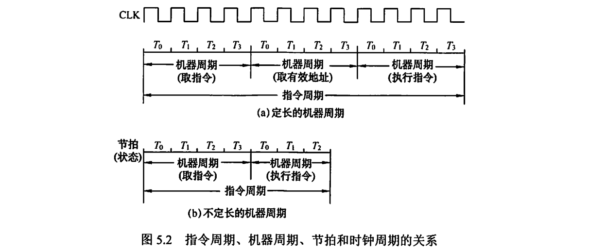
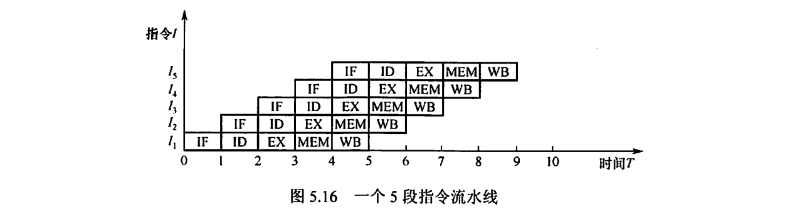
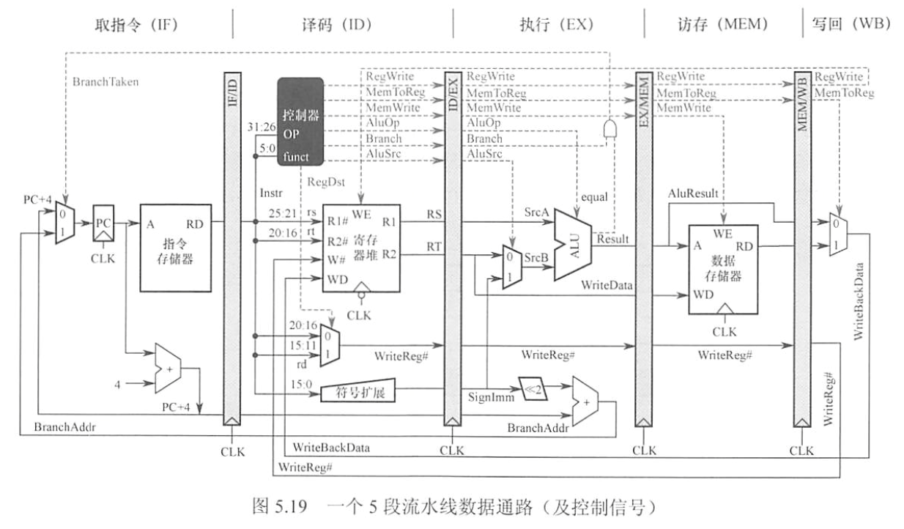
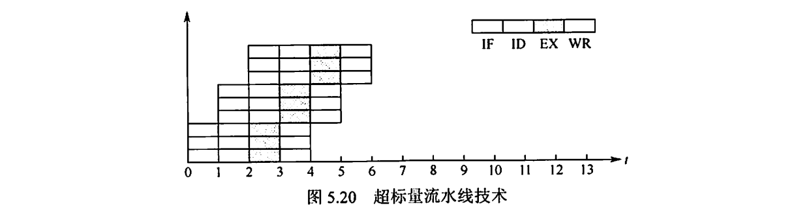
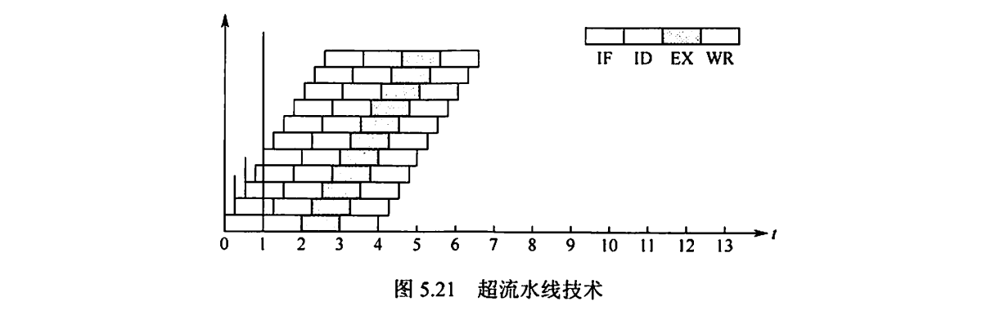

> **重点内容**：
> 
> 数据通路五阶段
> 
> 常见指令各个阶段的行为
> 
> 控制信号的逻辑判断
> 
> 单周期CPU、多周期CPU的概念
> 
> 流水线处理器，相关计算
> 
> 三种冒险、识别stall，fowarding
> 
> 典型操作的异常类型，返回哪条指令

# 5.1 CPU 的功能和基本结构

> 功能、基本结构

## 5.1.1 CPU 的功能

CPU 由运算器和控制器组成。
- **控制器**：负责协调和控制计算机各部件执行程序的指令序列，取指、分析、执行指令。
- **运算器**：对数据进行加工。

**CPU 的具体功能：**
- 取指、分析、执行指令
- 将各种操作信号送往对应的部件，控制这些部件按要求动作
- 对各种指令按照时间顺序提供控制信号
- 对数据进行算术和逻辑运算
- 对异常和特殊请求进行处理
## 5.1.2 CPU 的基本结构

**运算器**：
- **算术逻辑单元 / ALU**：进行算术、逻辑运算
- 暂存寄存器：暂存从主存读来的数据。对应用程序员透明
- **累加寄存器 / ACC**：暂时存放 ALU 结果信息，可以作为输入端
- **通用寄存器组**：存放操作数和各种地址信息，如 AX, BX, CX, DX, SP，其中 SP 是栈顶地址
- **程序状态字寄存器 / PSW**：如溢出标志 OF、符号标志 SF、零标志 ZF、进位标志 CF
- 移位器：进行移位运算
- 计数器：控制乘除运算

**控制器**：
- **程序计数器 / PC**：下一条指令在主存的存放地址，有自增功能
- **指令寄存器 / IR**：保存正在执行的指令
- **指令译码器**：对操作码字段进行移码，提供特定操作信号
- **存储器地址寄存器 MAR**：存放要访问的主存单元的地址
- **存储器数据寄存器 MDR**：存放向主存写入的信息或从主存读出的信息。
- 时序系统：CLOCK
- 微操作信号发生器：产生各种控制信号。

**透明性**：
- **应用程序员透明**：指令系统、通用寄存器、虚存空间、系统调用接口
- **系统程序员透明**：特权指令、中断/异常机制、页表/TLB、IO控制寄存器、CPU工作模式
- **对所有程序员都不透明**：CPU内部电路实现、微指令、ALU、时钟、分支预测、乱序执行、Cache 内部电路

# 5.2 指令执行过程

> 指令周期、数据通路

## 5.2.1 指令周期

**指令周期**：CPU 从主存取出并执行一条指令的时间称为指令周期。
一个指令周期包含若干机器周期，一个机器周期包含若干时钟周期

**传统指令周期模型**：取指、间址、执行、中断

**五级流水模型**：取指、译码、执行、访存、回写

## 5.2.2 指令周期的数据流

**1. 取指周期**：根据 PC 的内容取出指令代码，并放在 IR 中
- **指令地址**：PC → MAR → 地址总线 → 主存
- **读指令信号**：CU → 控制总线 → 主存
- **指令内容**：主存 → 数据总线 → MDR → IR
- **下一条指令地址**：CU 发出控制信号 → PC 自增 1

**2. 间址周期**：取操作数有效地址
- **操作数地址**：Ad(IR) → MAR → 地址总线 → 主存
- **读指令信号**：CU → 控制总线 → 主存
- **操作数内容**：主存 → 数据总线 → MDR

**3. 执行周期**：根据 IR 中的操作码通过 ALU 产生结果。

**4. 中断周期**：处理中断请求，将程序断点存入堆栈中，并用 SP 指示程序断点的地址
- **栈顶指针移动**：CU 控制 SP - 1，然后 SP → MAR → 地址总线 → 主存
- **写指令信号**：写指令 → 控制总线 → 主存
- **存入程序断点**：PC → MDR → 数据总线 → 主存
- **开始中断服务程序**：CU → PC

## 5.2.3 指令执行方案

- 单指令周期：所有指令都用相同的执行时间，下一条指令只能在前一条指令结束后才能启动
- 多指令周期：不同的指令用不同个数的时钟周期来完成
- 流水线方案：指令之间并行执行，力争在每个时钟周期完成一条指令的执行过程
# 5.3 数据通路的功能和基本结构

> 功能、基本结构
## 5.3.1 数据通路的功能

**数据通路**：
- 数据在功能部件之间传送的路径
- 包括数据通路上的部件（ALU / 各种寄存器 / 异常和中断处理逻辑）
- 描述了信息从什么地方开始，经过什么寄存器，最后传送到什么寄存器
- 数据通路由**控制部件**控制
- 数据通路的**功能**：实现 CPU 内部的运算器与寄存器及寄存器之间的**数据交换**

## 5.3.2 数据通路的基本结构
$$\bigstar \mathbf{IMPORTANT}\bigstar$$
- **CPU 内部单总线方式**：把所有寄存器的输入端和输出端都连接到同一条公共通路上。
	- 优点：结构简单
	- 缺点：存在较多冲突现象，性能较低
- **CPU 内部三总线方式**：把所有寄存器的输入端和输出端都连接到多条公共通路上。
	- 优点：指令执行效率高
	- 缺点：结构复杂
- **专用数据通路方式**：根据数据和地址的流动方向连接线路，避免共享的总线
	- 优点：性能更高
	- 缺点：硬件量大、结构更复杂

寄存器之间的数据传送可以通过 CPU 内部总线完成：
- PC → Bus → MAR

主存和 CPU 之间的数据传送：需要分为多步
- PC → Bus → MAR
- I → R
- Mem(MAR) → MDR → Bus → IR

执行算数或逻辑运算：
- 对于两个操作数，一个在 ACC 中，另一个读主存放到暂存器 Y 中：MDR → Bus → Y
- (ACC) + (Y) → Z → (ACC)

# 5.4 控制器的功能和工作原理

> 结构和功能、硬布线控制器、微程序控制器

## 5.4.1 控制器的结构和功能

**控制器的主要功能**：
1) 从主存中取出一条指令，并指出下一条指令在主存中的位置。
2) 对指令进行译码或测试，产生相应的操作控制信号，以便启动规定的动作。
3) 指挥并控制 CPU 、主存、输入和输出设备之间的数据流动方向。

## 5.4.2 硬布线控制器

硬布线控制器由复杂的 *组合逻辑门电路* 和一些 *触发器* 构成。

**输入信号来源**：
- 由指令译码器对操作码译码产生的指令信息
- 时序系统产生的机器周期信号和节拍信息
- 来自执行单元的反馈信息（标志）

**每个机器周期的微指令**：
- **取指周期**：先以 PC 为地址访存，然后 PC 自增 $1$，指令操作数通过 CU 译码
- **间址周期**：只有"间接寻址"的指令才有间址周期，将以指令地址码为地址访存，得到有效地址
- **执行周期**：
	- 非访存指令：不访存、只在 CPU 内部完成
	- 访存指令：
		- `ADD X`：先取操作数到 MDR，然后 (ACC) + (MDR) → ACC
		- `STA X`：先取操作数到 MAR，传写指令信号，然后 ACC → M(X)
		- `LDA X`：先取操作数到 MAR，传读指令信号，然后 M(X) → ACC
	- 转移指令：无条件则 X → PC，有条件则根据 ACC 的结果传 X/PC → PC

**CPU 的三种控制方式**：
- 同步控制方式：所有控制指令都由同一时钟节拍触发
	- 每条指令占用相同数量、相同长度的机器周期（以最长、最复杂指令为标准）
	- 控制方式简单，但是速度较慢
- 异步控制方式：没有统一时钟，每部件以应答/握手方式工作
	- 速度快，控制复杂
- 联合控制方式：常用部分同步，少量复杂部分不同步

**硬布线控制器设计思想**：$微操作控制信号 = 机器周期 \land 节拍 \land 操作码 \land 机器状态条件$
- 根据公式来化简，然后得出硬件布线电路。

## 5.4.3 \*微程序控制器

### 5.4.3.1 微程序控制的基本概念

微程序控制器将每条机器指令写成一个微程序。
- 每个微程序包含若干**微指令**：控制部件向执行部件的各种控制指令
- 每条微指令包含若干**微命令**：微指令的控制信号
- 微程序存储在 **控制存储器** 中，用寻址用户程序机器指令的办法来寻址每个微指令。
- 现在大多数计算机都用微程序设计技术。

**相容性微命令**：可以同时产生、共同产生某些微操作的微命令
**互斥性微命令**：机器中不允许同时出现的微命令

一条微指令包含的两大部分信息：
- **操作控制字段 / 微操作码字段**：产生各种操作控制信号
- **顺序控制字段 / 微地址码字段**：产生下一条要执行的微指令的地址

微周期：从控制存储器中读取一条微指令并执行相应微操作的时间。

控制存储器（CM）：用于存放微程序，在 CPU 内部，用 **ROM** 实现。

对于程序员来说，微程序的结构和功能是透明的，无需知道。

四种易混淆的寄存器：
- **地址寄存器** (MAR) ：用于存放主存的读／写地址。
- **微地址寄存器** (CMAR) ：用于存放控制存储器的读／写微指令的地址。
- **指令寄存器** (IR) ：用于存放从主存中读出的指令。
- **微指令寄存器** (CMDR 或µIR) ：用于存放从控制存储器中读出的微指令，其位数与微指令字长相等。

### 5.4.3.2 微程序控制器组成和工作过程

微程序控制器的工作流程：
- 取指微程序：所有指令共有。将取指微程序入口送到 CMAR，然后将 CM 读出相应的微指令送入 CMDR
- 执行微程序：逐条执行微程序的每条微指令

若指令系统具有 $n$ 种机器指令，那么控制存储器的微程序数至少为 $n + 1$，多的一条为公共的取指微程序。

### 5.4.3.3 微指令的编码方式

- **直接编码方式**：微命令字段中每位都代表一个微命令
	- 优点：简单、直观、速度快、并行性好
	- 缺点：指令字长过长，CM 容量很大
	
- 字段直接编码方式

# 5.5 异常和中断机制

> 基本概念、分类、响应过程

## 5.5.1 异常和中断的基本概念

**异常 / 内中断 / Exception / Internal Interrupt**：
- CPU 内部产生的意外事件，和当前执行的指令相关。
- 由 CPU 自身完成异常的检测，而不是外部信号通知。

**中断 / 外中断 / External Interrupt**：
- 来自 CPU 外部的设备向 CPU 发出的中断请求，通常用于信息的输入输出。
- 和当前正在执行的指令无关。
- CPU 需要通过中断请求线（INTR / NMI） 才能知道哪个设备发生了什么中断。

**异常和中断的处理过程**：由**操作系统和驱动程序**完成。
- CPU 执行指令时检测异常，或者执行指令后发现中断请求信号
- CPU 打断当前用户程序，转到相应的异常和中断处理程序去执行
- 若能成功解决问题，则执行异常或中断返回指令，返回到原指令（异常）或下一条指令（中断）继续执行。
- 若不能成功解决问题，则终止用户程序。

## 5.5.2 异常和中断的分类
$$\bigstar \mathbf{IMPORTANT}\bigstar$$
**异常的分类**：
- **程序性异常 / 软件中断**：CPU 内部因为执行指令而引起的异常事件。
- **硬故障中断**：硬连线出现异常，如存储器校验错，总线错误
- **故障 / Fault**：指令启动后、执行结束前被检测到的异常事件。**
	- **若可恢复，则回到原指令；若不可恢复，则终止执行**
	- eg.**取数据时，出现 *缺段 / 缺页* → 将所需的段/页调入主存**
	- eg.指令译码时，出现 *非法操作码* → 终止进程执行
	- eg.除法指令时，出现 *除数为零* → 终止进程执行
- **自陷 / 陷阱 / 陷入 / Trap**：预先安排的异常事件。
	- 用一条特殊事件或方式来认为设置陷阱，当执行到了陷阱指令后，就会根据不同的陷阱类型进行相应处理。
	- 当执行完毕后，回到自陷指令的**下一条指令**执行。
	- 当自陷指令时转移指令时，需要回到**转移目标指令执行**
	- eg.断点设置、单步跟踪、系统调用指令、条件自陷指令
- **终止 / Abort**：发生了使计算机无法继续执行的硬件中断
	- 此时**程序无法继续执行，只能终止**，并调出中断服务程序来重启系统
	- 不是由特定指令发生，而是**随机发生**

**中断的分类**：
- **可屏蔽中断**：可屏蔽中断请求线（INTR）向 CPU 发出的中断请求
	- CPU 可以设置屏蔽字来选择是否屏蔽它。
	- 被屏蔽的中断请求不送到 CPU。
- **不可屏蔽中断**：不可屏蔽中断请求线（NMI）向 CPU 发出的中断请求
	- 通常是非常紧急的硬件故障，如电源掉电。
	- CPU 需要快速处理这类紧急事件。

## 5.5.3 异常和中断响应过程

**CPU 对异常和中断的相应流程**：
1. **关中断**：首先禁止相应新的中断，通过设置 **中断允许 IF** 来实现
	- IF = 1 → 开中断；IF = 0 → 关中断。
2. **保存断点和程序状态**：
	- 将程序的断点（返回地址）送到**栈**中（为支持异常和中断的嵌套）
	- 被中断时的程序状态字寄存器（PSWR）的内容需要保存在**栈**中
	- 返回时，PC 回到程序断点，PSWR 恢复。
3. **识别异常/中断并转到相应处理程序**：
	- **软件识别**：
		- CPU 设置异常状态寄存器，记录异常原因。
		- 操作系统使用同一的异常和中断查询程序，按顺序查询以检测类型。
		- 先查询到的先处理，转到相应的处理程序
	- **硬件识别 / 向量中断**：
		- **中断类型号**：每个异常或中断的编号
		- **中断向量**：异常或中断处理程序的首地址
		- **中断向量表**：存放所有中断类型号到中断向量的**一一对应关系**，从而可根据类型号找到对应的处理程序。
	- 异常大多用软件识别，中断既可用软件识别也可用硬件识别。

整个响应过程不可被打断。响应结束后就从 PC 取出中断服务程序的第一条指令开始执行。

# 5.6 指令流水线

> 基本实现、冒险、性能指标

## 5.6.1 指令流水线的基本概念

提升处理机的并行性方法：
- **流水线技术**：在时间上并行，将一个任务分解成若干不同阶段。
- **超标量处理机**：在一个处理机内设置多个执行多个相同任务的功能部件，并让这些功能部件并行工作。
$$\bigstar \mathbf{IMPORTANT}\bigstar$$
在五级流水线中，一条指令执行过程分为五个阶段：
- **取指 / IF**：从指令存储器 / Cache 中取指令
- **译码 / ID**：CU 对指令译码，同时从寄存器堆中取操作数
- **执行 / EX**：执行运算操作或计算地址
- **访存 / MEM**：对存储器进行读写操作
- **写回 / WB**：将指令执行结果写回寄存器堆

流水线的设计原则：
- **指令流水段个数**：最复杂指令所用的功能段个数为准。
- **流水段长度**：以最复杂的阶段所花的时间为准。

利于实现流水线的指令集特征：
- 指令长度尽量一致，利于简化取指和译码操作
- 指令格式尽量规整，便于在指令未知时就取寄存器操作数
- 除了 Load/Store 指令，其他指令不能访问存储器
- 数据和指令在存储器中对齐存放

## 5.6.2 流水线的基本实现

### 5.6.2.1 流水线的数据通路

| 阶段     | 包含器件                 |
| ------ | -------------------- |
| 取指 IF  | PC、指令存储器、下条指令地址的计算逻辑 |
| 译码 ID  | 操作控制器、取操作数逻辑、立即数符号扩展 |
| 执行 EX  | ALU、分支地址计算           |
| 访存 MEM | 数据存储器                |
| 写回 WB  | 寄存器写入控制              |

| 流水寄存器  | 锁存信息                                                       |
| ------ | ---------------------------------------------------------- |
| IF/ID  | - 指令字 - PC + 4 的值                                       |
| ID/EX  | - 从寄存器取出的两个操作数 RS, RT - 写寄存器编号 WriteReg# - 立即数符号扩展值  |
| EX/MEM | - ALU 运算结果 - 数据存储器待写入数据 WriteData - 写寄存器编号 WriteReg# |
| MEM/WB | - ALU 计算结果 - 数据存储器读出的数据 - 写寄存器编号 WriteReg#           |

### 5.6.2.2 流水线的控制信号
$$\bigstar \mathbf{IMPORTANT}\bigstar$$

| 控制信号                | 产生阶段    | 使用阶段    | 信号含义 & 注意事项                                     | 在什么时候有效               |
| ------------------- | ------- | ------- | ----------------------------------------------- | --------------------- |
| **RegWrite**        | ID      | **WB**  | 是否将结果写回寄存器堆。 必须随指令一路传到 WB，**不能在 ID 就写**      | 需要写寄存器结果的指令（R 型、lw）   |
| **RegDst**          | ID      | ID      | 写回寄存器编号选择：1 → rd，0 → rt。 只和“写哪个寄存器”有关        | R 型指令有效               |
| **ALUSrc**          | ID      | **EX**  | ALU 第二操作数来源：0 → RT，1 → 立即数                      | 需要立即数参与运算的指令（lw / sw） |
| **ALUOp**           | ID      | **EX**  | 指定 ALU 运算类型（加 / 减 / 由 funct 决定）。                | 所有需要 ALU 运算的指令        |
| **MemWrite**        | ID      | **MEM** | 是否对数据存储器执行写操作。 只有 sw 才为 1                    | sw 指令                 |
| **MemToReg**        | ID      | **WB**  | 写回寄存器的数据来源：1 → 内存，0 → ALU                       | lw 指令                 |
| **Branch**          | ID      | EX      | 表示“这是分支指令”。 本身不决定跳不跳                         | beq 等分支指令             |
| **equal**           | EX      | EX      | ALU 比较结果（是否相等）。 是运算结果，不是控制信号                 | 分支指令执行时               |
| **BranchTaken**     | **EX**  | **IF**  | 是否真正发生跳转 = Branch ∧ equal。 唯一从 EX 反馈到 IF 的信号 | 分支条件满足时               |
| **PCWrite / PCSrc** | ID / EX | IF      | 控制 PC 是否更新 & 更新来源。 只关心“跳不跳”                  | 跳转或顺序执行时              |

### 5.6.2.3 流水线的执行过程
$$\bigstar \mathbf{IMPORTANT}\bigstar$$
**取指 IF**：
- PC 作为地址，取出第一条指令字，计算 PC + 4 送入 PC 输入端
- PC + 4 锁存到 IF/ID 流水寄存器，以备**后续可能使用（如 PC 相对转移指令）**
- 指令字锁存到 IF/ID 流水寄存器

**译码 ID**：
- CU 根据 IF/ID 锁存的指令字，生成后续各种控制信号
- 对于 `lw` 指令，根据 `rs, rt` 取出寄存器堆里面的 RS, RT
- 符号扩展单元对立即数 16 位**符号扩展**为 32 位
- MUX 根据指令生成可能的写寄存器编号 WriteReg#
- 生成的所有信号和数据，以及 PC + 4 锁存到 ID/EX 流水寄存器

**执行 EX**：
- 对于 `lw` 指令，计算访存地址 `RS + Ext(Imm)`
- 对于 `beq/bne` 指令，计算分支地址，生成分支转跳信号 `BranchTaken`
- ALU 运算结果，RT 作为待写入数据 WriteData、写寄存器编号 WriteReg# 锁存到 EX/MEM 寄存器

**访存 MEM**：
- 对于 `lw` 指令，根据待写入数据 WriteData、写寄存器编号 WriteReg# 和 MemWrite 对存储器进行读或写
- 寄存器中的访存地址、WriteReg#、数据存储器读出的数据都会送入 MEM/WB 流水寄存器，

**写回 WB**：
- 将 数据存储器读出的数据写入指定寄存器 WriteReg#

## 5.6.3 流水线的冒险与处理
$$\bigstar \mathbf{IMPORTANT}\bigstar$$

| 类型       | 结构冒险 (Structural Hazard)                                                                                                                                               | 数据冒险 (Data Hazard)                                                                                                                                                                                                                                    | 控制冒险 (Control Hazard)                                                                                                                                                                                                                |
| -------- | ---------------------------------------------------------------------------------------------------------------------------------------------------------------------- | ----------------------------------------------------------------------------------------------------------------------------------------------------------------------------------------------------------------------------------------------------- | ------------------------------------------------------------------------------------------------------------------------------------------------------------------------------------------------------------------------------------ |
| **描述**   | 同一部件同时被不用指令所使用                                                                                                                                                         | 后面指令需要用到前面指令的结果，但结果还没产生 分为写后读、读后写、写后写                                                                                                                                                                                                              | 转移指令或异常处理改变了程序顺序执行流程，但是顺序执行指令在目标地址产生之前已被取出                                                                                                                                                                                           |
| **例子**   | `IF` 需要访存取指令，`Mem` 阶段需要访存读写数据。 `WB` 需要写回寄存器，`ID` 阶段需要读寄存器。                                                                                                          | **Load 指令造成的数据冒险 / 数据相关**：对于 load 指令，在 load 指令开始的第五个周期 `Wr` 阶段才能写入寄存器。如果后面的指令需要用到该寄存器，其第二个阶段 `Reg/Dec` 需要在 load 指令的 `Wr` 阶段才能使用，造成三个指令的不必要延迟。 **Load-use 数据冒险**：当 `lw` 后的一条指令立即使用该寄存器的值，因为 `lw` 只有在 `Mem` 阶段才能结束，而随后命令需要在 `Ex` 阶段使用该寄存器，具有一个周期的延迟。 | **Branch 指令造成的控制冒险 / 分支冒险 / 转移冒险**：对于 beq 指令，如果需要跳转指令，目标地址在 beq 指令开始的第四个周期 `Mem` 阶段才能存入 PC，从而会有三条指令被错误取出，造成不必要的延迟。                                                                                                                   |
| **解决办法** | **分开存储器**：将 `InsMem` 和 `DataMem` 分开（*哈佛结构*）。 **读写口分离**： `REGs` 设计为两个独立读端口和一个独立写端口（*三端口寄存器堆*）。 写/读在时钟上/下半拍。 L1 Cache 使用数据 Cache 和指令 Cache 分离，可以有效避免资源冲突  | **硬件阻塞 (Stall)**：添加气泡，阻止后续指令执行。（特别是 Load-use 数据冒险） **插入无关指令**：添加无用的指令，阻止后续指令执行。 **转发 (Forwarding) / 旁路 (Bypassing)**：将上条指令的 `ALU` 输出或 `MEM/Wb` 的流水寄存器直接送入下一条指令的 `ALU` 输入端。 编译优化，拉大数据冒险指令的距离，减少停顿 **编译器优化指令调度**                            | **硬件阻塞 (Stall)** **插入无关指令** **静态预测**：总是预测条件不满足，继续执行后续指令。预测失败，则需要丢弃取错的指令。 **动态预测**：根据程序执行历史情况，预测下一次可能发生的转移。 使用 *分支历史记录表 BHT*（指令地址 + 预测位 + 转移目标地址） 查找→预测→选择→修正 指令静态调度 **编译优化指令顺序，实现分支延迟**：把分治指令前面无关的指令调到分支指令后面执行。 |
## 5.6.4 流水线的性能指标
$$\bigstar \mathbf{IMPORTANT}\bigstar$$
**流水线的吞吐率**：单位时间完成的任务数量
- $\displaystyle TP = \frac{n}{T_k} = \frac{n}{(k + n - 1) \Delta t}$，其中 $n$ 是任务数，$k$ 是流水线级数，$\Delta t$ 是时钟周期
- $\displaystyle \lim_{n \to \infty} TP = \frac{1}{\Delta t}$

**流水线的加速比**：完成同样一批任务，不使用流水线和使用流水线的时间之比
- $\displaystyle S = \frac{T_0}{T_k} = \frac{kn \Delta t}{(k + n - 1)\Delta t} = \frac{kn}{k + n - 1}$，其中 $T_0$ 是 $k$ 周期处理器的总时间，$T_k$ 是 $k$ 级流水线处理器的总时间
- $\displaystyle \lim_{n \to \infty} S = k$.

## 5.6.5 高级流水线技术

增加指令级并行的**策略**：
- **多发射技术**：通过采用多个内部功能部件，使流水线功能段能同时处理多条指令，处理机一次可以发射多条指令进入流水线执行；
- **超流水线技术**：通过增加流水线级数来使更多的指令同时在流水线中重叠执行。

增加指令级并行的**技术**：
- **超标量流水线技术（空间并行）**：每个时钟周期并发多条独立指令，以并行操作方式将两条或多条指令编译执行。需要增加功能部件。
- **超长指令字技术 / 静态多发射技术（编译期并行）**：编译程序发掘指令间并行性，将多条并行操作指令组成超长指令字，需要多个处理部件

- **超流水线技术（时间并行）**：提高流水线主频以提升流水线性能。

# 5.7 \*多处理器的基本概念

> SISD/SIMD/MIMD，多线程、多核、共享内存

