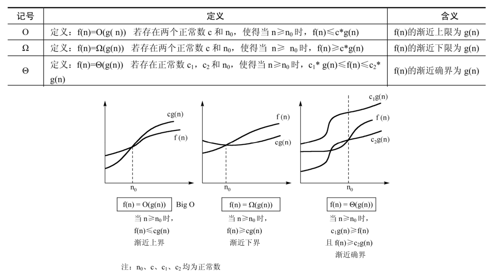
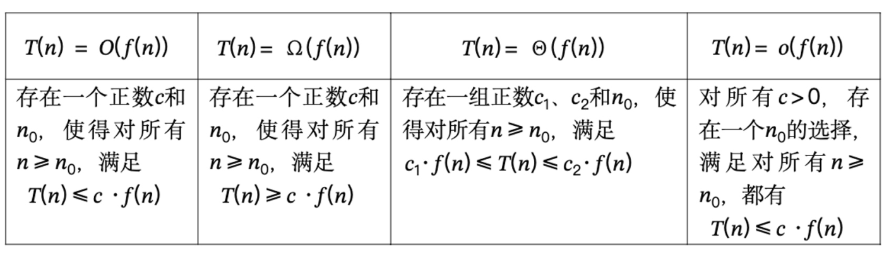

> - 数据结构、数据类型、逻辑结构和物理存储结构
> - 算法时间复杂度：评价效率方法、算法执行时间、时间复杂度、空间复杂度
> - 算法描述：算法五个基本特性、优秀算法的特性、算法描述方法
> - 递归：递归转非递归（循环形式、栈形式）
> - 哈希：散列函数、哈希冲突、哈希构造方法、冲突处理
> - 搜索：静态查找（顺序查找、折半查找、分块查找）、动态查找（二叉排序树、平衡二叉树、B树）
> - 排序：稳定性、插入排序、希尔排序、冒泡排序、快速排序、选择排序、堆排序、归并排序、基数排序

# 数据结构三要素

- 数据的逻辑结构（线性、非线性）
- 数据的存储结构（顺序、链式、索引、散列）
- 数据的运算

# 算法的重要特性

- 有穷性：有穷步后结束
- 确定性：指令含义确定、对于相同输入有相同输出
- 可行性：算法操作可以通过基本运算执行有限次实现
- 输入
- 输出

# 优秀算法的特性

- 正确性
- 可读性
- 健壮性
- 高效率
- 低存储

# 时空复杂度

- 算法执行时间 = 执行语句数 × 每条语句所需时间
- 时间复杂度：$T(n) = O(f(n))$，随着 $n$ 的增大，算法执行时间的增长率与 $f(n)$ 相同（这里的定义不严格），指 $\exists C > 0,\ n_0 > 0,\ \forall n \ge n_0,\ 0 \le T(n) \le Cf(n)$.
- 更严格的定义：分为上限 $O$、下限 $\Omega$、等限 $\Theta$   

- 空间复杂度不仅包括存放算法本身所有的指令、常数、变量和输入数据外，还包括对数据进行操作的工作单元和存储实现计算所需信息的辅助空间。

# 递归算法转非递归算法

| 递归类型               | 非递归类型 | 例子  |
| ------------------ | ----- | --- |
| 尾递归（递归调用线性且在算法的末尾） | 循环方式  | 阶乘  |
| 任何递归               | 栈方式   |     |
```cpp
【尾递归】
f(state, acc):
    if terminal(state):
        return acc
    else:
        return f(next(state), update(acc, state))
```

```cpp
【循环方式】
state = initial_state
acc   = initial_acc

while not terminal(state):
    acc   = update(acc, state)
    state = next(state)

return acc
```

```cpp
【一般递归】
R dfs(u):
    // A: 进入时做的事
    for v in children(u):
        // B: 递归前
        dfs(v)
        // C: 递归后
    // D: 返回前做的事
```

```cpp
【栈方式】
struct Frame {
    int u;
    int i;      // 处理到第几个孩子
    int stage;  // 0=刚进入(A), 1=处理中(B/C), 2=收尾(D)
};

stack<Frame> st;
st.push({root, 0, 0});

while (!st.empty()) {
    auto &f = st.top();

    if (f.stage == 0) {
        // A: enter
        f.stage = 1;
    } 
    else if (f.stage == 1) {
        if (f.i == deg(f.u)) {
            f.stage = 2; // 所有孩子处理完，准备收尾
        } else {
            int v = child(f.u, f.i++);
            // B: before recurse
            st.push({v, 0, 0}); // 模拟 dfs(v)
        }
    } 
    else { // stage == 2
        // D: exit
        st.pop(); // return
        // C: after recurse
    }
}
```

# 哈希函数的构造

| 构造方法  | 描述                                               | 特点                 |
| ----- | ------------------------------------------------ | ------------------ |
| 直接定址法 | $H(x) = x$ 或 $H(x) = ax + b$                     | 不冲突，但是很少使用         |
| 数字分析法 | 对于有一定特点的关键字，取关键字的若干位或组合为哈希地址                     | 需要事先知道关键字特点        |
| 平方取中法 | 关键字平方后中间几位为哈希地址                                  | 适用于不知道关键字情况        |
| 折叠法   | 将关键字分段后叠加<br>移位叠加：对齐相加；<br>间界叠加：每一段交替反向再相加       | 适用于位数多，每位数字分布均匀的情况 |
| 除留余数法 | $H(x) = x \bmod p$<br>$p$ 常取 $2^i$（低位）、素数、一般不选合数 | 简单常用               |
| 伪随机数法 | $H(x) = random(x)$<br>其中 $random$ 是一个伪随机函数       | 适用关键字长度不等时         |

# 哈希冲突处理方法

| 冲突处理       | 描述                                                          | 优点               | 缺点            |
| ---------- | ----------------------------------------------------------- | ---------------- | ------------- |
| 线性探测法      | 增量序列 $d = \langle 1, 2, 3, \cdots\rangle$                   | 总能找到不冲突的散列地址<br> | 冲突会发生聚集       |
| 二次探测法      | 增量序列 $d = \langle \pm 1^2, \pm 2^2, \pm 3^2, \cdots\rangle$ | 不易产生冲突聚集         | 不能保证探测到所有散列地址 |
| 伪随机探测法     | 增量序列 $d$ 是一个随机的排列                                           | 不易产生冲突聚集         |               |
| 再哈希法       | 构造若干哈希函数直至不冲突为止                                             | 不易产生冲突聚集         | 计算时间慢         |
| 链地址法 / 拉链法 | 将散列地址相同的记录存在单链表中                                            |                  |               |
| 建立公共溢出区    | 将冲突的所有记录填到溢出表里                                              |                  |               |

# 平衡树的旋转

平衡二叉树的性质：
- 满足左右子树的深度之差绝对值不超过 $1$
- 左右子树也是平衡二叉树

平衡二叉树的对于失衡点的旋转：
- LL 型平衡化旋转：
- RR 型平衡化旋转：
- LR 型平衡化旋转：
- RL 型平衡化旋转：
第一个字母（L/R）指的是 x 的重儿子 a 的方向，第二个字母（L/R）指的是 a 的重儿子 y 的方向。
若两个方向相同， 则只需要一次旋转（LL/RR）。
若两个方向不相同，则需要两次旋转（LR/RL），第一次旋转后转化为同方向的情况。

# B-Tree

- B-Tree 是为外存索引设计的平衡多路树，核心目标是减少磁盘 I/O 次数。
- 一个结点存放 多个关键字 + 多个孩子指针，在结点内部对关键字做**顺序/二分查找**，再决定走哪棵子树
- 对于 $m$ 阶 B-Tree 每个内部结点至少有 $\lceil m/2\rceil$ 棵子树，最多有 $m$ 棵子树，
- 关键字数等于孩子数减一。

# 排序

**希尔排序**：每次按一定间隔（余数相同）提取出若干子序列，分别直接插入排序，间隔逐渐减小为 $1$ 后，最后再来一次直接插入排序。

最好步长序列由 Marcin Ciura 设计 $\{1,4,10,23,57,132,301,701,1750\cdots\}$。

基于大量实验数据的**平均**时间复杂度为 $O(n^{1.25})$.

**堆排序**：堆排序首先采用自底向上的方式一次性建立堆结构，然后反复将堆顶元素与当前堆末尾元素交换，并对新的堆顶进行向下调整以恢复堆性质。

| 排序算法   | 比较排序 | 稳定性     | 最好时间复杂度      | 平均时间复杂度           | 最坏时间复杂度      | 空间复杂度       | 是否原地 |
| ------ | ---- | ------- | ------------ | ----------------- | ------------ | ----------- | ---- |
| 直接插入排序 | 是    | 稳定      | $O(n)$       | $O(n^2)$          | $O(n^2)$     | $O(1)$      | 是    |
| 折半插入排序 | 是    | 稳定      | $O(n)$       | $O(n^2)$          | $O(n^2)$     | $O(1)$      | 是    |
| 希尔排序   | 是    | 不稳定     | $O(n)$       | $O(n^{1.25})$（经验） | $O(n^2)$     | $O(1)$      | 是    |
| 冒泡排序   | 是    | 稳定      | $O(n)$       | $O(n^2)$          | $O(n^2)$     | $O(1)$      | 是    |
| 简单选择排序 | 是    | 不稳定     | $O(n^2)$     | $O(n^2)$          | $O(n^2)$     | $O(1)$      | 是    |
| 快速排序   | 是    | 不稳定     | $O(n\log n)$ | $O(n\log n)$      | $O(n^2)$     | $O(\log n)$ | 是    |
| 归并排序   | 是    | 稳定      | $O(n\log n)$ | $O(n\log n)$      | $O(n\log n)$ | $O(n)$      | 否    |
| 堆排序    | 是    | 不稳定     | $O(n\log n)$ | $O(n\log n)$      | $O(n\log n)$ | $O(1)$      | 是    |
| 计数排序   | 否    | 稳定      | $O(n+k)$     | $O(n+k)$          | $O(n+k)$     | $O(k)$      | 否    |
| 基数排序   | 否    | 稳定      | $O(d(n+r))$  | $O(d(n+r))$       | $O(d(n+r))$  | $O(r)$      | 否    |
| 桶排序    | 否    | 取决于桶内排序 | $O(n+m)$     | $O(n+m)$          | $O(n+m)$     | $O(n+m)$    | 否    |
