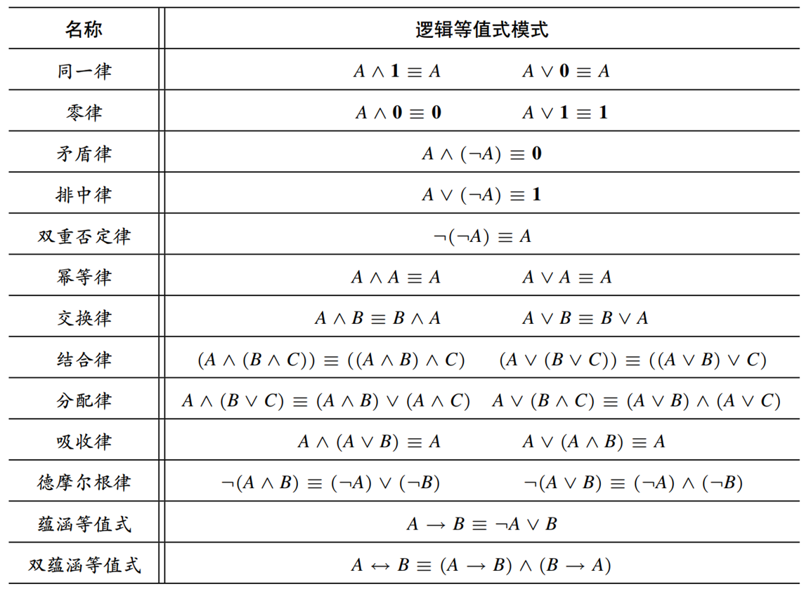
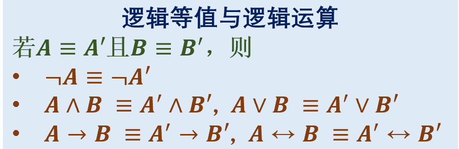

# 2.4 命题逻辑的等值演算

**逻辑等值**：$A \equiv B$，如果对于任意取值，均有 $\sigma (A) = \sigma(B)$

$A \equiv B$ 当且仅当 $(A \leftrightarrow B)$ 永真。

**等值演算**：
- **逻辑等值式模式**：将任意公式的大写字母替换逻辑等值式中的命题变量
- **逻辑等值式模式的替换实例**：用具体的公式替换逻辑等值式的**命题变量**（ 只可以是命题变量）
-  逻辑等值式**本身**是它自己的逻辑等值式模式的替换实例。
- 用基本公式的等值式模式的置换方式，对公式进行变形。
- 等值置换定理：将公式的某个子公式置换成其等值子公式，那么替换后的总公式和原公式等值。

容易忘记名字：同一律、零律、矛盾律、排中律、幂等律

**基本逻辑等值式模式**：

$\bigstar$ 需要注意的模式：**分配律**、**吸收律**、德摩尔根律、蕴涵等值式、双蕴涵等值式

- $(A \lor B) \land (A \lor C) \equiv A \lor B \land C,\quad (A \land B) \lor (A \land C) \equiv A \land (B \lor C)$（其实就是分配律反过来  ）

逻辑等值的**性质**：
- 自反性、对称性、传递性（和等式一样）
- 

# 2.5 命题逻辑公式的范式
合取 $\rightarrow$  合 and $\rightarrow$ 逻辑与 $\land$

析取 $\rightarrow$ 析 只选一个 or $\rightarrow$ 逻辑或 $\lor$

**析取范式**：若干个简单合取式的析取 (Sum of Products)

**合取范式**：若干个简单析取式的合取 (Product of Sums)

**文字**：命题变量 或 其否定

特例：_单个文字、单个简单析取式、单个简单合取式_，既是析取范式又是合取范式

**主析取范式**：每个简单合取式必须包含所有变量，均为极小项

**主合取范式**：每个简单析取式必须包含所有变量，均为极大项

极小项(简单合取式)的编码：使得该极小项真值为 $1$ 的唯一真值赋值方式的二进制编码

分别使用 $m_0, m_1, \cdots, m_{2^n - 1}$ 命名：对于每一变量，有否定为 $0$，无否定为 $1$

极大项(简单析取式)的编码：使得该极大项真值为 $0$ 的唯一真值赋值方式的二进制编码

分别使用 $M_0, M_1, \cdots, M_{2^n - 1}$ 命名：对于每一变量，有否定为 $1$，无否定为 $0$  

每个公式有与它逻辑等值的**唯一**主范式，可认为是公式真值表的一种表达形式

主析取范式的极小项编码集 与 主合取范式的极大项编码集 互补。

**等值演算法**：已知范式，求主范式。
- 主析取范式：对于每个不是最小项的简单合取式，若未出现 $p$，则乘以 $\land (p \lor \lnot p)$，再用分配律
- 主合取范式：对于每个不是最大项的简单析取式，若未出现 $p$，则加上 $p \land \lnot p$，再用 $A \lor B \land C \equiv (A \lor B) \land (A \lor C)$ 变换（分配律）
- 直接通过真值表求主范式，更加方便。