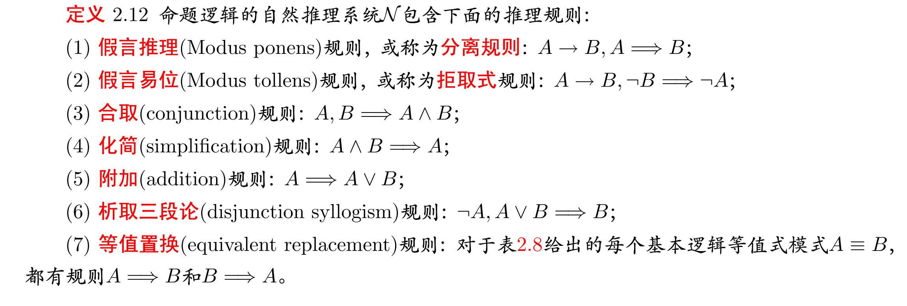
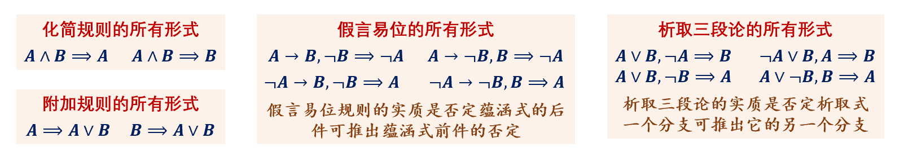

# 2.5 命题逻辑的推理理论

## 推理的有效性

**推理**：从一组作为前提的命题，得到一个作为结论的命题的过程。

记号：$A_1, A_2, \cdots A_n \Rightarrow B$

**推理的有效性**：
- 直观含义：所有前提为真时，得到的结论也为真
- 语义定义：$(A_1 \land A_2 \land \cdots A_n) \to B$ 永真

推理有效不并保证结论为真，只是假设所有前提为真，看结论能不能推出来。
## 自然推理系统

**自然推理系统**：推理规则（基本的有效推理）、论证（用于验证推理有效性）

**推理规则**：简单有效推理的泛化，得到的 _推理模式_。（永真式的替换实例） 

假言易位、合取、化简、附加、等值置换

部分推理规则的理解：
- **假言推理**：$A \to B, A \Rightarrow B$
	- 对于条件式，前件成立，那么后件成立
- **假言易位**：$A \to B, \lnot B \Rightarrow \lnot A$
	- 对于条件式，后件不成立，那么前件不成立（逆否命题）
- **析取三段论**：$\lnot A, A \lor B \Rightarrow B$
	- _排除法_，若两种情况之一成立，而已知其中之一不成立，则另一成立
- **分类讨论**：$A \lor B, A \to C, B \to C \Rightarrow C$

**论证**：对于推理 $A_1, A_2, \cdots, A_n \Rightarrow B$，它的论证是一个以结论公式 $B$ 结束的公式序列：$B_1, B_2, \cdots, B_m = B$，使得每个 $B_i$
- 归纳基：要么 $\exists j, B_i = A_j$
- 归纳步：要么 $\exists 1 \le j_1, j_2, \cdots, j_k < i$，使得 $B_{j_1}, B_{j_2}, \cdots, B_{j_k} \Rightarrow B_i$ 是某个 _推理规则的替换实例_
## 论证的构造方法

基本思路：
- 从推理结论开始进行分析，**倒推**回中间结论。逐次形成一个推理树
- 将推理树**后序遍历**得到的序列就是论证序列

不建议使用 _双重否定律、交换律和双蕴涵等值式_ 以外的等值置换规则。

**附加前提法**：对于推理 $A_1, A_2, \cdots, A_n \Rightarrow B \to C$，相当于证明 $A_1, A_2, \cdots, A_n, B\Rightarrow C$，最后再加一句 $B \to C \quad // 附加前提法$，这一步消除了附加前提。

**反证法**：对于推理 $A_1, A_2, \cdots, A_n \Rightarrow B$，相当于证明在附加前提 $\lnot B$ 下，$A_1, A_2, \cdots, A_n, \lnot B \Rightarrow C \land \lnot C$，其中 $C$ 是任一公式，$C \land \lnot C$ 指推出二者矛盾。最后再加一句 $B \quad // 反证法$，这一步消除了附加前提。

# 2.7 命题逻辑的应用

## 自然语言命题的符号化

容易产生疑惑的句式： 

| 自然语言           | 符号语言                                                                                    | 解释                 | 例子            |
| -------------- | --------------------------------------------------------------------------------------- | ------------------ | ------------- |
| `虽然p但是q`、`p而q` | $p \land q$                                                                             | 转折关系，则说明前后的分句都为真   | 虽然是晴天，但是很凉爽   |
| `p或q二者必居其一`    | $(p \land \lnot q) \lor (q \land \lnot p)$ $(p \lor q) \land (\lnot p \lor \lnot q)$ |                    | 这个人是男或女二者必居其一 |
| `如果p那么q`       | $p \to q$                                                                               | $p$ 是 $q$ 的充分条件    | 如果下雨了，地就会湿    |
| `只有p才q`、       | $q \to p$                                                                               | $p$ 是 $q$ 的必要条件    | 只有努力了，才会成功    |
| `除非p才q`        | $q \to p$ 或 $\lnot p \to \lnot q$                                                       | $p$ 是 $q$ 的必要条件    | 除非努力，才会成功     |
| `除非p否则q`       | $\lnot q \to p$                                                                         | 如果不是 $q$，那么一定是 $p$ | 除非努力，否则不会成功   |
| `p除非q`         | $\lnot p \to q$                                                                         | 如果不是 $p$，那么一定是 $q$ | 我会去跑步除非下雨     |
| `不p不q`         | $\lnot p \to \lnot q$                                                                   |                    | 不努力就不会成功      |

- 原命题：$p \to q$
- 逆命题：$q \to p$
- 逆否命题：$\lnot q \to \lnot p$
- 否命题：$\lnot p \to \lnot p$

原命题与逆否命题等值，逆命题与否命题等值。

## 普通逻辑问题的符号化分析

三类普通逻辑问题：
- 第一类问题：给出一些条件，寻找是否存在满足这些条件的情况或方案
- 第二类问题：给出从一些前提得到一个结论的推理，验证推理的有效性
- 第三类问题：给出一些前提，探讨从这些前提出发通过有效的推理可以得到怎样的结论