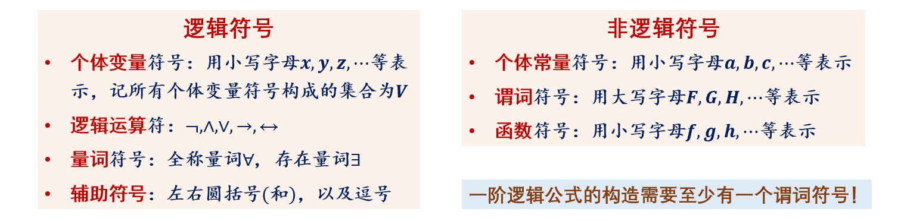

# 3.1 一阶逻辑的基本概念

**个体**：原子命题要判断的事物，用前端小写字母 $a, b, c, \cdots$

**个体类**：多个个体构成的整体，用中部大写字母 $F, G, H, \cdots$

**谓词**：原子命题给出的性质或关系，用类似函数的表示 $P(x)$

**个体变量**：谓词可能作用的个体，用后端小写字母 $\cdots, x, y, z$

**量词**：全称量词 $\forall$、存在量词 $\exists$

**具体命题**：对某个个体进行判断。_”个体“ + ”谓词“_

**量化命题**：对个体类进行判断。_“量词” + "个体类" + “谓词”_

**全总域**：研究范围内所有个体构成的集合，一般写成 $\forall x$，没有后面的命题

**论域**：谓词作用的个体变量的取值范围，一般写成 $\forall x H(x)$，有一个后面的命题

**特征谓词**：描述论域的谓词

**量化命题的符号化：
- **全称量化命题**：$\forall x(P(x) \to H(x))$
- **存在量化命题**：$\exists x(P(x) \land H(x))$

# 3.2 一阶逻辑公式的语法

**符号集**：

**一阶逻辑公式的归纳定义**：
- 原子公式（归纳基）：谓词作用于**项**（如：$H(x), H(x, y)$）
- 归纳步 I：否定式 $\lnot A$、合取式 $A \land B$、析取式 $A \lor B$、蕴含式 $A \to B$、双蕴含式 $A \leftrightarrow B$
- 归纳步 II：全称量词公式 $\forall x A$，存在量词公式 $\exists x A$，其中 $x$ 为个体变量， $A$ 为公式
- 优先级：$\forall / \exists$, $\lnot, \land, \lor, \to, \leftrightarrow$

**项的归纳定义**：
- 归纳基：任何个体常量 $c$ 和任何个体变量 $x$ 都是项
- 归纳步：$f(t_1, t_2, \cdots, t_n)$ 是项，其中 $f$ 是 $n$ 元函数，$t_1, t_2, \cdots, t_n$ 是项

**辖域**：对于量词公式 $\forall x A$ 或 $\exists x A$，$x$ 为指示变量，$A$ 为该公式的辖域

**约束出现和自由出现**：
- 若 $x$ 在公式 $A$ 的一处出现是在子公式 $\forall xB$ 或 $\exists x B$ 的辖域 $B$ 中，则此出现是约束出现。
- 若 $x$ 在公式 $A$ 的一处出现不在子公式 $\forall xB$ 或 $\exists x B$ 的辖域 $B$ 中，则此出现是约束出现。

**自由变量**：**有一处**出现是自由出现

**约束变量**：**所有**出现都是约束出现

**闭公式 / 句子**：没有自由变量的公式

**约束变量改名**：将量词公式 $\exists x A$ 或 $\forall x A$ 的里面出现的所有指示变量 $x$ 都改成从未出现过的 $y$.（可避免某个个体变量既自由出现，又约束出现，也可避免辖域嵌套）