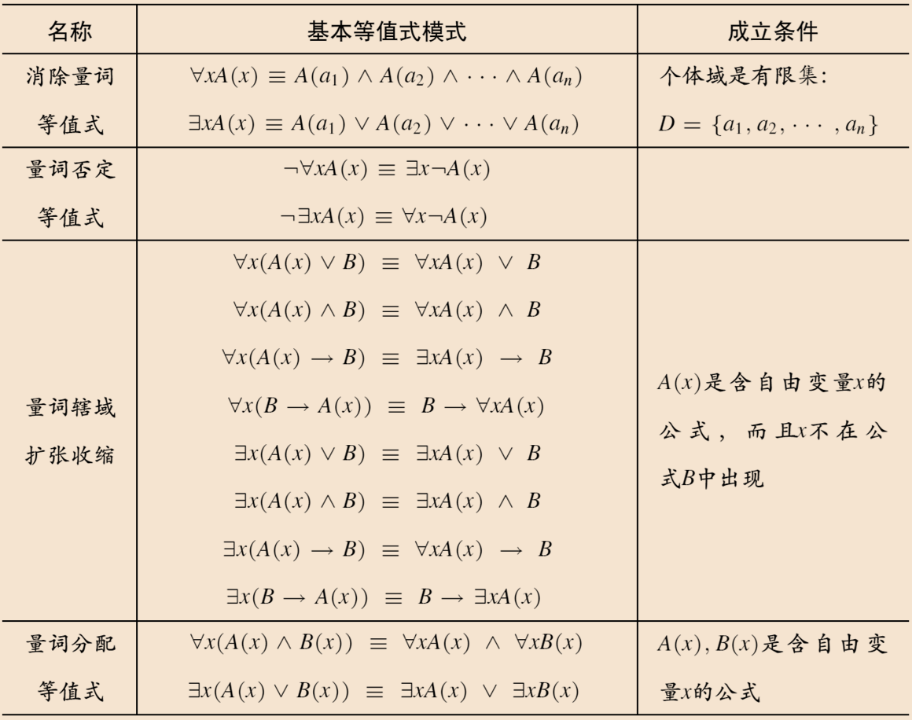

# 3.4 一阶逻辑的等值演算
## 3.4.1 一阶逻辑公式的逻辑等值

**逻辑等值**：两个一阶逻辑公式在任意解释和任意个体变量指派函数的真值都相同。

$A \equiv B$ 当且仅当 $A \leftrightarrow B$ 是永真式。

一阶逻辑永真式的证明：用自然语言来证明。

## 3.4.2 量词公式的基本等值式

一阶逻辑的基本等值式：
- 命题逻辑基本逻辑等值式（之前已学过）
- 量词公式的基本等值式：
	- **量词辖域扩张收缩**：当量词出现在前件的时候，需要改变前件的类型（利用析取的扩张收缩 + 量词否定等值式）
	- **量词分配等值式**：全称量词对合取分配、存在量词对析取分配，但是**不存在**全称量词对析取分配、存在量词对合取分配！

## 3.4.3 一阶逻辑公式的前束范式

**前束范式**：$Q_1x_1Q_2x_2\cdots Q_kx_kB$，其中 $Q_i$ 是量词符号，$B$ 是不含量词的一阶逻辑公式

求前束范式：
1. 约束变量改名规则使得每个个体变量要么约束出现，要么自由出现
2. 用量词否定等值式 + 量词辖域扩张等值式将量词放到最前面

用量词辖域扩张，前移的量词一般放在所有之前的量词的后面

# 3.5 一阶逻辑的推理理论

## 3.5.1 一阶逻辑推理的有效性

**命题逻辑的推理规则**：都一样，不过等值置换多了量词公式等值式

## 3.5.2 量词公式的推理规则

**全称例化规则**：
- $\forall x A(x) \Rightarrow A(y)$，其中变量 $x$ 不在 $A(x)$ 中以 $y$ 的指示变量的量词辖域出现
- $\forall x  A(x) \Rightarrow A(c)$，其中 $c$ 是个体常量

**全称泛化规则**：
- $A(y) \Rightarrow \forall x A(x)$，其中变量 $x$ 不在 $A(y)$ 中约束出现且不是在 $A(y)$ 中除 $y$ 以外的其他自由变量

**存在例化规则**：
- $\exists x  A(x) \Rightarrow A(c)$，其中 $c$ 是个体常量，这个 $c$ 一定是新出现的

**存在泛化规则**：
- $A(c) \Rightarrow \exists x  A(x)$，其中 $c$ 是个体常量，$x$ 不在 $A(c)$ 出现

| 规则   | 推理形式                            | 代入对象 | 关键前提               | 新出现       |
| ---- | ------------------------------- | ---- | ------------------ | --------- |
| 全称例化 | $\forall xA(x)\Rightarrow A(y)$ | 变量   | $y$ 在代入后是自由变量      |           |
| 全称例化 | $\forall xA(x)\Rightarrow A(c)$ | 常量   |                    |           |
| 全称泛化 | $A(y)\Rightarrow \forall xA(x)$ | 变量   | $y$ 不在任何未解除假设中自由出现 |           |
| 存在例化 | $\exists xA(x)\Rightarrow A(c)$ | 常量   | $c$ 不得在当前推导中出现     | $c$ 必须新出现 |
| 存在泛化 | $A(c)\Rightarrow \exists xA(x)$ | 常量   | $x$ 不在 $A(c)$ 中出现  |           |

消除的量词的辖域必须是整个公式，而引入的量词的辖域也包含整个公式。