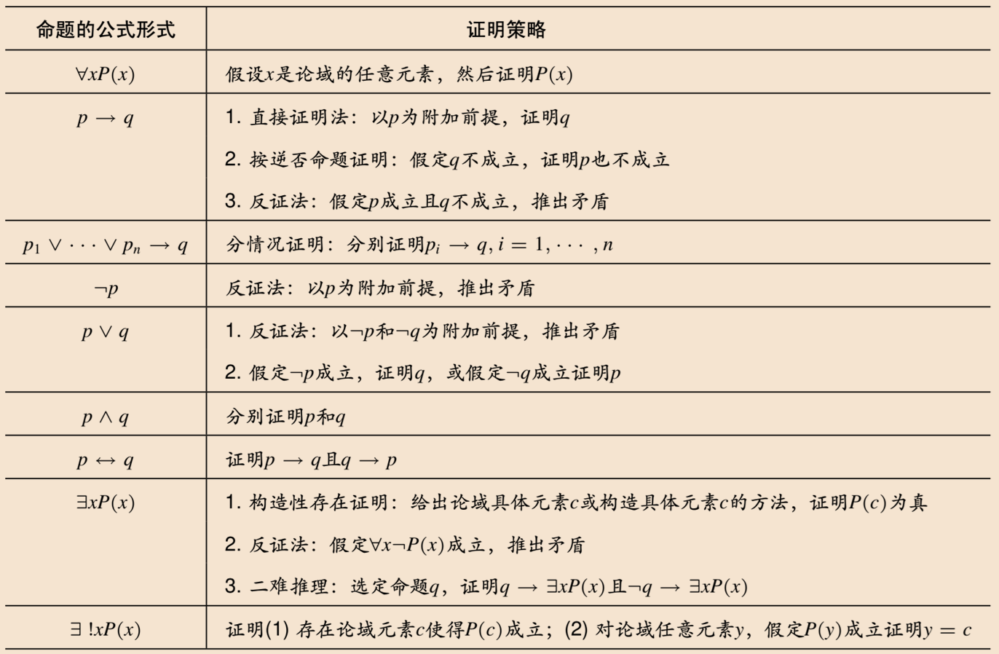

# 4.1 数学证明导引

| 证明类型 | 形式化证明                 | 非形式化证明                        |
| ---- | --------------------- | ----------------------------- |
| 例子   | 命题逻辑和一阶逻辑中的推理有效性论证    | 一般的数学证明                       |
| 前提   | 给出所有前提                | 没有明确给出                        |
| 中间结论 | 全部列出，且结论间通过基本推理规则一步得到 | 只给出重要中间结论，结论间可能不是由最基本推理规则一步得到 |
对数学命题进行形式化，可以更准确地理解定理证明的前提，以及各个命题之间的逻辑关系。

# 4.2 基本证明方法与策略

## 4.2.1 直接证明与间接证明

**直接证明**：从前提或附加前提出发，直接考虑如何得到待证命题的结论。

**间接证明**：不通过~，类型有
- **反证法**：要证明 $p$，以 $\lnot p$ 为附加前提，推出矛盾 $q,\ \lnot q$
- **逆否命题**：要证明 $p \to q$，以 $\lnot q$ 为附加前提，推出 $\lnot p$
## 4.2.2 分情况证明

**分情况证明**：把前提成立的情况分为几种，证明每种情况下结论是否成立。

要证明 $p \to q$，将 $p \equiv p_1 \lor p_2 \lor \cdots \lor p_n$，则 $$p_1 \lor p_2 \lor \cdots \lor p_n \to q \equiv (p_1 \to q) \land (p_2 \to q) \land \cdots \land (p_n \to q)$$
注意，分情况时，要做到**不重复（尽量做到）、不遗漏（必须做到）**

**不失一般性 / 不妨设**：选取一个代表性情况进行证明，不会影响一般性，因为其他情况等价或对称。可以缩小讨论范围。

**同理可得**：说明另一种情况和当前类似，所以也可以用同样的方法证明

## 4.2.3 存在性证明

**存在性证明**：用于证明形如 $\exists x P(x)$ 或 $\forall x \exists y P(x, y)$ （变量可以有多个）的命题。

**构造性证明**：
- 对于 $\exists x P(x)$，给出使得 $P(x)$ 为真的具体 $x$
- 对于 $\forall x \exists y P(x, y)$，给出对于任意 $x$，构造 $y$ 使得 $P(x, y)$ 为真的方法

**非构造性证明**：
- **反证法**：对于 $\exists x P(x)$，证明如果 $\forall x \lnot P(x)$，，将会产生矛盾
- **二难推理**：对于 $\exists x P(x)$，选择合适的命题 $Q$，证明无论 $Q$ 是否成立，都存在 $x$ 使得 $P(x)$ 为真。是分情况证明的一种经典形式。对于 $Q$ 的选择：
	- $Q$ 是否成立都应使得很容易确定使得 $P(x)$ 为真的元素 $x$
	- $Q$ 通常是**具有真值但很难确定其真值**的命题，由于真值没确定，因此没有实际构造出使 $P(x)$ 成立的具体元素 $x$.

**存在唯一性证明**：证明满足某个性质的元素存在，并且唯一。$$\exists x (P(x) \land \forall y(P(y) \to x = y ) )\quad \equiv \quad \exists! x P(x)$$
## 4.2.4 基本证明策略

**正向推理**：从已知前提看能推出什么中间结论，看能否获得需要证明的结论。常用于书面证明。

**反向推理**：从需要证明的结论出发，倒推所需的中间结论，看能否得到已知前提。常用于寻找证明思路。

**双蕴含式的证明**：要证明 $p \leftrightarrow q$，则分别证明 $p \to q$ 且 $q \to p$，或者找到若干中间命题，使得他们都是双蕴含关系。