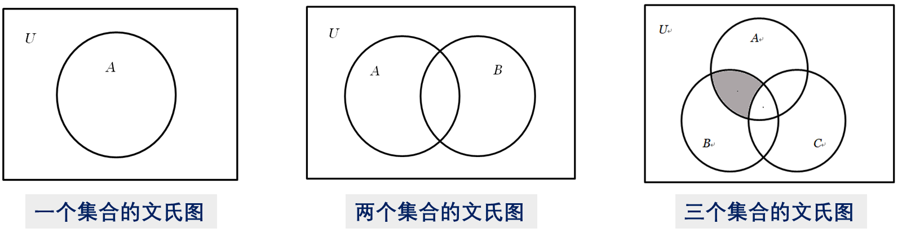
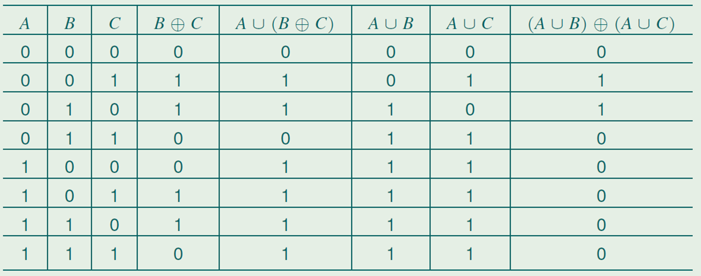
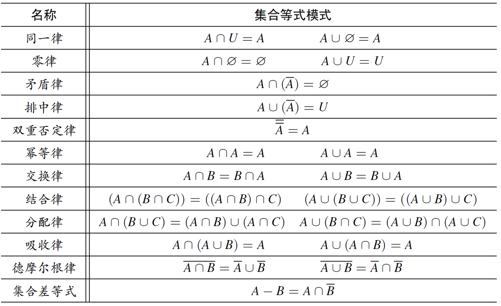

# 5.1 集合的基本概念

**子集**：$A \subseteq B$ 当且仅当 $\forall x (x \in A \to x \in B)$

**相等**：$A = B$ 当且仅当 $\forall x (x \in A \leftrightarrow x \in B)$，或者 $A \subseteq B \land B \subseteq A$

**真子集**：$A \subseteq B \land A \ne B$

**空集**：$\forall x (x \in \emptyset)$

**子集的性质**：
- 自反性：$A \subseteq A$
- 传递性：$A \subseteq B \land B \subseteq C \to A \subseteq C$
- 空集：$\emptyset \subseteq A$

**定义集合法**：

| 方法    | 描述                                                                                            | 例子                                                 |
| ----- | --------------------------------------------------------------------------------------------- | -------------------------------------------------- |
| 元素枚举法 | 将集合的所有元素一一罗列出来                                                                                | $\\\{1, 2, 3, 4\\\}$                                   |
| 性质概括法 | 用谓词概括元素满足的共同性质 基本形式：$\\\{x \mid P(x)\\\}$，扩展形式：$\\\{f(x) \mid P(x)\\\}$ 所有集合必须从已有集合中定义，否则产生罗素悖论 | 罗素悖论：P = $\\\{x \mid x \notin P\\\}$                   |
| 归纳定义法 | 归纳基 + 归纳步                                                                                     | $2, 6 \in S$ $x, y \in S \to x + y, x - y\in S$ |

**文氏图**：方框表示全集、其他封闭图形表示集合。图形的相交表示交集。

# 5.2 集合运算

集合并和集合交都满足交换律、结合律和幂等律

**集合并对集合交有分配律，集合交对集合并也有分配律**

**交与子集关系**：
- $A \cap B \subseteq A$, $A \cap B \subseteq B$
- $C \subseteq A \cap B \Leftrightarrow C \subseteq A \land C \subseteq B$

**并与子集关系**：
- $A \subseteq A \cup B$, $B \subseteq A \cup B$
- $A \cup B \subseteq C \Leftrightarrow A \subseteq C \land B \subseteq C$

**差、补与子集关系**：
- $A - B \subseteq A$
- $A \subseteq B \Leftrightarrow A - B = \emptyset$
- $A \subseteq B \Leftrightarrow \overline{B} \subseteq \overline{A}$

**集合族**：以集合为元素的集合，用花体字母表示。

**广义交**：对于集合族 $\mathcal A$，广义交为所有集合的交：$\cap \mathcal A = \\\{x \mid \forall S \in \mathcal A,\ x \in S\\\}$

**广义并**：对于集合族 $\mathcal A$，广义并为所有集合的并：$\cup \mathcal A = \\\{x \mid \exists S \in \mathcal A,\ x \in S\\\}$

**幂集**：所有子集构成的集合 $\wp(A) = \\\{S \mid S \subseteq A\\\}$

# 5.3 集合等式

**集合等式**：断言两种不同形式定义或表达的集合相等。

**证明集合等式的方法**：

**元素考察法**：考察每个元素要么都在两个集合，要么都不在两个集合。
- **基于定义**：$\forall x$，从 $x \in A$ 推出 $x \in B$.

**成员关系表**：二进制枚举所有是否属于基本集合的各种组合，那么每一列相当于命题逻辑，可以构建出真值表。

**等式演算法**：利用基本集合等式，演算方式证明。

重点关注：*吸收律*、*集合差等式*

**子集关系法**：根据集合等式与子集关系的联系证明。
- 集合交与子集关系：
	- $A \cap B = A \Leftrightarrow A \subseteq B$
	- $A \cap B \subseteq A$
	- $C \subseteq A \cap B \Leftrightarrow C \subseteq A \land C \subseteq B$
	- $A \subseteq B \land C \subseteq D \Rightarrow A \cap C \subseteq B \cap D$
- 集合并与子集关系：
	- $A \cup B = A \Leftrightarrow A \subseteq B$
	- $A \subseteq A \cup B$
	- $A \cup B \subseteq C\Leftrightarrow A \subseteq C \land B \subseteq C$
	- $A \subseteq B \land C \subseteq D \Rightarrow A \cup C \subseteq B \cup D$
- 集合差/补与子集关系：
	- $A - B \subseteq A$
	- $A \subseteq B \Leftrightarrow A -B =\emptyset$
	- $A \subseteq B \Leftrightarrow \overline{B}\subseteq \overline{A}$
- 幂集与子集关系：
	- $A \subseteq B \Rightarrow \wp(A)\subseteq\wp(B)$

**根据集合等式证明题判断方法规则：**
- **单纯的集合等式证明，涉及三个集合以内，出现 $\oplus,\ \cap,\ \cup,\ -$**：用成员关系表最快
- **找反例**：用描述型集合，最好集合不超过两个元素来做（eg. $\emptyset,\ \\\{1\\\},\ \\\{1, 2\\\}$）
- **目标是 $\subseteq$**：默认用元素考察法，常常需要分类讨论（是否属于某个集合 / 并集时讨论属于哪个集合）
- **差集 / 补集很多**：把 $A - B \Rightarrow A \cap \overline{B}$，然后用等值演算
- **证明等式 / 当且仅当**：拆成 $A \subseteq B,\ B \subseteq A$ 两步来证明，然后默认用元素考察法
- **前提是 $X \subseteq Y$，结论是 $Z \subseteq W$**：
	- 可以尝试反证法，如果存在 $x \in Z - W$，则会推出矛盾
	- 可以使用子集推演
- **幂集**：
	- 将 $S \in \wp(A) \Rightarrow S \subseteq A$，一般是对 $S$ 作为元素考察。
	- 使用 $A \subseteq B \Rightarrow \wp(A)\subseteq\wp(B)$ 来推演