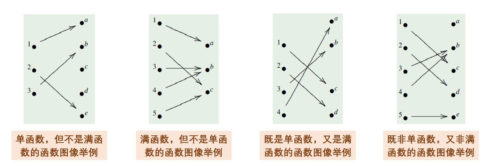

# 概念

**函数**：记为 $f: A \to B \subseteq A \times B$，且满足 $\forall a \in A,\ \exists! b \in B,\ \langle a, b \rangle \in f$
- 对于每个对应关系 $\langle a, b \rangle$，记作 $b = f(a)$，称 $b$ 是 $a$ 的 *像*，$a$ 是 $b$ 的 *原像*。
- $A$ 是 $f$ 的 *定义域 / 域*，$B$ 是 $f$ 的 *陪域*。
- *像集*：$f(S) = \\\{f(x) \in B \mid  x\in S\\\}$，其中 $S \subseteq A$.
- *原像集*：$f^{-1}(T) = \\\{ x \in A \mid f(x) \in T \\\}$，其中 $T \subseteq B$.
- *值域*：$f(A),\ ran(f)$.

**定义方法**：性质概括法、元素枚举法。

**恒等函数**：$id_A = \Delta_A$.

**特征函数**：$\chi_S(a) = \begin{cases} 1,&a \in S\\\\0,&a \notin S\end{cases}$

**单函数 / 一对一函数**：$\forall x, y \in A,\ x \ne y \Rightarrow f(x) \ne f(y)$.

**满函数 / 映上函数**：$ran(f) = B$.

**双函数**：既是单函数又是满函数。即 $\forall y \in B, \exists! x \in A,\ f(x)  = y$.

# 运算

**函数复合**：等同于关系复合，$(g \circ f)(x) = g(f(x))$.

函数复合的性质：
- 单位元：对于 $f: A \to B$，有 $id_B \circ f = f = f \circ id_A$.
- 结合律：$h \circ (g \circ f) = (h \circ g) \circ f$.
- 函数复合保持函数单满性质：如 $f, g$ 都是单/满/双函数，那么 $g \circ f$ 也是单/满/双函数。

**双函数的逆函数 / 反函数**：对于双函数 $f: A \to B$，其逆函数为 $g: B \to A = \\\{ \langle y, x \rangle \mid \langle x, y\rangle \in f\\\}$.
- 二者关系：$g \circ f = id_A,\ f \circ g = id_B$.
- 函数是双函数 $\Leftrightarrow$ 函数存在逆函数。

**左逆函数**：$g : B  \to A$ 是 $f$ 的左逆，当且仅当 $g \circ f = id_A$.

**右逆函数**：$g : B  \to A$ 是 $f$ 的右逆，当且仅当 $f \circ g = id_A$.
# \*基数

**等势**：若存在 $f: A \to B$ 是双函数，则 $A$ 和 $B$ 等势，记作 $A \approx B$.
- 性质：自反性、对称性、传递性
- 例子：$\mathbb N \approx \mathbb Z,\ \mathbb R \approx (0, 1),\ \mathcal p(A) \approx \mathbb 2^A$.
- 对于有穷集，若 $|A| = |B| \Leftrightarrow A \approx B$.

**康托尔定理**：对任意集合 $A$，它的幂集 $℘(A)$ 的势大于 $A$.

**归纳集**：$\emptyset \in A$，且若 $S \in A$，那么后继 $S^+ \in A$.

**有穷集**：有穷个元素的集合。

**无穷集**：无穷个元素的集合，判定：$\exists B \subset A,\ A \approx B$.

**基数**：$Card(A) = |A|$
- 对于有限集，$|A|$ 就是元素个数。
- $\mathbb N,\ \mathbb R$ 的基数为 $\aleph_0$.
- $A \approx B \Leftrightarrow |A| = |B|$.
- **施罗德-伯恩斯坦定理**：既存在 $A$ 到 $B$ 的单函数又存在 $B$ 到 $A$ 的单函数，则 $A$ 与 $B$ 等势。

**可数集 / 可枚举集**：有穷集，或与自然数等势的集合。
- 例子：$\mathbb N$, $\mathbb Z,\ \mathbb N*$, $\mathbb Z^+\times \mathbb Z^+$, $\mathbb N^+\times \mathbb N^+$.

**不可数集**：比自然数势更大的集合。
- 例子：$\mathbb R,\ \mathbb N^{\mathbb N} = \\\{f : \mathbb N \to \mathbb N\\\}$

# 算法复杂度

**大 O 记号**：对于函数 $f, g$，若 $f \in O(g)$，那么 $\exists C > 0,\ k >0, \ \forall x > k,\ |f(x)| \le C|g(x)|$.
- 代表函数 $g$ 刻画了函数增长的一种上界。

**常见函数增长情况比较（从快到慢）**：
1. 指数函数：$b^n\ (b > 1)$.
2. 幂函数：$n^c\ (c > 0)$.
3. 对数函数：$(log_b n)^c\ (b > 1,\ c > 0)$.

**大 O 记号的运算**：
- $\max(f_1, f_2) \in O(\max(g_1,g_2))$.
- $f_1 + f_2 \in O(g_1+g_2)$.
- $f_1·f_2 \in O(g_1·g_2)$.

判断算法时间复杂度，已经十分熟悉，略去。

**易解问题 / P 问题**：存在多项式时间复杂度的算法的问题。

**不易解问题**：不存在多项式时间复杂度的算法的问题。

**NP 问题**：能在多项式时间复杂度内检查解正确性的问题，但无法知道其是否存在多项式时间复杂度的算法（P = NP?）。

**NP-Complete / NPC 问题**：所有的 NP 问题可归结为该问题的问题。

**P = NP?**：问 NP 问题是否存在多项式时间复杂度算法。

*该问题的求解困难，是因为缺乏一种能够描述算法能力边界的数学工具。*

**可解问题**：存在算法的问题。

**不可解问题**：不存在有效算法的问题。

不可解问题的例子：
- 图灵停机问题：判定任意计算机程序的执行会否终止
- 一阶逻辑公式的可满足性问题
- 程序是否有死循环
- 程序是否会触发某个特定状态
- 某个命题是否由形式系统可证明
- 某些数学猜想是否可由算法判定
