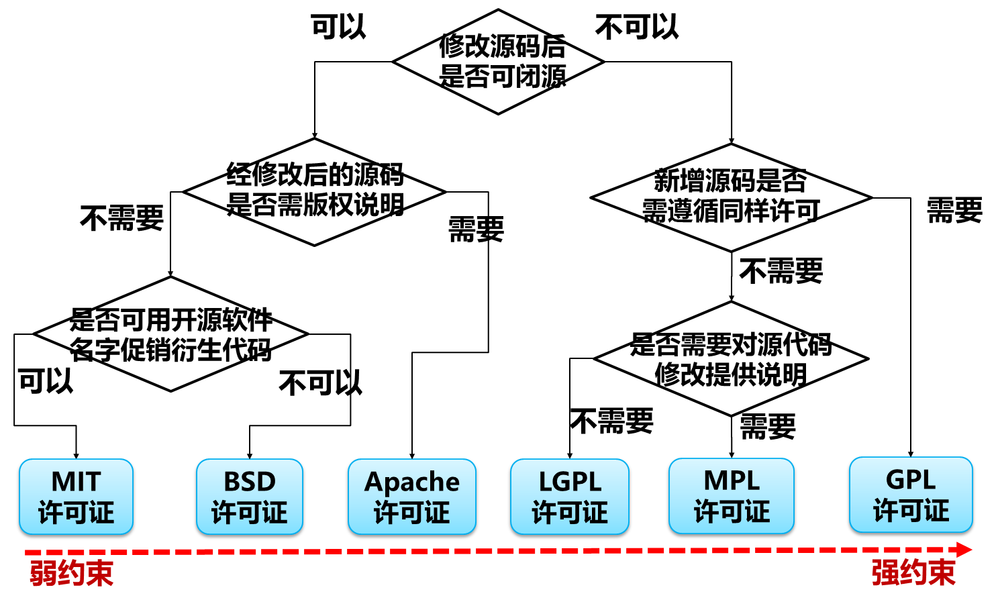

# 1.1 程序及质量保证方法
## 1.1.1 程序及质量要求

产品的质量问题：
- **外在质量（用户观点）**：用户可直接感觉到的，外在的功能和性能
	- 如正确性、高效性、可靠性、友好性
- **内在质量（程序员观点）**：用户无法直接感触到，维修人员能认识到
	- 如可理解、可修改、可维护、可重用

## 1.1.2 质量保证方法

- **编码规范**：好的编码风格可以提高代码的可读性和理解性，可维护性和可重用性
	- 目标：易读性（一看就懂）、简明性（结构清晰）、易改性、无二义
	- 代码布局：缩进、大括号换行、一行一条语句
	- 代码组织：一定次序说明顺序、字母顺序说明对象、尽量避免嵌套、统一缩进
	- 命名规范：有意义和一目了然的命名方式，用英文单词，不要过长，尽量全称
	- 代码注释：注释说明程序做什么、为什么这么做、注意事项。在语句块的头尾注解、有效必要简洁、随着代码的修改而修改
- **设计方法**：
	- 语句设计：单入口单出口，少用goto，加强异常处理
	- 模块化设计：尽量将程序按照模块编写，如函数、过程、方法、类、程序包
	- 高内聚度：模块内各要素紧密相关，仅实现单一功能。
	- 低耦合度：不同模块间的关系应当非常松散。
- **代码重用**：在编写代码的过程中，充分利用已有和现成的代码
	- 优点：可以极大提高编程效率和程序质量
	- 现成代码来源：他人子功能代码片段、函数库、开源代码
- **结对编程**：两位程序员坐在统一工作台前一起开发软件
	- 一方具体编写程序，另一方看程序和发现问题，双方相互讨论，周期性互换角色
	- 软件开发是集体性、群体性行为。
	- 优点：提高程序质量、提高开发效率、促进学习交流

## 1.1.3 质量分析方法

- **人工审查**：纯粹通过阅读和理解代码，来发现缺陷和问题
	- 审查内容：是否符合编程规范、是否存在错误和缺陷
	- 缺点：效率低、难以发现深层次问题、难以全面系统分析
	- 主体分类：自我复审、同伴复审、团队复审
- **自动化工具审查**：由计算机软件来自动完成代码审查，在 *无需运行被测代码* 的前提下
	- 审查内容：是否符合编程规范、是否存在错误和缺陷
	- 优点：可快速定位隐藏错误和缺陷
	- 常见分析工具：[SonarQube](http://www.sonarqube.org/), CheckStyle, FindBugs, PMD, Jtest 等
- **软件测试技术**：设计测试用例→运行测试用例→判断运行结果

# 1.2 软件及其特点

## 1.2.1 软件

**软件的定义**：在计算机系统的支持下，能够完成特定功能和性能的 *程序、数据和文档*。

**软件中的文档**：
- 定义：记录软件开发活动和阶段性成果、软件配置及变更的阐述性资料。
- 优点：可以帮助定义和理解软件、记录软件开发成果、辅助开发人员交流
- 分类：需求文档、设计文档、测试文档、用户手册等等

**软件中的数据**：
- 定义：程序的加工处理对象和结果
- 形式：用户、订单、交易、日志数据
- 处理方式：表示、获取、存储、检索、分析

软件不仅仅是程序，开发软件不仅仅是编写程序。

**软件生命周期**：
- 定义：软件从提出开发到最终灭亡所经历的时期。
- 各阶段：需求分析 $\Rightarrow$ 软件设计 $\Rightarrow$ 编码实现 $\Rightarrow$ 软件测试 $\Rightarrow$ 部署运行 $\Rightarrow$ 使用维护

**软件特点**：
- 逻辑性：是思维活动的产物，不会磨损和老化
- 易变性：需求经常变，难以把控
- 复杂性：规模大、运行复杂
- 是设计开发而成的
- 缺陷具有隐蔽性

**软件的分类**：
- 应用软件：面向特定应用领域的专用软件，如淘宝、12306、微信等等
- 系统软件：对计算机资源进行管理，为应用软件的运行提供基础设施和服务的一类软件。介于计算机硬件和应用软件之间。如操作系统、数据库、编译软件等等
- 支撑软件：辅助软件开发和运维的软件。如 SonarQube, Visual Studio 等等

## 1.2.2 开源软件

**闭源软件**：
- 代码不对用户开放的一类软件，购买软件时只提供可运行软件或服务，没有提供源代码。
- 以 **许可证 (License)** 的方式授权用户使用软件。
- 问题：无法掌握软件内部实现情况，限制开发者的创新自由。
- 示例：Windows, Office 等

**开源软件**：
- 源代码可以自由获取和传播的计算机软件。
- 通过 *开源许可证* 赋予被许可人对软件进行使用修改和传播。
- 好处：源代码可自由传播、激发创作者热情、降低使用成本、质量更高更安全、研制和交付更快、功能更为强大
- 示例：Linux, Ubuntu, Eclipse, Kubernetes, MySQL, TensorFlow 等
- 开源软件正在逐步替代闭源软件

开源软件代码托管平台：[Github](www.github.com), [SourceForge](sourceforge.net), [Gitee](www.gitee.com)

软件开发知识分享平台：[Stack Overflow](stackoverflow.com)

开源许可证：声明获得开源代码后拥有的权利，界定对别人的开源作品进行何种操作、何种操作是被禁止的，规范开源软件的使用要求和约束

## 1.2.3 软件质量

软件质量要素：
- 正确性、可靠性、健壮性、有效性、安全性
- 可维护性、可移植性、可重用性
- 可理解性、可信性、持续性、可用性、互操作性

