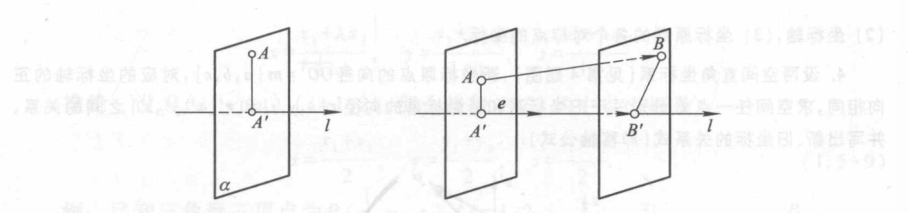

# 1.4 向量的线性关系 (cont'd)

**线性相关**：向量组合 $= \boldsymbol 0$ 的方程只有平凡解，则线性无关，否则线性相关。

$\ge 2$ 个向量线性相关 $\Leftrightarrow$ 存在一个向量是其他向量的线性组合

可以转换成向量形成的系数矩阵的简化阶梯型没有全零行，或者行列式等于零

# 1.5 标架与坐标
**标架**：给定 _有序_ 向量作为坐标轴，这些向量整体叫做标架
- 笛卡尔标架：向量均为单位向量
- 笛卡尔直角标架：向量均为单位向量，且两两垂直
- 放射标架：无要求
- 右手/左手标架：三维标架中，坐标轴顺序为拇指、食指、中指
- 工程上经常用右手标架，计算机有时用左手标架

**坐标**：给定标架，某个向量关于这个标架的线性组合系数。记为 $\boldsymbol r \{x, y, z\}$

如果是点坐标，就写作 $P(x, y, z)$

**坐标系**：向量/点与坐标的一一对应关系。

常用 $\{O; \boldsymbol{i, j, k}\}$ 表示直角坐标系，其中 $O$ 表示坐标原点，$\boldsymbol{i, j, k}$ 表示单位坐标向量

坐标原点、坐标向量

坐标轴：坐标向量所在的直线

坐标面：每两条坐标轴决定的平面。直角坐标系中，各坐标面垂直。

三维坐标系中：

卦限：由坐标面分成的八个区域（$z$ 先正后负，$x, y$ 和平面的象限顺序一样）

$x, y, z$：横坐标、纵坐标、竖坐标

坐标分解式：$\boldsymbol r = x \boldsymbol i + y\boldsymbol j + z \boldsymbol k = \{x, y, z\}$

**向量的运算**：
- 向量的坐标，等于终点坐标减去始点坐标
- 两向量和的坐标，等于两向量坐标对应相加
- 数乘向量的坐标，等于向量每个坐标乘以该数

**共线与共面**
两个非零向量 $\{x_1, y_1, z_1\}, \{x_2, y_2, z_2\}$ 共线 $\Leftrightarrow$ $\displaystyle \frac{x_1}{x_2} = \frac{y_1}{y_2} = \frac{z_1}{z_2}$（忽略 $\displaystyle \frac{0}{0}$）

三个点 $(x_1, y_1, z_1), (x_2, y_2, z_2),  (x_3, y_3, z_3)$ 共线 $\Leftrightarrow$ $\displaystyle \frac{x_2 - x_1}{x_3 - x_1} = \frac{y_2 - y_1}{y_3 - y_1} = \frac{z_2 - z_1}{z_3 - z_1}$

三个非零向量 $\{x_1, y_1, z_1\}, \{x_2, y_2, z_2\},  \{x_3, y_3, z_3\}$ 共面 $\Leftrightarrow$ $\displaystyle \begin{vmatrix}x_1&y_1&z_1\\\\x_2&y_2&z_2\\\\x_3&y_3&z_3\end{vmatrix}=0$

（用线性相关的充要条件来证）

四个点 $(x_1, y_1, z_1), (x_2, y_2, z_2),  (x_3, y_3, z_3), (x_4, y_4, z_4)$ 共面 $\Leftrightarrow$ $\begin{vmatrix}x_2-x_1&y_2-y_1&z_2-z_1\\\\x_3-x_1&y_3-y_1&z_3-z_1\\\\x_4-x_1&y_4-y_1&z_4-z_1\end{vmatrix}=0$

**定比分点**：给定 $P_1(x_1, y_1, z_1), P_2(x_2, y_2, z_2)$，那么 $\overline{P_1P_2}$ 的成定比 $\lambda (\lambda \ne -1)$  $P$ 的坐标为 $$\left( \frac{x_1 + \lambda x_2}{1 + \lambda}, \frac{y_1 + \lambda y_2}{1 + \lambda}, \frac{z_1 + \lambda z_2}{1 + \lambda} \right)$$
令 $\lambda = 1$，得中点坐标公式。

# 1.6 向量在轴上的射（投）影

点在轴上的射影：过 $A$ 做轴 $l$ 的平面 $\alpha$，那么 $\alpha$ 与 $l$ 的交点 $A'$ 就是 $A$ 在 $l$ 的射影。

向量在轴上的射影：向量的始点和终点分别对轴做射影得到的新向量，记作射影向量 $_l \overline{AB} = \overline{A'B'}$

**夹角**：两向量 $\overline{OA}, \overline{OB}$ 的 $\in [0, \pi]$ 的夹角记作 $\angle (\boldsymbol{a, b})$

**射影定理**：$射影_l \overrightarrow{AB} = |\overrightarrow{AB}| \cos \theta$，其中 $\theta = \angle(l, \overrightarrow{AB})$

- 同向：$0 \le \theta < \frac{\pi}{2}$，射影为正数
- 垂直：$\theta = \frac{\pi}{2}$，射影为零
- 反向：$\frac{\pi}{2} < \theta \le \pi$，射影为负数

相等向量在同一轴上的射影相等。

**射影的运算**：
- $射影_l(\boldsymbol a + \boldsymbol b) = 射影_l \boldsymbol a + 射影_l \boldsymbol b$，可推广到有限多个的加法
- $射影_l(\lambda \boldsymbol a) = \lambda 射影_l \boldsymbol a$

**射影与坐标的关系**：在直角坐标系 $\{O; \boldsymbol{i, j, k}\}$ 下，向量 $\boldsymbol a$ 的坐标为 $$\{射影_i \boldsymbol a, 射影_j \boldsymbol a, 射影_k \boldsymbol a\}$$
# 1.7 两向量的数量积
**数量积/内积**：$\boldsymbol a · \boldsymbol b = |\boldsymbol a||\boldsymbol b| \cos\angle(\boldsymbol a, \boldsymbol b)$
