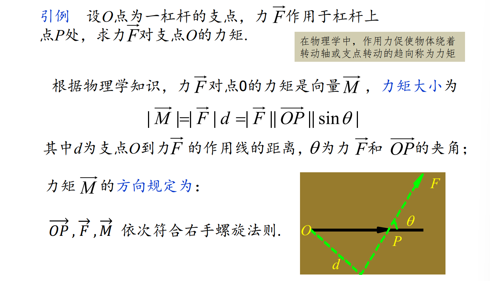
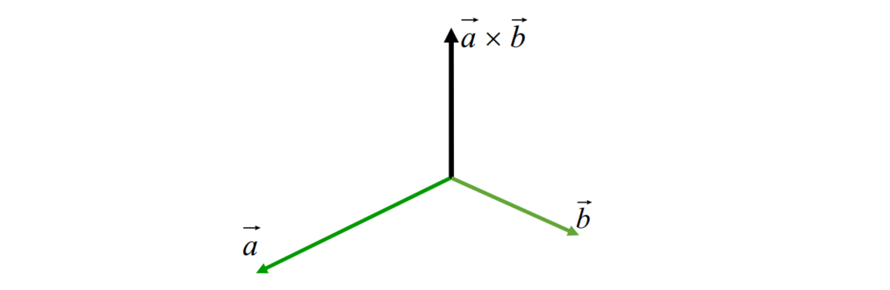

# 1.7 两向量的数量积 (con'd)
向量的模表达式：对于 $\boldsymbol a \{X, Y, Z\}$，则 $|\boldsymbol a| = \sqrt{X^2 + Y^2 + Z^2}$

空间两点距离公式：对于 $P_1(x_1, y_1, z_1), P_2(x_2, y_2, z_2)$，则 $\left|\overrightarrow {P_1P_2} \right| = \sqrt{(x_1 - x_2)^2 + (y_1 - y_2)^2 + (z_1 - z_2)^2}$

**方向角**：向量与三条坐标轴的正向夹角 $\alpha, \beta, \gamma \in [0, \pi]$

方向余弦：方向角的余弦值 $\cos \alpha, \cos \beta, \cos \gamma$

方向余弦**性质**：
- $x = |\boldsymbol a| \cos \alpha,\ y = |\boldsymbol a| \cos \beta,\ z = |\boldsymbol a| \cos \gamma$
- $\displaystyle \boldsymbol a^0 = \frac{\boldsymbol a}{|\boldsymbol a|} = (\cos \alpha, \cos \beta, \cos \gamma)$
- $\displaystyle \cos \alpha = \frac{x}{\sqrt{x^2 + y^2 + z^2}},\ \cos \beta = \frac{y}{\sqrt{x^2 + y^2 + z^2}},\ \cos \gamma = \frac{z}{\sqrt{x^2 + y^2 + z^2}}$
- $\cos^2 \alpha + \cos^2 \beta + \cos^2 \gamma = 1$
- $\boldsymbol a$ 在 $\boldsymbol b$ 上的投影为 $\displaystyle \frac{\boldsymbol a · \boldsymbol b}{|\boldsymbol b|}$

**夹角余弦**：$\boldsymbol a \{X_1, Y_1, Z_1\}, \boldsymbol b \{X_2, Y_2, Z_2\}$ 的夹角余弦为 $$\cos \theta = \frac{X_1 X_2 + Y_1 Y_2 + Z_1 Z_2}{\sqrt{X_1^2 + Y_1^2 + Z_1^2} \sqrt{X_2^2 + Y_2^2 + Z_2^2}}$$
- 两向量相互垂直充要条件为 $X_1 X_2 + Y_1 Y_2 + Z_1 Z_2 = 0$
- 柯西不等式：$\displaystyle \left(\sum_{i = 1}^n a_i b_i\right)^2 \le \sum_{i = 1}^n a_i^2 \sum_{i = 1}^n b_i^2$

# 1.8 两向量的向量积
向量积的物理意义：

**向量积 / 外积**：$\boldsymbol a \times \boldsymbol b$ 是一个向量，满足 $|\boldsymbol a \times \boldsymbol b| = |\boldsymbol a| |\boldsymbol b| \sin \angle (\boldsymbol a, \boldsymbol b)$，方向与 $\boldsymbol a, \boldsymbol b$ 都垂直，且形成右手标架 $\{ O: \boldsymbol a, \boldsymbol b, \boldsymbol a \times \boldsymbol b\}$

$|\boldsymbol a \times \boldsymbol b|$ 是两个向量为邻边构成的平行四边形的面积。

$\boldsymbol a, \boldsymbol b$ 共线的充要条件： $\boldsymbol a \times \boldsymbol b = \boldsymbol 0$

向量积的**运算规律**：
- 反交换：$\boldsymbol a \times \boldsymbol b = - \boldsymbol b \times \boldsymbol a$
- 与数乘的结合律：$(\lambda \boldsymbol a) \times \boldsymbol b =  \boldsymbol a \times (\lambda\boldsymbol b) = \lambda( \boldsymbol a \times \boldsymbol b)$
- 左分配律：$\boldsymbol a \times (\boldsymbol b + \boldsymbol c) = \boldsymbol a \times \boldsymbol b + \boldsymbol a \times \boldsymbol c$
- 右分配律：$(\boldsymbol a + \boldsymbol b) \times \boldsymbol c = \boldsymbol a \times \boldsymbol c + \boldsymbol b \times \boldsymbol c$

向量积的**性质**：
- $(\boldsymbol a \times \boldsymbol b)^2 + (\boldsymbol a·\boldsymbol b)^2 = |\boldsymbol a|^2 |\boldsymbol b|^2$

向量积的**坐标**：
用分配律来计算。

# 1.9 三向量的混合积
**混合积**：$(\boldsymbol a \times \boldsymbol b) · \boldsymbol c$ 或 $(\boldsymbol a, \boldsymbol b, \boldsymbol c)$ 或 $(\boldsymbol{abc})$

混合积公式： $(\boldsymbol a \times \boldsymbol b) · c = |\boldsymbol a \times \boldsymbol b| · |\boldsymbol c| \cos \theta$，其中 $\theta$ 为 $\boldsymbol a \times \boldsymbol b$ 与 $\boldsymbol c$ 的夹角。

当 $\boldsymbol a = \boldsymbol b$ 时，$(\boldsymbol a, \boldsymbol b, \boldsymbol c) = 0$

混合积的**几何意义**：混合积的绝对值等于以 $\boldsymbol a, \boldsymbol b, \boldsymbol c$ 为棱的平行六面体的体积 $V$
- $|\boldsymbol a \times \boldsymbol b|$ 为底边面积，$|\boldsymbol c| \cos\theta$ 为六面体的高
- 当 $\boldsymbol a, \boldsymbol b, \boldsymbol c$ 构成右手标架，混合积为正
- 当 $\boldsymbol a, \boldsymbol b, \boldsymbol c$ 构成左手标架，混合积为负

$\bigstar$ 三向量**共面**的充要条件：三向量的混合积为 $0$。

混合积的**性质**：
- 混合积的因子循环位移，则混合积不变：$(\boldsymbol a \boldsymbol b \boldsymbol c)  = (\boldsymbol b \boldsymbol c \boldsymbol a) = (\boldsymbol c \boldsymbol a \boldsymbol b)$（标架类型不变）
- 混合积的因子发生两因子交换，则混合积取反：$(\boldsymbol a \boldsymbol b \boldsymbol c)  = -(\boldsymbol a \boldsymbol c \boldsymbol b) = -(\boldsymbol c \boldsymbol b \boldsymbol a) = -(\boldsymbol b \boldsymbol a \boldsymbol c)$（标架类型改变）
- 用坐标计算混合积：
	- 由此可以得出，如果三个向量线性相关（共面），则混合积为零。
- 用混合积计算标架坐标：

# 1.10 三向量的双重向量积
**双重向量积**：$(\boldsymbol a  \times \boldsymbol b) \times \boldsymbol c$

几何关系：$(\boldsymbol a  \times \boldsymbol b) \times \boldsymbol c$ 与 $\boldsymbol a, \boldsymbol b$ 共面

一般情况下，双重向量积不满足结合律。

双重向量积的**性质**：
- 
- 
