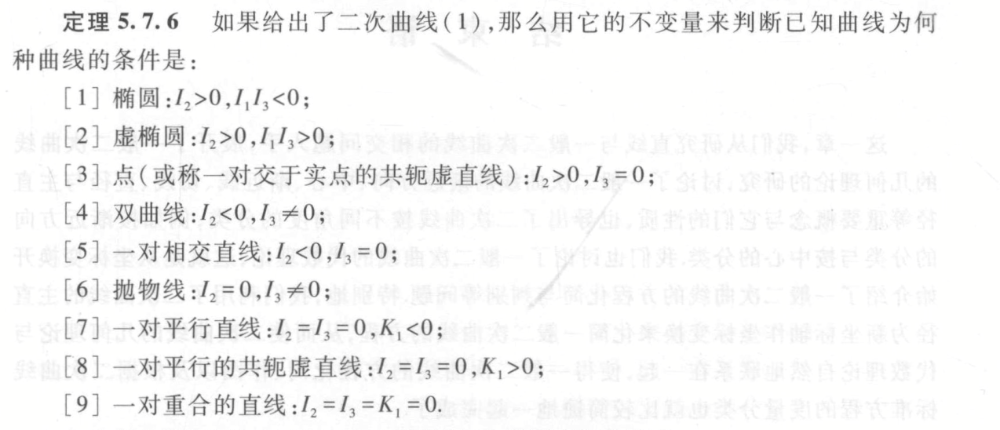

# 5.6 二次曲线的方程化简与分类

## 5.6.1 平面直角坐标变换

坐标变换可以通过先移轴到 $(x_0, y_0)$（使得原坐标原点与新坐标系的原点重合），然后顺时针旋转 $\alpha$（使得原曲线与新坐标系的曲线重合，因此每个坐标相对地逆时针旋转 $\alpha$），因此一般坐标变换公式为 $$\begin{cases}x' = (x - x_0) \cos \alpha - (y - y_0) \sin \alpha \\\\ y' = (x - x_0)\sin \alpha + (y - y_0) \cos \alpha \end{cases} $$
如果坐标变换仅由两条正交直线给出，那么我们可以求出他们的交点作为新的坐标系原点，然后求出旋转的角度，即可转换为上面的方法。

坐标变换下，$F(x, y) = 0$ 左边的次数仍然是不变的，换句话说，与坐标系的选择无关。

## 5.2 二次曲线的方程化简与分类

对于*移轴变换*，方程的变换规律：
- 二次项系数不变
- 一次项系数为 $a'\_{13} = F(x_0, y_0),  a'\_{23} = F_2(x_0, y_0)$
- 常数项变为 $a'_{33} = F(x_0, y_0)$
- 如果移到中心，那么一次项消失 $a'\_{13} = a'\_{23} = 0$。

对于*转轴变换*，方程的变换规律：
- 二次项系数一般会改变，仅与各个二次项系数相关
- 一次项系数一般要改变，仅与各个一次项系数相关
- 常数项不变。
- 如果旋转到与主直径重合 $\displaystyle \cot 2 \alpha = \frac{a_{11} - a_{22}}{2a_{12}}$，那么 $a'_{12} = 0$.

为了将二次曲线变换到合适的位置使得曲线的方程尽量简介，我们需要：
- 将坐标轴变换到二次曲线的 *主直径（对称轴）* 重合的位置
- 中心曲线：坐标原点与曲线中心重合
- 无心曲线：坐标原点与曲线顶点重合
- 线心曲线：坐标原点与曲线任何一个中心重合

**定理**：通过适当选取坐标系，二次曲线的方程总可以化成下面三个简化方程中的一个：

| 曲线类型                                                                                  | 标准方程                                      | 名称                 | 不变量                   |
| ------------------------------------------------------------------------------------- | ----------------------------------------- | ------------------ | --------------------- |
| 中心曲线：$I_2 \ne 0$ $$a_{11}x^2 + a_{22}y^2 + a_{33} = 0$$$$(a_{11}a_{22} \ne 0)$$       | $$\frac{x^2}{a^2} +\frac{y^2}{b^2} = 1$$  | 椭圆                 | $I_2 > 0, I_1I_3 < 0$ |
|                                                                                       | $$\frac{x^2}{a^2} +\frac{y^2}{b^2} = -1$$ | 虚椭圆                | $I_2 > 0, I_1I_3 > 0$ |
|                                                                                       | $$\frac{x^2}{a^2} -\frac{y^2}{b^2} = 1$$  | 双曲线                | $I_2 < 0, I_3 \ne 0$  |
|                                                                                       | $$\frac{x^2}{a^2} +\frac{y^2}{b^2} = 0$$  | 点 （相交于实点的共轭虚直线） | $I_2 > 0, I_3 = 0$    |
|                                                                                       | $$\frac{x^2}{a^2} -\frac{y^2}{b^2} = 0$$  | 两相交直线              | $I_2 < 0, I_3 = 0$    |
| 无心曲线：$I_2 = 0,\ I_3 \ne 0$ $$a_{22} y^2 + 2a_{13} x = 0$$$$ (a_{22}a_{13} \ne 0)$$ | $$y^2 = 2px$$                             | 抛物线                |                       |
| 线心曲线：$I_2 = I_3 = 0$ $$a_{22}y^2 + a_{33} = 0$$$$ (a_{22} \ne 0)$$                 | $$y^2 = a^2$$                             | 两平行直线              | $K_1 < 0$             |
|                                                                                       | $$y^2 = -a^2$$                            | 两平行共轭虚直线           | $K_1 > 0$             |
|                                                                                       | $$y^2 = 0$$                               | 两重合直线              | $K_1 = 0$             |

# 5.7 应用不变量化简二次曲线的方程

二次曲线在直角坐标变换下，有三个不变量 $I_1, \ I_2,\ I_3$ 以及一个半不变量 $K_1$（移轴改变，转轴不变）。

