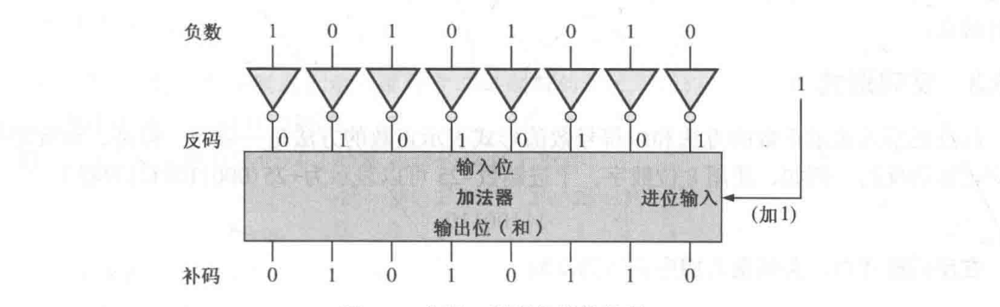
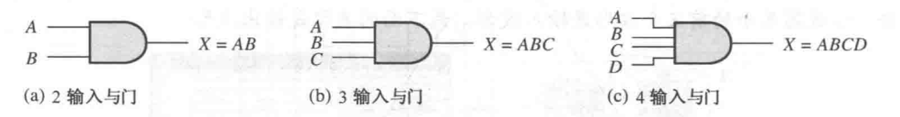
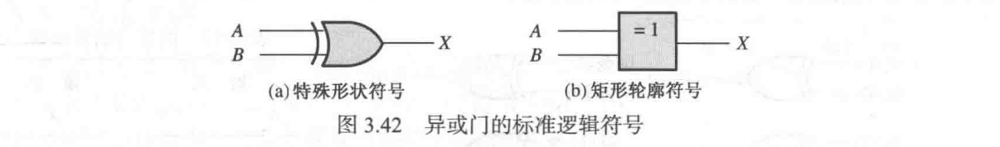
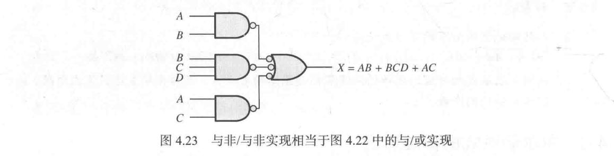

| 章节                                                | 内容概述         | 重点程度 |
| ------------------------------------------------- | ------------ | ---- |
| Ch.1 Introductory Concepts 基本概念                   | 模块结构、基础概念    | 入门   |
| Ch.2 Number Systems and Codes 数字系统、运算和编码          | 编码转换、运算、BCD等 | 高    |
| Ch.3 Logic Gates 逻辑门                              | 基本逻辑门电路及组合逻辑 | 高    |
| Ch.4 Boolean Algebra and Simplification 布尔代数和逻辑化简 | 布尔代数、K图、QM法  | 核心   |
# 1 基本概念
## 1.1 数字量与模拟量
- 数字量的优点：处理和传输更高效；便于保存，复制时更加精确；受噪声影响较小。
- 模拟电子系统：如扩音系统（声波 → 模拟电压 → 线性放大 → 声波）
- 数字和模拟方法：如 CD 播放器（数字数据 → 数模转换器 → 线性放大器 → 声波）
- 机电一体化：跨领域的机械和电子器件的组合，如洗衣机、机械手。
## 1.2 二进制数、逻辑电平和数字波形
- 高电平 $= 1$，低电平 $= 0$
- 高电平和低电平有一定的合法区间：$[V_{H(\min)}, V_{H(\max)}], [V_{L(\min)}, V_{L(\max)}]$，这两个区间不能有重叠，即 $V_{H(\min)} > V_{L(\max)}$
- 上升沿、下降沿、脉冲：
	- 上升时间：脉冲幅度的 $10 \%$ 到 $90 \%$ 的时间宽度
	- 下降时间：脉冲幅度的 $90 \%$ 到 $10 \%$ 的时间宽度
	- 脉冲宽度：$t_w$ 上升沿的脉冲幅度 $50 \%$ 到下降沿的脉冲幅度 $50 \%$ 
- 周期波形：
	- 周期与频率：$\displaystyle f = \frac{1}{T}, T = \frac{1}{f}$
	- 占空比：$\displaystyle \text{占空比} = \frac{t_w}{T} \times 100\%$
- 时钟：具有周期波形，脉冲间隔等于一个位时间
- 时序图：数字波形的图形，表示两个及以上的实际时间关系
- 数据传输：将数据从一个系统传到另一个系统，传输方式分为串行和并行。
	- 串行传输：所需数据线少，需要更长时间
	- 并行传输：所需时间少，需要更多数据线
## 1.3 固定功能的逻辑设备
- 单片集成电路：单个小型硅芯片组成的电路，具有独立的逻辑功能
- 封装方法：对穿孔封装（如双列直插式封装 DIP）、表面贴装技术（SMT，如小轮廓集成电路 SOIC）
	- 表面贴装比对穿孔封装更加节省空间，空间尺寸更小
	- 使用哪种技术取决于引脚数
- 引脚编号：小圆点/缺口/斜角边 标志引脚 1，然后逆时针逐次偏大
- 集成电路的集成度分类：按照等效门电路来分类。
  
  小规模集成（SSI，$\le 10$）、中规模集成（MSI，$\le 100$）、大规模集成（LSI，$\le 10^4$）、甚大规模集成（VLSI，$\le 10^5$）、超大规模集成（ULSI，$> 10^5$）
# 2 数字系统、运算和编码
## 2.1~2.4 十进制数和二进制数
- 十进制数字系统的基是 $10$，在第 $i$ 位的权为 $10^i$
- 二进制数字系统的基是 $2$，在第 $i$ 位的为 $2^i$。对于 $n$ 个二进制位，可以计数到 $2^n - 1$
- 二进制转十进制：二进制中所有位为 $1$ 的权相加即可。
- 十进制转二进制：
	- 权和：将十进制拆成若干个不同的权相加
	- （整数部分）重复除以 $2$：不断整除 $2$ 直至为 $0$，越往后的余数，对应的权逐次增大。
	- （小数部分）重复乘 $2$：不断乘 $2$ 提取整数部分直至为 $0$，越往后的余数，对应的权逐次减小。
- 二进制算术：同样使用竖式运算。
	- 进位和借位原则 $(1)_2 + (1)_2 = (10)_2$，$(10)_2 - (1)_2 = (1)_2$
	- 乘法：对于 $A \times B$，将 $B$ 中所有位为 $1$ 的权乘 $A$（对应将 $A$ 向左移动）并相加
	- 除法：和十进制除法很相似。
## 2.5~2.6 二进制的反码、补码和带符号数
- 反码：二进制数的每一位取反，即可得到反码。
- 补码：
	- $\text{补码} = \text{反码} + 1$
	- 二进制数最低有效 $1$ 左边的每一位取反，即可得到补码
	- 补码电路：每一位传到反相器，然后使用加法器来加 $1$ 
- 带符号数：

|   形式   |                           描述                           |                   转十进制数                    |                                  表示范围                                   |
| :----: | :----------------------------------------------------: | :----------------------------------------: | :---------------------------------------------------------------------: |
| 符号数值形式 | 带符号数的最高位就是符号位， 符号位 $0$ 表示正数，符号位 $1$ 表示负数 其余的位是原码 |            最高位决定符号 数值位决定绝对值             |  $[-2^{n - 1} + 1, 2^{n - 1} - 1]$ 数值位全为 $0$ 都代表 $0$ （$+0, -0$）   |
|  反码形式  |                  正数是其原码 负数是相应正数的反码                  | 正数是所有位为 $1$ 的权加起来， 负数是所有位为 $0$ 的权加起来后取负 | $[-2^{n - 1} + 1, 2^{n - 1} - 1]$ 全 $0$ 和全 $1$ 都代表 $0$ （$+0, -0$） |
|  补码形式  |             正数的补码形式就是其原码 负数的补码形式是其正数的补码             |             所有为 $1$ 的权加起来               |                  $[-2^{n - 1}, 2^{n - 1} - 1]$ 均不重复                  |

- 浮点数：由符号位（Sign）、指数（Exponent）和尾数（Manitssa，F）组成。
	- 单精度浮点二进制数：
	- 单精度浮点二进制数转十进制数：
	  $$D = (-1)^S \times \overline{1.F} \times 2^{E - 127}$$
	- 例外：数 $0.0$ 用全 $0$ 表示；无穷大的数由全 $1$ 和尾数全 $0$ 表示。
- 带符号数（补码形式）的算术运算：
	- 加法：两数相加，舍弃最高的进位。若出现 $\text{正} + \text{正} = \text{负}$ 或 $\text{负} + \text{负} = \text{正}$，则说明出现了溢出。
	- 减法：减去一个数，等于加上它的补码。
	- 乘法/除法：先都转换为原码再相除，然后判断一下最终符号判断要不要转成补码
## 2.8~2.10 十六进制数、八进制数、BCD码
- 十六进制数字系统的基为 $16$，由 $0 \sim 9, A \sim F$ 组成，后面常加一个 $\textrm{H / h}$
	- 二进制转十六进制数：从右往左，每四位转成对应的十六进制符号。
	- 十六进制数转二进制数：对于每一位，将每个十六进制符号转成四位二进制数
	- 十六进制数转十进制数：每一位乘权的总和
	- 十进制数转十六进制数：用 $16$ 重复除十进制数，越往后得到的余数对应的权越高。小数则是用 $16$ 重复乘十进制数取整数部分，越往后得到的余数对应的权低。
	- 算术运算：和二进制的模式差不多。
- 八进制数字系统的基为 $8$，由 $0 \sim 7$ 组成，后面常加一个 $\textrm{Q / o}$
	- 转二进制：每三位转成对应的八进制
	- 转十进制：重复乘 $8$ 或除以 $8$
- 8421 BCD 码：每个十进制位变成 4 位二进制编码
	- 无效码：如果 4 位二进制编码出现了 $>10$ 的数，则是无效码。
	- 加法：把同一位的 BCD 码看作十进制加法。
## 2.11~2.12 数字编码、错误检测码
- 格雷码 (Gray)：格雷码是无权码。相邻码字之间仅有一位发生了变化。
	- 优点：在两个相邻顺序数之间，只有一位出现变化，则减小了出错概率。
	- 二进制转格雷码：$G_{n - 1} = B_{n - 1}, G_{i} = B_{i + 1} \oplus B_i$
	- 格雷码转二进制：$B_{n - 1} = G_{n - 1}, B_i = B_{i + 1} \oplus G_{i}$
	- 典型应用：轴位编码器，相邻扇区之间只有一位出现了改变。
- 奇偶校验法：奇偶校验位给出一个数中 $1$ 的个数是奇数还是偶数。
	- 奇校验：所有位包括校验位的异或和为 $1$，因此奇校验位等于所有位的异或和取反。
	- 偶校验：所有位包括校验位的异或和为 $0$，因此偶校验位等于所有位的异或和。
	- 只能检测出奇数个位产生错误的情况。
- 循环冗余校验码（CRC）：
	- 选择固定的生成码，让数据附上与生成码相同位数的 $0$（附加位）；
	- 附上与生成除以固定的生成码，而减法改成了按位异或；
	- 最终的余数放置在原来的附加位上。
# 3 逻辑门
## 3.1~3.3  反相器、与门、或门
- 反相器（NOT）：$X = \overline{A}$ 
- 否定指示：一个小圆圈 $\circ$ 在输入位置表示低电平有效（无则为高电平有效）；在输出位置说明低电平有效输出（无则为高电平有效）
- 极性指示：一个直角三角形，和否定指示同样的效果。
- 真值表：所有可能的输入和对应输出组成的表格，若有 $n$ 个输入，则行数有 $2^n$ 行。
- 与门（AND）：$X = AB$ 
	- 可以拓展到多输入与门：
	- 应用：
		- 使能/禁止设备：允许信号在某个时间传输而其他时间不传输。
		- 安全带警报系统：$\text{警报} = \text{点火}·\text{未系安全带}·\text{定时器}$
- 或门（OR）：$X = A + B$ 
	- 可以拓展多输入或门：
	- 应用：
		- 入室盗窃警报：$\text{警报} = \text{门1打开} + \text{门2打开} + \text{门3打开}$
## 3.4~3.6 与非门、或非门、异或门、同或门
- 与非门（NAND）：$X = \overline{AB}$ 
	- 等于「非 - 或运算（Negative-OR）」：$\overline{AB} = \overline{A} + \overline{B}$ 
- 或非门（NOR）：$X = \overline{A + B}$ 
	- 等于「非 - 与运算（Negative-AND）」：$\overline{A + B} = \overline{A}·\overline{B}$ 
- 异或门（XOR）：$X = A \oplus B$ 
- 同或门（XNOR）：$X = \overline{A \oplus B}$ 
## 3.7 固定功能的逻辑门
- 74 系列：标准固定功能逻辑电路。
	- 与门：74XX08（四二输入与门）、74XX11（三三输入与门）、74XX21（双四输入与门）
	- 或门：74LS32（四二输入或门）
	- 与非门：74LS00（四二输入与非门）、74XX10（三三输入与非门）、74XX20（双四输入与非门）、74LS30（八输入与非门）
	- 或非门：74LS02（四二输入或非门）、74LS27（三三输入或非门）
	- 异或门：74LS86（四二输入异或门）
- IC 封装：双列直插封装（DIP）用于对穿孔安装，小轮廓集成电路（SOIC）用于表面贴装。单个门的逻辑电路封装称为小逻辑。
- 逻辑电路技术：LC（双极型电路，低功率肖特基）、HC（CMOS 电路，高速 CMOS），二者兼容。它们封装的引脚配置相同，差别是电学特性和性能不同如功率、直流电压、开关速度、输入输出电压电平。
- 工作特性和参数：
	- 传输延迟时间：
		- $t_p$：从输入脉冲出现到输出脉冲出现的时间间隔。
		- $t_{PHL}$：输入脉冲特定参考点到输出脉冲特定参考点（高到低）的时间间隔
		- $t_{PLH}$：输入脉冲特定参考点到输出脉冲特定参考点（低到高）的时间间隔
	- 直流供电电压：$V_{CC}$，CMOS 比双极型更宽。
		- 双极型逻辑电路：典型 $V_{CC} = 5V$，可工作 $V_{CC} \in [4.5V, 5.5V]$
		- CMOS 逻辑电路：典型 $V_{CC} = 5V$，可工作 $V_{CC} \in [2V, 6V]$
	- 功率损耗：$P_D$
		- 门电路输出低电平时工作电流 $I_{CCL}$ 比高电平时工作电流 $I_{CCH}$ 要更低，因此取平均工作电流
		- 功率损耗公式：$$\displaystyle P_D = V_{CC} · \frac{I_{CCL} + I_{CCH}}{2} \
		\quad (W)$$
		- CMOS 比双极型的功率损耗更小。
		  CMOS 的功率损耗与其工作频率有关，频率越高功率损耗越高。
		  双极型的功率损耗和工作频率无关。
	- 输入/输出电压电平：
		- $V_{IL}$ 为输入电压低电平值，$V_{IH}$ 为输入电压高电平值
		- $V_{OL}$ 为输出电压低电平值，$V_{IH}$ 为输出电压高电平值
		- CMOS：$V_{IL} = 1.5 V, V_{IH} = 3.5 V, V_{OL} = 0.33 V, V_{OH} = 4.4 V$
		- 双极型：$V_{IL} = 0.8 V, V_{IH} = 2 V, V_{OL} = 0.4 V, V_{OH} = 2.4 V$
	- 速度-功率乘积：$$SPP = t_p P_D \quad(J)$$
	- 扇出和负载：逻辑门可以连接的其他输入端的数目，同时保持输出电压电平仍保持在范围内。这仅对于双极型逻辑是重要参数，CMOS电路扇出数很大。扇出由单位负载定义 $$\text{单位负载数} = \frac{I_{OL}}{I_{IL}} \text{或} \frac{I_{OH}}{I_{IH}}$$
- 未使用的输入端：TTL 和 CMOS 电路中未使用的输入端应该连接到恰当的逻辑电平上（接 $V_{CC}$ 或接地）
# 4 布尔代数和逻辑化简
## 4.1~4.5 布尔代数
- 文字变量：一个变量或其反码。
- 布尔加法 $=$ 或运算，布尔乘法 $=$ 与运算
- 布尔代数的定律：
	- 加法交换律：$A + B = B + A$，乘法交换律：$AB = BA$
	- 加法结合律：$A + (B + C) = (A + B) + C$，乘法结合律：$(AB)C = A(BC)$
	- 分配律：$A(B + C) = AB + AC$
- 布尔代数的法则：
	- $A + 0 = A$，$A + 1 = 1$，$A·0 =  0$，$A·1=A$
	- $A + A = A$，$A + \overline{A} = 1$，$A·A = A$，$A· \overline{A} = 0$，$\overline{\overline{A}} = A$
	- $A + AB = A$，$A + \overline{A}B = A + B$
	- $(A + B)(A + C) = A + BC$
- 德摩根定律：
	- 变量乘积的反码等于变量反码的或：$\overline{AB} = \overline{A} + \overline{B}$
	- 变量之和的反码等于变量反码的乘积：$\overline{X + Y} = \overline{X}·\overline{Y}$
	- 德摩根定律可以应用到多变量。
- 化简布尔表达式可以使用尽可能少的门，从而实现表达式的功能。
## 4.6~4.7 布尔表达式
- 乘积项之和 (SOP) 形式：
	- 布尔表达式的域：表达式包含的变量集合
	- 与/或实现 $=$ 与非/与非实现，因为与非 $=$ 非-或 
	- 最小项（标准乘积项）之和形式：每个乘积项都包含了所有变量
	  转换只需对于没有某个变量（如 $A$） 的乘积项乘上 $(A + \overline{A})$ 再用分配律展开
	- 乘积项之和表达式为 $1$，当且仅当存在乘积式为 $1$ 时成立。
- 和项之乘积（POS）形式：
	- 或/与实现 $=$ 或非/或非实现，因为或非 $=$ 非-与
	- 最大项（标准和项）之和形式：每个和项都包含了所有变量
	  转换只需对于每个某个变量（如 $A$） 的和项加上 $A \overline{A}$ 再使用法则 $A + BC = (A + B)(A + C)$ 展开。
	- 和项之乘积表达式为 $0$，当且仅当存在和项为 $0$ 时成立。
- 最小项之和、最大项之乘积、真值表的相互转换：
	- 每个最小项表示了使表达式为 $1$ 的取值，其余取值均为 $0$
	- 每个最大项表示了使表达式为 $0$ 的取值，其余取值均为 $1$
	- 两种取值是互补的，SOP 和 POS 的转换相当于求补集。
## 4.8~4.10 卡诺图
- 卡诺图方格数：$n$ 个变量的方格数为 $2^n$
- 小方格相邻：两个小方格相邻，当且仅当它们仅有一个变量不同。因此行列均为格雷码。
- Q-M 方法（奎恩-麦克拉斯基方法）：用于化简多于 $4$ 或 $5$ 个变量的逻辑函数更实用，并且容易用计算机实现。
- Espresso 算法：可以减小存储容量和计算时间，对于变量和乘积项的数目没有限制。通常用于有几十个输出和几十个变量的函数。
- 乘积项之和表达式的卡诺图化简：对 $1$ 分尽可能少的组，每个小组方格数是 $2$ 的幂并且为矩形，然后对于每个小组写出对应的乘积项
- “无关”项：有时候会出现无效码，那么对应方格既可以为 $0$ 也可以为 $1$，因此可以在格子上写 $X$，可以让表达式更加简单。
- 和项之乘积表达式的卡诺图化简：对 $0$ 分尽可能少的组，每个小组方格数是 $2$ 的幂并且为矩形，然后对于每个小组写出对应的和项。
## 4.11 Q-M 方法
- Q-M 方法：通常适用于在计算机上化简逻辑表达式。
	1. 将表达式的每个乘积项写成二进制数
	2. 对于每个二进制数按照 $1$ 的数量分组。对于每个组寻找所有仅有一位不同的二进制数，写在下一级。合并的项打钩，其余不打钩。
	3. 对于下一级，继续寻找所有仅有一位不同的项（X 和 0/1 是相同的），继续合并。
	4. 最后，把所有未打钩的项写成乘积项之和的形式。