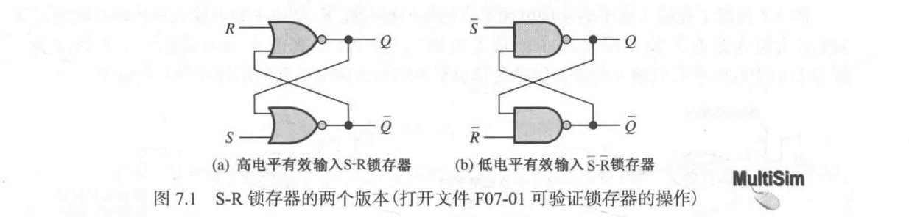
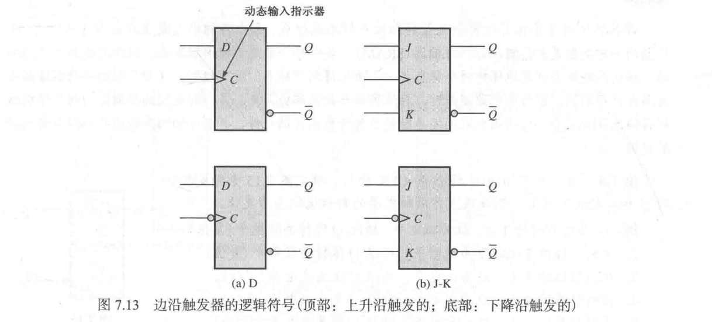
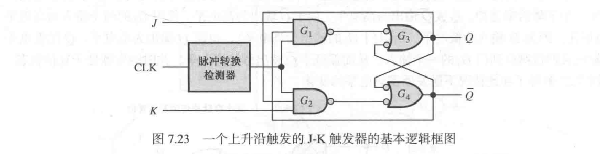
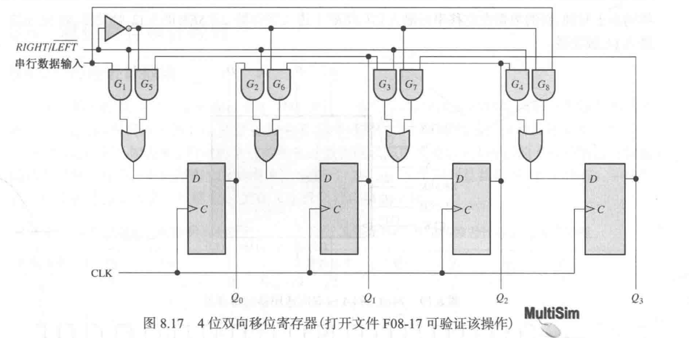
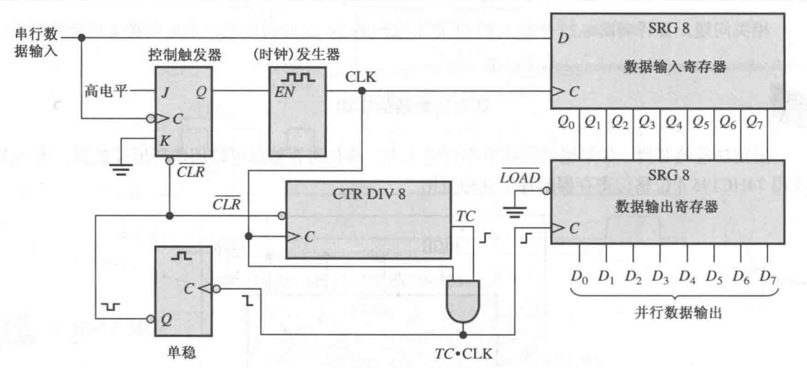
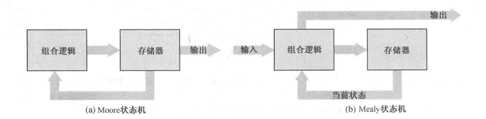

| 章节                                               | 内容概述           | 重点程度 |
| ------------------------------------------------ | -------------- | ---- |
| Ch.7 Latches, Flip-Flops, and Timers 锁存器、触发器和定时器 | 触发器、单稳态、双稳态    | 高    |
| Ch.8 Shift Registers 移位寄存器                       | 移位寄存器与应用       | 中    |
| Ch.9 Counters 计数器                                | 异步/同步计数器设计与状态机 | 核心   |
# 7 锁存器、触发器和定时器
## 7.1 锁存器 (Latch)
- $S - R$（置位 - 复位）锁存器：
	- 高电平有效输入 $S - R$ 锁存器：由两个交叉耦连的或非门组成，每个门的输出都连接到另一个门的输入上。
	- 低电平有效输入 $\overline{S} - \overline{R}$ 锁存器：由两个交叉耦连的与非门组成，每个门的输出都连接到另一个门的输入上。
	  
	- 低电平有效输入 $\overline{S} - \overline{R}$ 锁存器的三种模式：

| $\overline{S}$ | $\overline{R}$ | $Q$          | $\overline{Q}$ | 说明  |
| -------------- | -------------- | ------------ | -------------- | --- |
| 1              | 1              | No Change    | No Change      | 保持  |
| 0              | 1              | 1            | 0              | 置位  |
| 1              | 0              | 0            | 1              | 复位  |
| 0              | 0              | 1 (Unstable) | 1 (Unstable)   | 无效  |
- 门控 $S - R$ 锁存器：添加了一个使能输入 $EN$，当 $EN$ 为高电平的时候，$S, R$ 才控制锁存状态 
- 门控 $D$ 锁存器：数据输入为 $D$，其中 $S = D, R = \overline{D}$，只能置位或移位 
	- 对应芯片：74XX75（四门控 $D$ 锁存器）
## 7.2~7.5 触发器 (Flip-Flop)
- 边缘触发器 (Edge-Triggered Flip-Flop)：只有在时钟的上升沿或下降沿瞬间才对其输入响应。
- 动态输入指示器：无小圆圈 $\circ$ 的是上升沿触发，有小圆圈的 $\circ$ 的是下降沿触发 
- 边沿触发的 $D$ 触发器：使得 $D$ 输入是同步输入。只有时钟的触发边沿到来时，$D$ 输入才能响应。

| $D$ | $CLK$      | $Q$ | $\overline{Q}$ | 说明  |
| --- | ---------- | --- | -------------- | --- |
| 0   | $\uparrow$ | 0   | 1              | 置位  |
| 1   | $\uparrow$ | 1   | 0              | 复位  |

- 边沿触发的 $J-K$ 触发器：使得 $J-K$ 输入是同步输入。只有时钟的触发边沿到来时，$J-K$ 输入才能响应。
  
| $J$ | $K$ | $CLK$      | $Q$              | $\overline{Q}$   | 说明  |
| --- | --- | ---------- | ---------------- | ---------------- | --- |
| 0   | 0   | $\uparrow$ | $Q_0$            | $\overline{Q_0}$ | 保持  |
| 0   | 1   | $\uparrow$ | 0                | 1                | 复位  |
| 1   | 0   | $\uparrow$ | 1                | 0                | 置位  |
| 1   | 1   | $\uparrow$ | $\overline{Q_0}$ | $Q_0$            | 切换  |
- 边沿触发操作：将时钟信号传送到脉冲转换检测器，利用门电路的延迟 $Y = A · \overline{A}$ 产生一个窄脉冲（尖峰信号） 
- $J-K$ 触发器：将与非门输出连接到另一个门电路里面 
- 异步置位和异步清零：将对应的输入连接到与非门上 
	- 对应芯片：74XX74（双上升沿触发 $D$ 触发器）、74XX112（双下降沿触发 $J-K$ 触发器）
- 触发器运算特性：
	- 传输延迟时间：既可以从时钟到输出，也可以从异步输入到输出
		- $t_{PLH}$：对应触发边沿 $50\%$ 到输出从低电平到高电平转换 $50\%$ 的时间间隔
		- $t_{PHL}$：对应触发边沿 $50\%$ 到输出从高电平到低电平转换 $50\%$ 的时间间隔
	- 建立时间 $t_b$：同步输入保持 $50 \%$ 先于时钟脉冲触发边沿到来 $50\%$ 的最小时间间隔
	- 保持时间 $t_h$：时钟脉冲触发边沿到来 $50\%$ 后到同步输入保持 $50\%$ 的最小时间间隔
	- 最大时钟频率 $f_{\max}$：触发器可以可靠触发的最高时钟频率
	- 脉冲宽度 $t_w$：触发器可以可靠触发的最小脉冲宽度
	- 功率损耗：$P = V_{CC} \times I_{CC} \quad (W)$
- 触发器应用：
	- 并行数据存储：多个触发器的时钟输入连向同一个时钟，即可获得基本寄存器。
	- 分频：当脉冲波形加在一个 $D$ 触发器（$D = \overline{Q}$）或者 $J-K$ 触发器（$J=K=1$）的时钟输入时，$Q$ 输出就是时钟频率一半的方波。于是可以实现 $2^n$ 分频。
	- 计数：和分频类似，每个触发器的输出代表了一个进制位。
## 7.6 定时器 (Timer)
- 单稳态触发器 (Trigger)：单稳态触发器每触发一次就产生一个单脉冲。
	- 单稳态多谐振荡器：由逻辑门、反相器和 RC 电路组成 
	- 通过 RC 电路充电，让反相器的输入保持一段低电平，从而输出一个单脉冲，其保持高电平的时间由 $RC$ 时间常数决定。
	- IC 单稳态触发器的类型 \*：
		- 不可重复触发型：输出脉冲期间，输入的脉冲不能再延长这个脉冲
			- 对应芯片：74XX121
			- 设置脉冲宽度的三种方法：
		- 可重复触发型：输出脉冲期间，输入的脉冲可以继续延长这个脉冲
			- 对应芯片：74XX122
			- 设置脉冲宽度：$$t_w = 0.32 RC_{EXT} \left(1 + \frac{0.7}{R}\right)$$
- 555 定时器 \*：
	- 单稳态触发器：
	- 脉冲振荡器：
# 8 移位寄存器
## 8.1~8.2 移位寄存器
- 移位寄存器的功能：数据存储、数据移动
- 寄存器的存储容量：寄存器中触发器的数量 / 级数
- 串行输入：$D_0$ 连 $D_{in}$，$D_i$ 连向 $Q_{i - 1}$ 
- 串行输出：只有 $D_{n - 1}$ 连向 $D_{out}$
- 并行输入：所有 $D_i$ 都有输入数据线
- 并行输出：所有 $Q_i$ 都有输出数据线
- 芯片：74XX164（八位串行输入并行输出移位寄存器）、74XX165（八位并行输入串行输出移位寄存器）、74XX195（四位通用移位寄存器）
## 8.3 双向移位寄存器
- 增加控制输入 $RIGHT / \overline{LEFT}$，高电平时向右移位，低电平时向左移位，用反相器和与门来控制串行输入 
- 对应芯片：74XX194（四位双向通用移位寄存器）
## 8.4~8.5 移位寄存器应用
- 计数器：
	- 约翰逊计数器 (Johnson Counter)：最后一个触发器 $\overline{Q_{n - 1}}$ 的反码回接到第一个触发器的输入上。计数器会从全 0 状态开始，从左到右填充 1，到全 1 状态，从左到右填充 0，到全 0 状态循环。总共有 $2n$ 种状态。
	- 环形计数器（Ring Counter）：第一个触发器初始为 1，其余为 0，最后一个触发器 $Q_{n - 1}$ 的回接到第一个触发器的输入。计数器中的 1 会逐位向右循环移动。总共有 $n$ 种状态。
- 时间延迟：对于串行输入串行输出计数器，输出波形会比输入波形延迟 $n$ 个时钟周期
- 串行到并行数据转换器：起始位开始进行八位时钟延迟，将使能传到串行输入寄存器中 
- 通用异步接收发送机 (UART) \*
- 键盘译码器 \*
## 8.6 关联标注的逻辑符号 \*
# 9 计数器
## 9.1 有限状态机
- 时序逻辑的两种模型：
	- Moore 状态机：由组合逻辑、存储器、输出组成。组合逻辑仅依赖于当前存储器的状态。
	- Mealy 状态机：由输入、组合逻辑、存储器、输出组成。组合逻辑既依赖于当前存储器的状态，也依赖于输入。
	- 
## 9.2 异步计数器
- 异步计数器：$CLK$ 只应用于 $FF_0$ 的 $C$ 上，其余的 $C$ 连向前一个的 $Q$
- 传输延迟：产生「进位」的时候会出现传输延迟，时间正比于进位数。
- 异步译码计数器：如果令模为 $B$，那么当计数器计数到 $B$ 的时候，利用与门拉低所有触发器的 $CLR$ 进行清零。这样会一个 $B$ 假信号。
- 芯片：74XX93（四位异步二进制计数器）
## 9.3~9.5 同步计数器
- 同步译码计数器：令 $CLK$ 应用到所有 $FF$ 的 $C$ 上，同时令所有的 $J_i = K_i = Q_0 Q_1 \cdots Q_{i - 1}$
- 加/减同步计数器：加序列时，低位全 1 时才进位；减序列时，低位全 0 才退位，因此 $$J_i = K_i = UP · Q_0 Q_1 \cdots Q_{i - 1} + \overline{DOWN} \overline{Q_0}·\overline{Q_1}\cdots \overline{Q_{i - 1}}$$
- 芯片：74XX163（四位同步二进制计数器）、74XX190（加/减同步十进制计数器）
- 同步计数器的设计：
	- 创建状态图
	- 编写触发器状态转换表 
	- 画次态卡诺图，得出触发器输入的表达式
	- 实现计数器
## 9.6 级联计数器
- 异步级联：将低位计数器的进位输出连到高位计数器的时钟输入。总模等于多个计数器的模的乘积。
- 同步级联：将低位计数器的进位输出连到高位计数器的计数势能 $CTEN$，而计数器的时钟输入连向同一个 $CLK$。总模等于多个计数器的模的乘积。
- 具有截断序列的级联计数器：每次循环后预置为某一个数，即可删除它之前的状态，从而实现模任意数的计数器。
## 9.7~9.8 计数器应用
- 计数器译码：用 $FF$ 的所有输出用反相器和与门即可判断当前译码是否为某一特定状态
- 译码假信号：异步计数器的传输延迟会造成短暂的假信号，我们可以让假信号小时之后才使译码输出（选通），即用高电平有效时钟的低电平来使译码器工作。
- 应用：数字时钟、停车控制、并行到串行数据的转换
## 9.9 关联标注的逻辑符号 \*