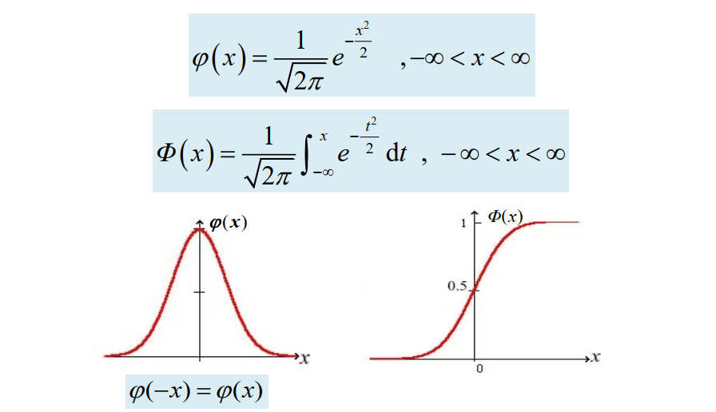
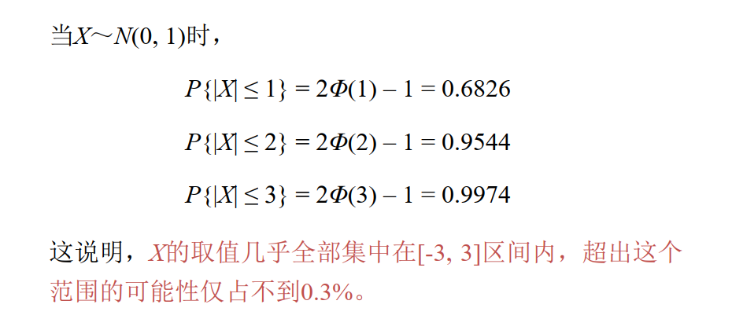
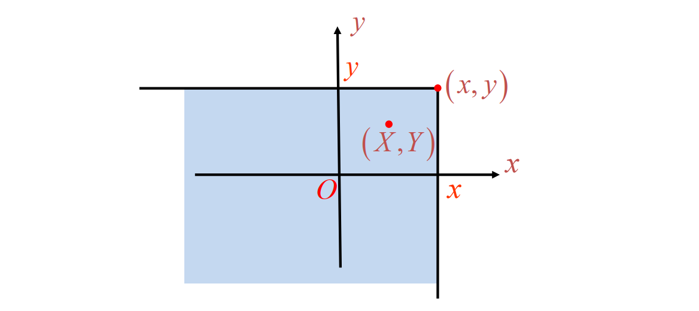

# 2.4 连续型随机变量及其概率密度 (con'd)
## 均匀分布 

**均匀分布**：$X \sim U(a, b)$ 表示 $X$ 在 $(a, b)$ 上服从均匀分布 $$f(x) = \begin{cases}\dfrac{1}{b -a},& a < x < b \\ 0,& otherwise\end{cases}$$
和离散型的古典概型是类似的。

均匀分布的性质：
- $\displaystyle P\{c \le X \le d\} = \frac{d - c}{b - a}$，等长区间的概率相同，概率与区间长度成正比。
- $\displaystyle F(x) = \begin{cases}0,&x \le a\\\dfrac{x - a}{b - a},&a < x< b\\1,&x \ge b\end{cases}$

## 指数分布

**指数分布**：称 $X$ 服从参数为 $\theta\ (\theta > 0)$ 的指数分布，当 $$f(x) = \begin{cases}\dfrac{e^{-x/\theta}}{\theta},& x > 0 \\ 0,& x \le 0\end{cases}$$

与离散型随机变量的几何分布类似。

指数分布的性质：
- $P\{X > x\} = e^{-x/\theta}$
- **无记忆性**：$P\{X > s + t \mid X > s\} = P\{X > t\} = e^{-t/\theta}$

## 正态分布 / 高斯分布
**正态分布**：$X \sim N (\mu, \sigma^2)$ 称 $X$ 服从参数为 $\mu, \sigma\ (\sigma > 0)$ 的正态分布，当

其中 $\mu$ 是位置参数（对称轴位置），$\sigma$ 是形状参数（$\sigma$ 越大则越矮）

正态分布概率密度函数的几何特征：
- 区间关于 $x = \mu$ 对称，且取得最大值 $\dfrac{1}{\sqrt{2\pi} \sigma}$
- $\displaystyle \lim_{x \to \infty} f(x)= 0$
- 曲线在 $x = \mu \pm \sigma$ 处存在拐点

**标准正态分布**：$X \sim N(0, 1)$

标准正态分布的性质：
- $\varphi(-x) = \varphi(x)$
- $\Phi (0) = \frac{1}{2}$
- $\Phi(-x) = 1 - \Phi(x)$

**上 $\mathbf \alpha$ 分位点**：在 $X \sim N(0, 1)$ 中，若 $P\{X > z_\alpha\} = \alpha\ (0 < \alpha < 1)$，则称 $z_\alpha$ 为标准正态分布的上 $\alpha$ 分位点。

**正态分布的标准化**：若 $X \sim N(\mu, \sigma^2)$，则 $\displaystyle Z = \frac{X - \mu}{\sigma} \sim N(0, 1)$

任何一个一般的正态分布都可以通过线性变换转化为标准正态分布。

$\displaystyle P\\{a < X < b\\} = P\left\\{ \frac{a - \mu}{\sigma} < Z < \frac{b - \mu}{\sigma} \right\\} = \Phi\left( \frac{b - \mu}{\sigma} \right) - \Phi\left( \frac{a - \mu}{\sigma} \right)$

1. $\displaystyle \int_{0}^{+\infty} e^{-u^2} \mathrm du = \frac{\sqrt{\pi}}{2}$
2. $\displaystyle \int_0^{+\infty} e^{-\frac{x^2}{b}} \mathrm dx = \frac{\sqrt \pi}{2} · \sqrt{b}$
3. 遇到 $\displaystyle \int x^n e^{-\frac{x^2}{b}} \mathrm dx$ 的形式，拆成 $x^{n - 1} · \left( x e^{-\frac{x^2}{b}}\right)$ 的形式，后面可以积分
   $\displaystyle \int x e^{-\frac{x^2}{b}} \mathrm dx = -\frac{b}{2} e^{-\frac{x^2}{b}}$
   所以用分部积分来降次，直到降为 $n = 0$，再用高斯公式。

**$3\sigma$ 准则**：
推广到一般的正态分布中，$X$ 的取值绝大多数集中在 $[\mu - 3 \sigma, \mu + 3 \sigma]$ 区间内。

# 2.5 随机变量的函数的分布
对于离散型随机变量 $X$，有另一离散型随机变量 $Y = f(X)$，那么 $Y$ 的分布律为 $$P\{Y = y_i\} = \sum_{f(x_j) = y_i} P\{ X = x_j \}$$
对于连续型随机变量 $X$，概率密度为 $f_X(x)$。另一连续型随机变量 $Y = h(X)$，那么 $Y$ 的概率密度为 $$g(y) = \frac{\mathrm d}{\mathrm dy} \int_{h(x) \le y} f(x) \mathrm dx$$
如果 $h(x) \le y$  的解是区间 $x \in [\psi(y), \varphi(y)]$，那么可以用以下公式 $$\frac{\mathrm d}{\mathrm dy} \int_{\psi(y)}^{\varphi(y)} f(x) \mathrm dx = f(\varphi(y)) \varphi'(y) - f(\psi(y))\psi'(y)$$

**难点理解：**

**连续型随机变量函数变换（最一般情形）**

设 $X$ 为连续型随机变量，概率密度为 $f_X(x)$；$Y = g(X)$，其中 $g:\mathbb{R}\to\mathbb{R}$ 在其定义域上可导；对给定的 $y$，方程 $g(x)=y$ 的所有解为 $x_1(y),x_2(y),\dots,x_n(y),$ 且在这些解点处 $g'(x_i(y))\neq 0$。则 $Y$ 的概率密度函数为

$$f_Y(y)=\sum_{i=1}^{n}f_X\big(x_i(y)\big)\,\left|\frac{dx_i(y)}{dy}\right|.$$
由于
$$\frac{dx_i(y)}{dy}=\frac{1}{g'(x_i(y))}$$
上式等价为
$$f_Y(y)=\sum_{x:\,g(x)=y}\frac{f_X(x)}{|g'(x)|}.$$

**注意点（可行条件）**：
- 对每个 $y$，方程 $g(x)=y$ 只有有限个解；
- 在所有解点处 $g'(x)\neq 0$；
- 求和只对存在解的 $y$ 进行；
- 若 $g$ 在 $X$ 的支持集上严格单调，则求和项只有一项。

如果导数 $g'(x)$ 为零（只是有限个），那么可以不用管，因为 *有限个点的概率函数不影响整体的概率分布*。

除了有概率密度的区间，还要注意写那些 *平凡情况* ！

# 3.1 多维随机变量

**$n$ 维随机变量 / 随机向量**：$n$ 个随机变量的整体 $X = (X_1, X_2, \cdots, X_n)$

**二维随机变量**：对于一个随机试验 $E$，样本空间 $S$，则两个随机变量 $X : S \mapsto \mathbb R, Y: S \mapsto \mathbb R$ 构成的向量 $(X, Y)$ 叫做二维随机变量。

**(联合)分布函数**：$F(x, y) = P\{X \le x, Y \le y\}$ 
则 $P\{x_1 \le X \le x_2,\  y_1 \le Y \le y_2\} = F(x_2, y_2) - F(x_2, y_1) - F(x_1, y_2) + F(x_1, y_1)$

分布函数的**性质**：
- $0 \le F(x, y) \le 1$
- $F(-\infty, y) = F(x, -\infty) = F(-\infty, -\infty) = 0$，$F(+\infty, +\infty) = 1$
- （？）$F(x, y) = F(x + 0, y) = F(x , y + 0)$
- $F(x, y)$ 关于 $x, y$ 都不减

**二维离散型随机变量**：$(X, Y)$ 的(联合)分布律为 $$P\{X = x_i, Y = y_j\} = p_{ij},\quad i, j = 1, 2, \cdots$$
分布律的性质：
- $p_{ij} \ge 0$
- $\displaystyle \sum_i \sum_j p_{ij} = 1$

分布函数：$\displaystyle F(x, y) = \displaystyle \sum_{x_i \le x} \sum_{y_i \le y} p_{ij}$
