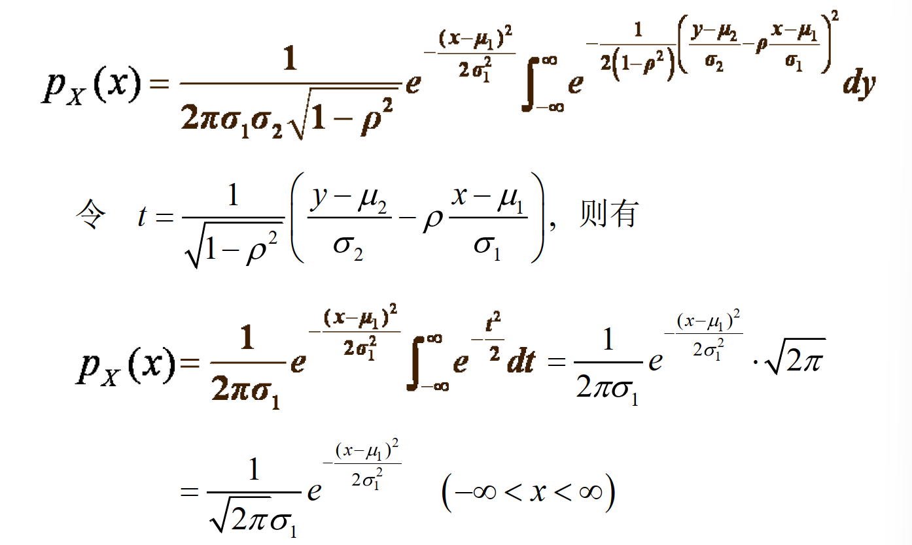
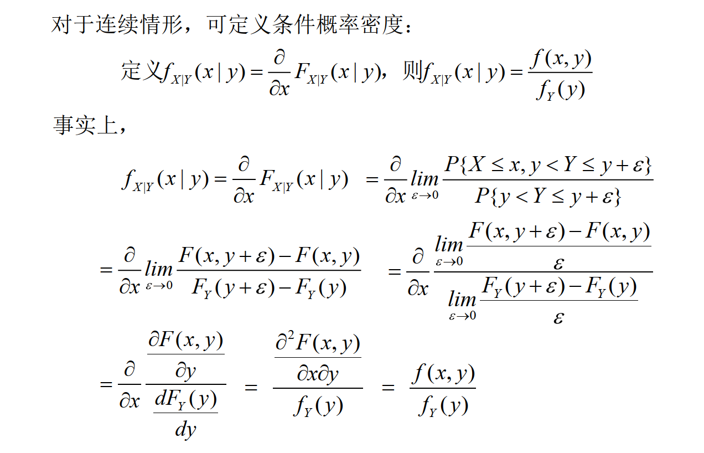
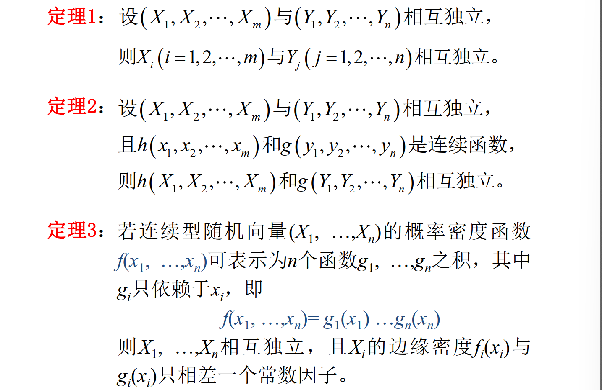

# 3.1 多维随机变量 (con'd)

**二维连续型随机变量**：令 $(X, Y)$ 为二维随机变量，且 $\displaystyle P\{(X, Y) \in G\} = \iint_G f(x, y) \mathrm dx \mathrm dy$，且有特点：
- $f(x, y) \ge 0$
- $\iint f(x, y) \mathrm dx \mathrm dy = 1$，即 $f$ 与 $xOy$ 平面之间的体积为 $1$

则 $(X, Y)$ 是二维连续型随机变量，$f(x, y)$ 是其联合概率密度函数。

**分布函数**：$\displaystyle F(x, y) = \int_{-\infty}^ y \int_{-\infty}^x f(u, v) \mathrm du \mathrm dv$

那么有 $\displaystyle f(x, y) = \frac{\partial^2 F(x, y)}{\partial x \partial y}$

**【常见的二维分布】**

**均匀分布**：若平面 $G$ 的面积为 $S$，且 $(X, Y)$ 的联合概率密度函数为 $$f(x, y) = \begin{cases} \frac{1}{S}, & (x, y) \in G \\ 0, & otherwise\end{cases} $$ 则称 $(X, Y)$ 在 $G$ 上服从均匀分布。

**正态分布**：若 $(X, Y)$ 的联合概率密度函数为 $$f(x, y) = \frac{1}{2\pi \sigma _1 \sigma_2 \sqrt{1 - \rho^2}} \exp \left( - \frac{(\frac{x - \mu_1}{\sigma_1})^2 - 2\rho (\frac{x - \mu_1}{\sigma_1})(\frac{y - \mu_2}{\sigma_2}) + (\frac{y - \mu_2}{\sigma_2})^2}{2(1 - \rho^2)} \right)$$ 其中 $\sigma_1, \sigma_2 > 0,\ |\rho| < 1$，则 $(X, Y)$ 服从参数为 $\mu_1, \mu_2, \sigma_1, \sigma_2, \rho$ 的二维正态分布，即 $(X, Y) \sim N(\mu_1, \mu_2, \sigma_1, \sigma_2, \rho)$.

# 3.2 边缘分布函数

**边缘分布**：对于二维随机变量 $(X, Y)$，$X, Y$ 各自的单随机变量分布称为边缘分布。

$$F_X(x) = P\{X \le x\} = F(x, +\infty) = \lim_{y \to + \infty} F(x, y)$$
$$F_Y(y) = P\{Y \le y\} = F(+\infty, y) = \lim_{x \to + \infty} F(x, y)$$
由联合分布可以确定边缘分布；但由边缘分布**一般不能确定**联合分布（因为丢失了 $x, y$ 之间的关系）。 

**离散型**随机变量的边缘分布：
$$F_X(x) = \sum_{x_i \le x} \sum_{j = 1}^\infty p_{ij} = \sum_{x_i \le x} p_{i\cdot}$$
$$F_Y(y) = \sum_{i = 1}^{\infty} \sum_{y_j \le y} p_{ij} = \sum_{y_j \le y} p_{\cdot j}$$
若将联合分布律列表，则关于 $X$ 的边缘分布 $p_{i·}$ 是对应行总和，关于 $Y$ 的边缘分布 $p_{·j}$ 是对应列总和

**连续型**随机变量的边缘分布：
$$\displaystyle F_X(x) = F(x, +\infty) = \int_{-\infty}^ x \int_{-\infty}^{+\infty} f(u, y) \mathrm dy \mathrm du = \int_{-\infty}^ x f_X(u) \mathrm du$$
$$\displaystyle F_Y(y) = F(+\infty, y) = \int_{-\infty}^ y \int_{-\infty}^{+\infty} f(x, v) \mathrm dx \mathrm dv = \int_{-\infty}^ y f_Y(v) \mathrm dv$$从二维正态分布推边缘分布：

关键是使用高斯积分：$\displaystyle \int_{-\infty}^{+\infty} e^{-\frac{x^2}{2}} = \sqrt{2\pi}$

# 3.3 条件分布

**条件分布律**：
- 随机变量 $X$ 的条件分布律：$\displaystyle P\\{ X = x_i | Y = y_j\\} = \frac{p_{ij}}{p_{·j}},\ i = 1, 2, \cdots$
- 随机变量 $Y$ 的条件分布律：$\displaystyle P\\{ Y = y_i | X = x_i\\} = \frac{p_{ij}}{p_{i·}},\ j = 1, 2, \cdots$

**条件分布函数**：
- 离散情形：$\displaystyle F_{X|Y}(x|y) = P\\{X \le x | Y = y\\} = \frac{P\\{X\le x, Y = y\\}}{P\\{Y = y\\}}$
- 连续情形：

**条件概率密度**：$\displaystyle f_{X|Y}(x|y) = \frac{f(x, y)}{f_Y(y)}$ 为 $Y = y$ 的条件下， $X$ 的条件概率密度。

# 3.4 相互独立的随机变量

**相互独立**：对于两个随机变量 $X, Y$，$\forall a < b, c < d$，有 $$P\\{a < X \le b,\ c < Y \le d\\} = P\\{a < X \le b\\}·P\\{c < X \le d\\}$$则随机变量 $X, Y$ 相互独立。

**相互独立的性质**：
- $X, Y$ 相互独立 $\Leftrightarrow$ $\forall x, y,\ F(x, y) = F_X(x) F_Y(y)$
- 对于**离散型随机变量** $(X, Y)$：$X, Y$ 相互独立 $\Leftrightarrow$ $\forall i, j,\ P\\{X = x_i,\ Y = y_j\\} = P\\{X = x_i\\} · P\\{Y = y_j\\}$
- 对于**连续型随机变量** $(X, Y)$：$X, Y$ 相互独立 $\Leftrightarrow$ $\forall x, y,\ f(x, y) = f_X(x) f_Y(y)$ *几乎处处成立*。
> 我们允许在平面上面积为零的集合（如一条曲线、有限个点等），使得等式 $f(x, y) = f_X(x) f_Y(y)$ 不成立。

**多变量相互独立**：若对于所有的 $( x_1, x_2, \cdots, x_n )$，有：
$$F(x_1, x_2, \cdots, x_n) = F_{X_1}(x_1) F_{X_2}(x_2) \cdots F_{X_n}(x_n)$$

则称 $( X_1, X_2, \cdots, X_n )$ **相互独立**。

设 $(X_1, X_2, \cdots, X_m)$ 的分布函数为 $F_1(x_1, x_2, \cdots, x_m)$，  
$(Y_1, Y_2, \cdots, Y_n)$ 的分布函数为 $F_2(y_1, y_2, \cdots, y_n)$。

若它们的联合分布函数 $F(x_1, \cdots, x_m, y_1, \cdots, y_n)$ 满足：$$F(x_1, \cdots, x_m, y_1, \cdots, y_n) = F_1(x_1, \cdots, x_m) F_2(y_1, \cdots, y_n)$$
则称 $(X_1, X_2, \cdots, X_m)$ 与 $(Y_1, Y_2, \cdots, Y_n)$ **相互独立**。

