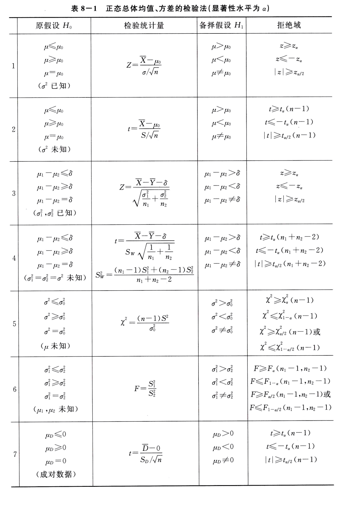

# 8.1 假设检验基本原理

**假设检验**：根据样本，对所提出关于总体的 *假设* 进行判断：*接受* 还是 *拒绝*。

**假设推断原理：小概率事件在一次试验中几乎不可能发生。**

**假设检验的步骤**：
- 提出原假设 $H_0$ 和备择假设 $H_1$，给定显著性水平 $\alpha$ 和样本容量 $n$
- 由样本值 $\\{X_i\\}_{i = 1}^n$，设计并计算 *检验统计量*
- 根据 $P\\{拒绝 H_0\mid H_0 为真\\} = \alpha$，确定 *拒绝域*；
- 通过统计量是否在拒绝域中，从而判断接受还是拒绝 $H_0$。

**原假设 / 零假设**：$H_0 : \mu = \mu_0$，默认情况下成立

**备择假设**：$H_1 : \mu \ne \mu_0$，"怀疑"的产生。需要看是否有证据证明该假设成立

**假设检验问题的描述**：显著性水平 $\alpha$ 下，检验假设 $H_0 : \mu = \mu_0,\quad H_1 : \mu \ne \mu_0$

**假设检验的实际结果**：

| 真实情况     | 接受 $H_0$                                                | 拒绝 $H_0$                                                 |
| -------- | ------------------------------------------------------- | -------------------------------------------------------- |
| $H_0$ 为真 | 正确                                                      | 第一类错误 / 弃真错误 概率为 $\alpha = P_{\mu \in H_0}\\{拒绝 H_0\\}$ |
| $H_0$ 为假 | 第二类错误 / 取伪错误 概率为 $\beta = P_{\mu \in H_1}\\{接受 H_0\\}$ | 正确                                                       |
**两类错误概率的变化情况**：
- 当样本容量 $n$ 一定时，若减少犯第一类错误的概率，则犯第二类错误的概率往往增大。
- 对于第一类错误，由于假设 $\mu = \mu_0$，并且控制 $\alpha$，所以错误概率是已知的 $P\\{拒绝 H_0 \mid H_0 为真\\} = \alpha$
- 对于第二类错误，错误概率由 $\mu$ 的实际值决定，概率并不确定。当 $\mu \ne \mu_0$ 但是十分接近 $\mu_0$ 时，检验统计量在接受域的概率将会特别大，极限情况 $\displaystyle \lim_{\mu \to \mu_0} P\\{接受 H_0 \mid H_1 为真\\} = 1 - \alpha$
- 当增加样本容量，则检验统计量的稳定性（如方差）会提高，从而将会在同弃真错误概率的情况下，能降低第二类错误的概率。

**显著性检验**：只控制犯第一类错误的概率，而不考虑犯第二类错误的概率的检验。

双边假设检验：$\mu$ 可能小于也可能大于 $\mu_0$

单边检验：
- 右边检验（$H_0 : \mu \le \mu_0,\quad H_1 : \mu > \mu_0$）
- 左边检验（$H_0 : \mu \ge \mu_0,\quad H_1 : \mu < \mu_0$）

# 8.2 正态总体均值的假设检验
大量引用了 [Week 9 样本及抽样分布](../week_09_sampling_distributions) 的内容。

| 前提               | 假设                                                       | 检验统计量（$H_0$ 为真前提下）                                                                                                                                              | 拒绝域                                                                                                                                           |
| ---------------- | -------------------------------------------------------- | --------------------------------------------------------------------------------------------------------------------------------------------------------------- | --------------------------------------------------------------------------------------------------------------------------------------------- |
| 方差 $\sigma^2$ 已知 | 双边检验： $$H_0 : \mu = \mu_0,\quad H_1 : \mu \ne \mu_0$$ | $$\displaystyle Z = \frac{\overline{X} - \mu_0}{\sigma / \sqrt{n}} \sim N(0, 1)$$                                                                               | 由 $P\\\{\lvert Z\rvert \ge z_{\alpha/2}\\\} = \alpha$，得到拒绝域 $\lvert Z\rvert \ge z_{\alpha / 2}$                                                 |
|                  | 右边检验： $$H_0 : \mu \le \mu_0,\quad H_1 : \mu > \mu_0$$ | $$\displaystyle Z = \frac{\overline{X} - \mu_0}{\sigma / \sqrt{n}}$$ $$\displaystyle \tilde{Z} = \frac{\overline{X} - \mu}{\sigma / \sqrt{n}} \sim N(0, 1)$$ | 由 $Z \le \tilde{Z}$ 知 $P\\{Z \ge z_\alpha\\} \le P\\{\tilde{Z} \ge z_\alpha\\} = \alpha$，得到拒绝域 $Z \ge z_\alpha$                                   |
|                  | 左边检验： $$H_0 : \mu \ge \mu_0,\quad H_1 : \mu < \mu_0$$ | $$\displaystyle Z = \frac{\overline{X} - \mu_0}{\sigma / \sqrt{n}}$$ $$\displaystyle \tilde{Z} = \frac{\overline{X} - \mu}{\sigma / \sqrt{n}} \sim N(0, 1)$$ | 由 $Z \ge \tilde{Z}$ 知 $P\\{Z \le -z_\alpha\\} \le P\\{\tilde{Z} \le -z_\alpha\\} = \alpha$，得到拒绝域 $Z \le -z_\alpha$                                |
| 方差 $\sigma^2$ 未知 | 双边检验： $$H_0 : \mu = \mu_0,\quad H_1 : \mu \ne \mu_0$$ | $$t = \frac{\overline{X} - \mu_0}{S / \sqrt{n}} \sim t(n - 1)$$                                                                                                 | 由 $P\\{\lvert t\rvert \ge t_{\alpha/2}(n - 1)\\} = \alpha$，得到拒绝域 $\lvert t\rvert \ge t_{\alpha / 2}(n - 1)$                                     |
|                  | 右边检验： $$H_0 : \mu \le \mu_0,\quad H_1 : \mu > \mu_0$$ | $$t = \frac{\overline{X} - \mu_0}{S / \sqrt{n}}$$ $$\tilde{t} = \frac{\overline{X} - \mu}{S / \sqrt{n}} \sim t(n - 1)$$                                      | 由 $t \le \tilde{t}$ 知 $P\\{t \ge t_{\alpha}(n - 1)\\} \le P\\{\tilde{t} \ge t_{\alpha}(n - 1)\\} = \alpha$，得到拒绝域 $t \ge t_{\alpha}(n - 1)$     |
|                  | 左边检验： $$H_0 : \mu \ge \mu_0,\quad H_1 : \mu < \mu_0$$ | $$t = \frac{\overline{X} - \mu_0}{S / \sqrt{n}}$$ $$\tilde{t} = \frac{\overline{X} - \mu}{S / \sqrt{n}} \sim t(n - 1)$$                                      | 由 $t \ge \tilde{t}$ 知 $P\\{t \le -t_{\alpha}(n - 1)\\} \le P\\{\tilde{t} \le -t_{\alpha}(n - 1)\\} = \alpha$，得到拒绝域 $t \le -t_{\alpha}(n - 1)$  |

# 8.3 正态总体方差的假设检验
大量引用了 [Week 9 样本及抽样分布](../week_09_sampling_distributions) 的内容。

| 前提          | 假设                                                                          | 检验统计量（$H_0$ 为真前提下）                                                         | 拒绝域                                                                                                                                                                                 |
| ----------- | --------------------------------------------------------------------------- | -------------------------------------------------------------------------- | ----------------------------------------------------------------------------------------------------------------------------------------------------------------------------------- |
| 均值 $\mu$ 已知 | 双边检验： $$H_0: \sigma^2 = \sigma_0^2,\quad H_1 : \sigma^2 \ne \sigma_0^2$$ | $$\chi^2 = \sum_{i = 1}^n\frac{(X_i - \mu)^2}{\sigma_0^2} \sim \chi^2(n)$$ | $$P\\{\chi^2 \le \chi^2_{\alpha/2}(n) \lor \chi_{1 - \alpha / 2}^2(n) \le \chi^2\\} = \alpha$$ 得到拒绝域 $\chi^2 \le \chi^2_{\alpha/2}(n) \lor \chi_{1 - \alpha / 2}^2(n) \le \chi^2$. |
| 均值 $\mu$ 未知 | 双边检验： $$H_0: \sigma^2 = \sigma_0^2,\quad H_1 : \sigma^2 \ne \sigma_0^2$$ | $$\chi^2 = \frac{(n-1)S^2}{\sigma_0^2} \sim \chi^2(n-1)$$                  | $$P\\{\chi^2 \le \chi^2_{\alpha/2}(n) \lor \chi_{1 - \alpha / 2}^2(n) \le \chi^2\\} = \alpha$$ 得到拒绝域 $\chi^2 \le \chi^2_{\alpha/2}(n) \lor \chi_{1 - \alpha / 2}^2(n) \le \chi^2$. |

