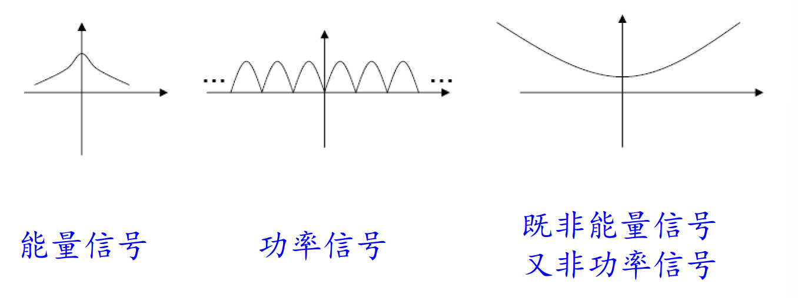
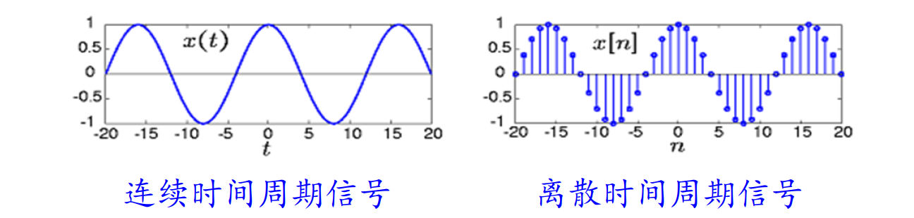
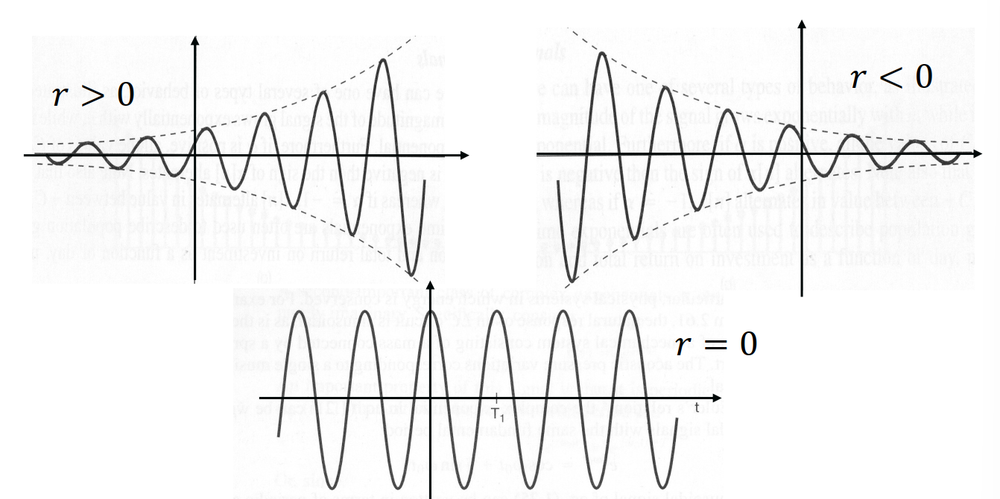

# 1.1 连续时间与离散时间信号

## 1.1.1 信号

**信号**：
- 用来传递某种消息或信息的物理形式，是消息或信息的载体。
- 如光信号、电信号、声信号。
- 从数学上，信号是 *承载信息的函数*，自变量是时间/空间，因变量是声压/亮度等等

**系统**：对输入信号 *响应*，并以输出信号作为响应结果的物理结构。
- 能够处理输入信号并输出信号的结构，或者是一个把输入信号到输出信号的 *映射*
- 响应的定义：对输入信号进行处理，将处理后的信号作为系统输出。

**一维信号**：只有一个自变量的承载信息的函数。如声音。
- 本课程只研究以时间为一维自变量的函数。
- **连续时间信号**：一维的以时间为连续的自变量的函数。
- **离散时间信号**：一维的以时间为离散的自变量的函数。

**二维/多维信号**：有两个或多个自变量的承载信息的函数。如图像。

信号可以分为 *确知信号* 与 *随机信号*。

## 1.1.2 信号的能量与功率

|                             | 总能量                                                                          | 平均功率                                                                                                      |
| --------------------------- | ---------------------------------------------------------------------------- | --------------------------------------------------------------------------------------------------------- |
| 连续时间信号 $x(t)$ 在 $[t_1,t_2]$ | $\displaystyle E = \int_{t_1}^{t_2} \lvert x(t) \rvert^2 \mathrm dt$         | $\displaystyle P = \frac{1}{t_2-t_1}\int_{t_1}^{t_2} \lvert x(t)\rvert^2 \mathrm dt$                      |
| 离散时间信号 $x[n]$ 在 $[n_1,n_2]$ | $\displaystyle E = \sum_{n=n_1}^{n_2} \lvert x[n] \rvert^2$                  | $\displaystyle P = \frac{1}{n_2-n_1+1}\sum_{n=n_1}^{n_2} \lvert x[n]\rvert^2$                             |
| 连续时间信号 $x(t)$ 在 无限区间        | $\displaystyle E = \int_{-\infty}^{+\infty} \lvert x(t) \rvert^2 \mathrm dt$ | $\displaystyle P_{\infty} = \lim_{T \to \infty} \frac{1}{2T} \int_{-T}^T \lvert x(t) \rvert^2 \mathrm dt$ |
| 离散时间信号 $x[n]$ 在 无限区间        | $\displaystyle E = \sum_{-\infty}^{+\infty} \lvert x[n] \rvert^2$            | $\displaystyle P_{\infty} = \lim_{N \to \infty}\frac{1}{2N+1} \sum_{n = -N}^N \lvert x[n] \rvert^2$       |

| 信号的分类    | 描述           | $E_{\infty}$        | $P_{\infty}$              |
| -------- | ------------ | ------------------- | ------------------------- |
| 能量信号     | 总能量有限        | $E_{\infty}<\infty$ | $P_{\infty} = 0$          |
| 功率信号     | 平均功率有限，总能量无限 | $E_{\infty}=\infty$ | $0 < P_{\infty} < \infty$ |
| 非能量非功率信号 | 总能量和平均功率都无限  | $E_{\infty}=\infty$ | $P_{\infty}=\infty$       |

## 1.1.3 周期信号

**周期信号**：连续时间信号满足 $x(t + T) = x(t)$，离散时间信号满足 $x[n+N]=x[n]$.

**基波周期**：其中最小的 $𝑇$ 或 $𝑁$。

# 1.2 自变量变换

与高中数学中函数的复合、奇偶性几乎完全一致。

| 变换类型 | 描述          | 连续时间变换                  | 离散时间变换                                                |
| ---- | ----------- | ----------------------- | ----------------------------------------------------- |
| 时移变换 | 信号左右平移，左加右减 | $x(t) \to x(t \pm t_0)$ | $x[n] \to x[n \pm n_0]$                               |
| 翻转变换 | 轴对称         | $x(t) \to x(-t)$        | $x[n] \to x[-n]$                                      |
| 尺度变换 | 压缩或扩展       | $x(t) \to x(at)$        | $x[n] \to x[Mn]$ 表示整数倍抽取 $x[n] \to x[n / M]$ 通常不考虑 |
| 偶信号  |             | $x(t) = x(-t)$          | $x[n] = x[-n]$                                        |
| 奇信号  |             | $x(-t) = - x(t)$        | $x[-n] = -x[n]$                                       |

任何信号可以分解为偶信号和奇信号之和
- $x(t)=x_e(t)+x_o(t)$ ，其中 $x_e(t)=\frac{1}{2}\left[x(t)+x(-t)\right],\quad  x_o(t)=\frac{1}{2}\left[x(t)-x(-t)\right]$ 
- $x[n]=x_e[n]+x_o[n]$，其中 $x_e[n]=\frac{1}{2}\left[x[n]+x[-n]\right],\quad  x_o[n]=\frac{1}{2}\left[x[n]-x[-n]\right]$

# 1.3 复指数信号和正弦信号

**欧拉公式**：$e^{j\omega} = \cos \omega + j \sin \omega$

## 1.3.1 连续时间

连续时间复指数信号：$x(t) = Ce^{at},\quad C,a \in \mathbb C$

**连续时间实指数信号**：$x(t) = Ce^{at},\quad C,a \in \mathbb R$，是平凡的指数函数

**连续时间周期性复指数信号**：$x(t) = e^{at}$，其中 $a$ 是 *纯虚数*
- 记 $a = j\omega_0,\ (\omega_0 \in \mathbb R)$，则 $x(t) = e^{j\omega_0 t} = \cos \omega_0 t + j \sin \omega_0 t$
- 实部和虚部都是正弦信号
- 周期为 $\displaystyle T = k · \frac{2\pi}{|\omega_0|},\ k \in \mathbb N^*$，*基波周期* 为 $\displaystyle T_0 = \frac{2\pi}{|\omega_0|}$，*基波频率* 为 $|\omega_0|$
- $\omega_0 = 0$ 时，$x(t) = C$，为 *直流信号*；$w_0 \ne 0$ 时，就必然为 *周期信号*。
- 一个周期的能量：$\displaystyle E_T = \int_0^{T} |e^{j\omega_0t}|^2 \mathrm dt = \int_0^T 1·\mathrm dt = T_0$
- 平均功率：$\displaystyle P_T = \frac{1}{T_0} E_T = 1$，$P_{\infty} = 1$

正弦信号：$\displaystyle x(t) = A \cos(\omega_0 t + \varphi) = \frac{A}{2} \left( e^{j(\omega_0 t + \varphi)} + e^{-j(\omega_0 t + \varphi)} \right)$

**成谐波关系的复指数信号集**：$\\\{\varphi_k(t)\\\} = \\\{e^{jk\omega_0t}\\\},\quad k = 0, \pm 1, \pm 2, \cdots$
- 每个信号的基波频率为 $k|\omega_0|$，均为 $|\omega_0|$ 的整数倍，因此称它们为 *成谐波关系*
- 公共周期：$\displaystyle T_0 = \frac{2\pi}{\omega_0}$
- 直流分量：$k = 0$；基波分量：$k = \pm 1$；二次谐波分量：$k = \pm 2$；

**一般复指数信号**：$x(t) = C e^{at},\quad C, a \in \mathbb C$
- 令 $C = |C|e^{j\theta},\, a = r + j \omega_0$，则 $$\begin{aligned}x(t) &= |C|e^{j\theta}e^{(r + j \omega_0)t} \\\\ &= |C|e^{rt}·e^{j(\omega_0 t + \theta)} \\\\ &= |C|e^{rt} \cos(\omega_0t + \theta) + j ·|C|e^{rt}\sin(\omega_0 t +\theta)\end{aligned}$$
- 该信号的振幅按照 *实指数信号规律变化*，因此实部和虚部的振幅也按照 *实指数信号规律变化*

## 1.3.2 离散时间

离散时间复指数信号：$x[n] = C \alpha^n,\quad C,\alpha \in \mathbb C$

**离散时间实指数信号**：$x[n] = C \alpha^n,\quad C,\alpha \in \mathbb R$，是平凡的离散指数函数

**离散时间复指数信号**：$x[n] = e^{j\omega_0 n} = \cos \omega_0 n + j \sin \omega_0 n,\quad \omega_0 \in \mathbb R$
- 由于信号变为离散了，所以不一定具有周期性（或者周期性复杂）
- 要使得该序列具有周期性，则 $x[n + N] = x[n]$ 得到 $\displaystyle e^{j \omega_0 N} = 1 \Leftrightarrow \omega_0 N = 2\pi m \Leftrightarrow \frac{w_0}{2\pi} = \frac{m}{N} \in \mathbb Q$
- 若 $\displaystyle \frac{w_0}{2\pi} = \frac{p}{q}\ (p, q \in \mathbb N^*,\ (p, q) = 1)$，则基波周期为 $N = q$，基波频率为 $\displaystyle \omega = \frac{2\pi}{N}$
- 只有 $\frac{\omega_0}{2\pi}$ 是有理数的时候，信号才有周期性
- 离散时间信号对于 $\omega_0$ 具有周期性，即 $\omega_0$ 和 $\omega_0 + 2\pi k,\, k \in \mathbb Z$ 对应的频率相同。
	- 离散时间信号的有效频率范围只有 $2\pi$ 的区间
	- $\omega = 2\pi k$ 对应最低频率，$\omega = 2\pi k + \pi$ 对应最高频率

**成谐波关系的离散时间周期性复指数信号集**：$\\\{\phi_k[n]\\\} = \\\{e^{j\frac{2\pi}{N}kn}\\\},\quad k = 0, \pm 1, \pm 2, \cdots$
- 每个信号都以 $N$ 为公共周期，频率均为 $\displaystyle \frac{2\pi}{N}$ 的整数倍
- 信号集内具有周期性，不是相互独立的：$\phi_{k + N}[n] = \phi_k[n]$
- 当只有 $k$ 取连续 $N$ 个整数时，对应的各个谐波才是相互独立的

**一般复指数信号**：$x[n] = C\alpha^n,\quad C = |C|e^{j \theta},\ \alpha = |\alpha|e^{j \omega_0}$，则 $$\begin{aligned} x[n] = |C| |\alpha|^n ·[\cos (\omega_0 n +\theta) + j \sin (\omega_0 n +\theta)]\end{aligned}$$
- 其中实部和虚部的幅度按照 离散时间实指数规律变化。

许多重要信号都可以表示为复指数信号的加权和或积分，这构成傅里叶分析的基础思想。

# 1.4 单位冲击与单位阶跃函数

## 1.4.1 离散时间

**单位脉冲信号**：$\delta[n] = \begin{cases}1, & n = 0 \\\\ 0, & n \ne 0\end{cases}$

**单位阶跃信号**：$u[n] = \begin{cases}1, & n \ge 0 \\\\ 0, & n < 0\end{cases}$

单位脉冲信号和单位阶跃信号的关系：**一阶差分/前缀和**
- $\delta[n] = u[n] - u[n - 1]$
- $\displaystyle u[n] = \sum_{m = - \infty}^n \delta[m] = \sum_{m = 0}^{\infty} \delta[n - m]$

$\delta[n]$ 可以提取离散信号 $x[n]$ 中的某一点：
- $x[n] \delta[n] = x[0]\delta[n] = \begin{cases}x[0], & n = 0 \\\\ 0, & n \ne 0\end{cases}$
- $x[n] \delta[n - m] = x[m]\delta[n - m] = \begin{cases}x[m],&n = m \\\\ 0,& n \ne m\end{cases}$

## 1.4.2 连续时间

**单位阶跃信号**：$u(t) = \begin{cases}1, & t > 0 \\\\ 0, & t < 0\end{cases}$
- 在该信号中 $t = 0$ 不定义，在 $t = 0$ 不连续，视为不重要的，不影响信号的能量

**单位冲激函数**：$\displaystyle \delta(t) = \frac{\mathrm du(t)}{\mathrm dt}$
- 实际上由于 $u(t)$ 在 $t = 0$ 不可导而不存在，但是我们将其视作广义上的函数。
- 近似的单位冲激函数 $\delta_{\Delta}(t)$
	- 在 $t = 0$ 的邻域具有下方面积为 $1$ 的，宽度趋于零的曲线。
	- $\displaystyle \lim_{\Delta \to 0} \delta_\Delta(t) \to \delta(t)$

$\delta(t)$ 可以提取连续信号 $x(t)$ 中的某一点：
- $x(t) \delta(t) = x(0) \delta(t)$，其中 $\displaystyle \int_{-\infty}^{+\infty} x(0) \delta(t) \mathrm dt = x(0) \int_{-\infty}^{+\infty} \delta(t) \mathrm dt = x(0)$
- $x(t) \delta(t - t_0) = x(t_0) \delta(t - t_0)$，其中 $\displaystyle \int_{-\infty}^{+\infty} x(t_0) \delta(t - t_0) \mathrm dt = x(t_0) \int_{-\infty}^{+\infty} \delta (t - t_0) \mathrm dt = x(t_0)$
